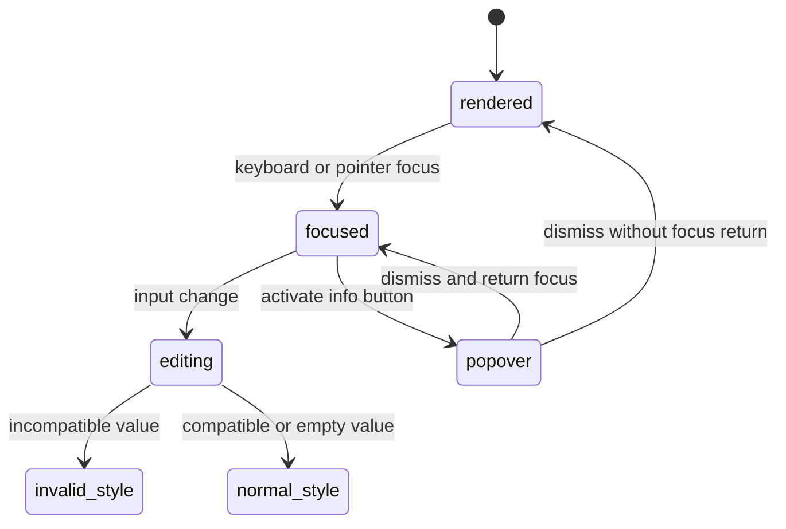

# Accessibility and layout

## Summary

The component presents a compact, square-edged input group with a right-aligned text field and an icon-only info button. Its styling exposes focus and invalid state, while its browser semantics provide text input, button activation, and `aria-invalid`. The stories also reveal limits: the Default and Spreadsheet inputs have no explicit accessible name in their story props.

## The simple case

In the centered Default canvas, the field occupies the decorator's `w-96` width. The input is monospace, right-aligned, and tabular; the info button sits at the inline start. The group has no rounded corners or shadow by default.

Focus on the input produces the input group's focus-visible border/ring styling. When invalid, the group uses destructive border and ring styling and the input exposes `aria-invalid="true"`. In Spreadsheet, the group class merges the field into table borders.

## The interaction, event by event

### Arrive

The input group renders as a `role="group"` container with a text input and an addon group. The button uses an icon-only size and the default accessible name `Show converted values`. The text input has `type="text"`, autocomplete disabled, right alignment, monospace font, and tabular numbers.

The Storybook preview centers the canvas. Default wraps the field in a fixed `w-96` container; Spreadsheet supplies table-cell classes to extend the group across cell boundaries.

### Leave untouched

An untouched field has no invalid attribute unless evaluation has already marked it invalid. The normal border is input-colored and the component does not show a visible unit suffix or a visible label. The info button remains available by pointer or keyboard.

### Begin editing

Focus can arrive by tab, pointer click, or clicking the non-button addon. The addon focuses the input when its click is not on the button. Typing uses the browser text-input interaction; the component does not intercept keyboard shortcuts or add a submit action.

### While editing

Focus-visible styles raise the focused input group above adjacent borders. Invalid state changes the border and ring to destructive colors. The input's own class removes its independent border so the group supplies the visual control boundary.

The info button opens a popup rather than shifting the input. In Spreadsheet, multiple groups can be adjacent; each field remains a separate input and button even when their borders touch.

### Finish editing

Blur or moving focus elsewhere does not submit or reset the value. Dismissal of the popover ends the transient panel interaction. The final visible styling follows the latest field state, and no focus or aria label is added by the component beyond the input and button semantics it receives.

## Modifiers

| Variant | Set at the start | Changed while extended |
| --- | --- | --- |
| Controlled or uncontrolled value | Does not change the basic DOM semantics. | Parent updates can change visible text while focus remains. |
| Default value | Determines initial text width and state styling. | Does not change layout by itself. |
| Declared unit | Affects only validation and messages, not the group geometry. | New invalidity can change border/ring styling. |
| Conversion list | Determines popover contents and therefore its size. | An updated list can resize the open panel. |
| Locale | Can alter conversion text width. | Reformatting can change panel width without changing the field width. |
| Runtime readiness | Loading/error content can delay or replace the story. | State changes can alter the group styling and panel content. |

## Cancel and interrupt

| Event | Before extended | While extended |
| --- | --- | --- |
| Escape | Dismisses the popup if open; no field styling is reset. | Dismisses the popup and leaves focus behavior to the primitive. |
| Clicking or interacting elsewhere | Moves focus to the chosen target. | Removes focus styling from the prior field and may dismiss the popup. |
| Closing the conversion popover | No layout change beyond the panel being absent. | The panel closes; the input group remains. |
| Runtime or browser failure | The canvas may show fallback content or incomplete styling. | The current DOM can be replaced or unmounted. |
| Reloading or closing the tab | All DOM and focus state disappear. | The page is recreated from story defaults. |
| Parent changes the value or props | New props can change status and popup content. | New styling or content renders while the user is interacting. |
| Input channel changes through paste, autofill, or another device | Browser-delivered text uses the same semantics. | The field's current DOM value and state update according to the event. |

## Interactions with other systems

**Validation and error display.** Invalid state is represented through border/ring styling, `aria-invalid`, and popup text.

**Controlled and uncontrolled state.** Ownership changes text updates but not the input's semantic role.

**Conversion formatting and locale.** Popup content can change dimensions based on formatted text.

**Callbacks.** Callbacks have no direct visual affordance in the stories.

**Focus and keyboard access.** This document owns focus, tab, button, addon, and dismissal observations.

**Dim runtime and provider.** Fallback content can replace the component during initialization.

**Popover and portal behavior.** Popup geometry is independent of the input group's normal flow.

**Layout and table integration.** Story-specific classes determine fixed width and border merging.

**Browser accessibility semantics.** The info button is labeled; the story inputs lack explicit labels and should be checked with an accessibility audit.

## Edge cases

- The Default input has no `aria-label`, `name`, or associated visible label in the story's props.
- The Spreadsheet fields are visually under a `Pressure` column header but are not programmatically associated with row labels.
- The popover is portal-rendered and may escape an ancestor's clipping context.
- The field has square edges even though the generic input-group primitive defaults to rounded corners.
- An invalid field keeps the same text alignment and font while changing group colors.

## Open questions and verification

- Keyboard tab order, focus return, and screen-reader names require a browser accessibility pass.
- The exact focus-visible ring and border appearance depends on the Storybook theme and needs visual verification.
- The component's missing input labels may be worth treating as a product bug, especially in Spreadsheet.

Verified against /Users/jerell/Repos/dim commit `c26ec6a`.
