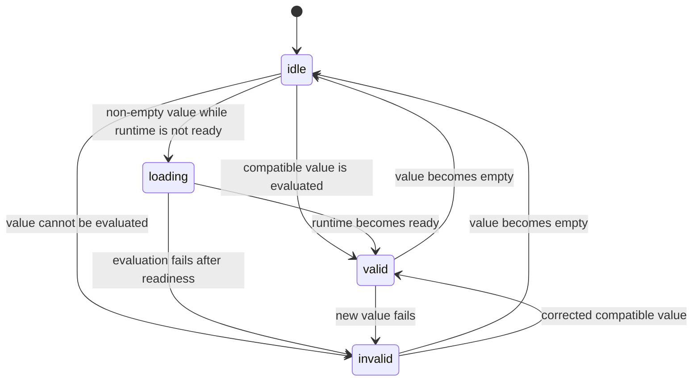

# Field state

## Summary

Every non-empty `QuantityInput` value is represented to the user as one of four states: loading, valid, invalid, or idle for empty text. The state controls the group's data status, invalid accessibility state, and the message shown by the conversion popover. This document owns those state meanings; feature documents link here rather than redefining them.

## The simple case

The Default story starts with `1 bar`. After the runtime is ready, the field is valid and the popover lists the configured conversions. Deleting all text makes it idle. Typing `12 kg` leaves the text visible but makes the field invalid because kilograms are not compatible with the declared `bar` unit.

## The interaction, event by event

### Arrive

An empty field is idle. A non-empty field is evaluated only when the runtime is ready; otherwise it is loading. `data-status` identifies the current state on the input group, but the state name is not printed in the normal field.

### Leave untouched

An empty field's panel says `Enter a quantity expression.` A valid field's panel says `Compatible with bar.` when there are no conversion rows, or shows the configured converted values. An invalid field's panel says `Invalid quantity` followed by the evaluation or compatibility error.

### Begin editing

The raw text changes first. The component derives an expression: trimmed empty text has no expression; a finite numeric string gains the declared unit; all other text is evaluated as supplied. The state is then recomputed from that expression.

### While editing

Valid means evaluation succeeded, the expression is compatible with the declared unit, and all requested conversions completed. Invalid means any of those operations throws; conversion rows are then empty. Loading means an expression exists but readiness is false. Idle means the trimmed input is empty regardless of the declared unit.

The state is recomputed from the current dependencies. It is not a cumulative error list: correcting the text replaces invalid state with valid or idle state, and changing conversions replaces the conversion results.

### Finish editing

State changes are visible through styling, `aria-invalid`, and the next popover render. State is also sent to `onResultChange` when supplied. No state transition writes to disk or submits a form.

## Modifiers

| Variant | Set at the start | Changed while extended |
| --- | --- | --- |
| Controlled or uncontrolled value | Ownership determines where the initial raw value comes from. | A controlled parent can replace the value and therefore the state; local typing cannot override it. |
| Default value | Supplies the uncontrolled starting text. | It does not replace local state after the component has mounted. |
| Declared unit | Sets bare-number interpretation and compatibility target. | Re-evaluates the current expression under the new target. |
| Conversion list | Determines whether valid state includes conversion rows. | Recomputes rows and can change the panel from converted values to compatible-only. |
| Locale | Determines rendered conversion text, not state validity. | Reformatting can occur without changing valid/invalid state. |
| Runtime readiness | Non-empty text is loading until ready. | A readiness change moves the current non-empty expression between loading and evaluated state. |

## Cancel and interrupt

| Event | Before extended | While extended |
| --- | --- | --- |
| Escape | Closes transient popover UI; state is unchanged. | Closes transient popover UI; state is unchanged. |
| Clicking or interacting elsewhere | Focus changes without changing state. | State remains based on the latest delivered value. |
| Closing the conversion popover | Does not alter state. | Does not alter state. |
| Runtime or browser failure | Loading can become provider error or remain unavailable. | Evaluation failure becomes invalid; a browser unmount ends observation. |
| Reloading or closing the tab | All in-memory state disappears. | All in-memory state disappears. |
| Parent changes the value or props | The next render derives a new state. | Current state is recomputed from changed dependencies. |
| Input channel changes through paste, autofill, or another device | Delivered text follows normal state derivation. | The latest delivered text determines state. |

## Interactions with other systems

**Validation and error display.** This foundation owns state-to-message and state-to-attribute rules.

**Controlled and uncontrolled state.** Ownership determines which raw value state is evaluated.

**Conversion formatting and locale.** Formatting changes conversion text, not compatibility.

**Callbacks.** A state update triggers `onResultChange` after render when supplied.

**Focus and keyboard access.** Focus does not itself change state.

**Dim runtime and provider.** Readiness gates evaluation of non-empty expressions.

**Popover and portal behavior.** The popover reads state; it does not own it.

**Layout and table integration.** Styling reflects invalid state on the group in every layout.

**Browser accessibility semantics.** Invalid state adds `aria-invalid="true"`; other states omit the attribute.

## Edge cases

- Whitespace-only text is idle because trimming happens before expression creation.
- A number that JavaScript cannot represent as finite is not expanded as a bare declared-unit value.
- A valid expression can still have zero conversion rows when the conversion list is empty.
- A conversion error makes the whole state invalid and clears all conversion rows.

## Open questions and verification

- The visual timing between an input event and the effect-driven state update needs browser verification.
- The exact error text for malformed expressions depends on the WASM wrapper and needs hand verification.

Verified against /Users/jerell/Repos/dim commit `c26ec6a`.
