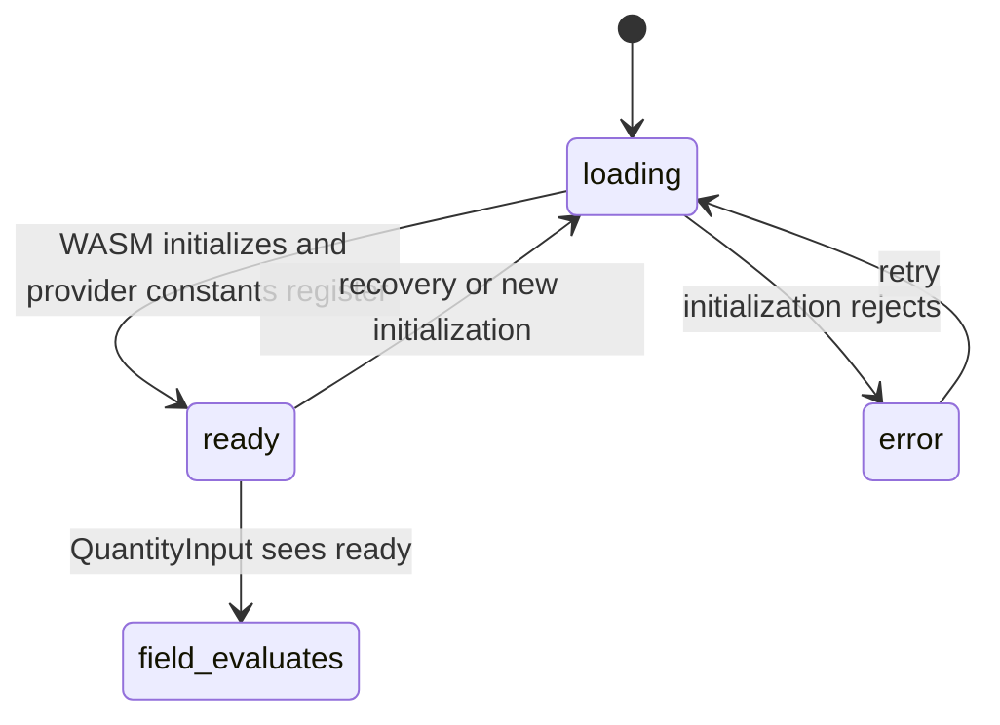

# Runtime readiness

## Summary

The field depends on a browser-loaded dim WASM runtime. `DimProvider` starts in loading state, initializes the runtime, and exposes readiness to its children. `QuantityInput` treats a non-empty value as loading until readiness is true; the Storybook decorator additionally replaces the whole canvas with `Loading dim…` during provider loading.

## The simple case

Storybook mounts the Default, Invalid, or Spreadsheet story inside `DimProvider`. The provider starts loading, then becomes ready when the WASM module is initialized. The story content becomes visible and each field evaluates its current value.

If initialization fails and the decorator supplies no error fallback, the provider still renders its children with an error status. The field does not see provider error directly; because readiness is false, a non-empty field shows its own loading state in the conversion panel. The exact canvas behavior depends on the decorator's fallback props.

## The interaction, event by event

### Arrive

The provider starts with status `loading`, error `null`, and `ready` false. Its first initialization uses the normal runtime initializer and registers declared constants before setting ready. The Storybook decorator passes `loadingFallback={
Loading dim…
}`, so the canvas may show that fallback instead of the story children until the provider is ready.

### Leave untouched

A field with empty text can remain idle while the provider loads. A field with text does not evaluate early; it reports loading to its own state once it is rendered. Opening the conversion panel during field loading says `Loading unit conversions…`.

### Begin editing

An input change while the provider is not ready changes the raw value but cannot produce a result. The field retains loading status until readiness changes. The provider's `ready` value is the gate, not the presence of a field value.

### While editing

When readiness becomes true, the field evaluates its current expression and checks compatibility. If recovery occurs after an error, the provider retries initialization and the current fields can evaluate again. Provider constants are registered before the provider exposes ready, so consumers observing ready can immediately evaluate expressions that use them; constants remain outside the component-only feature scope.

If initialization or evaluation fails, no converted values are shown. Initialization error fallback is a provider-level choice; the QuantityInput conversion panel has its own invalid/loading presentation for field-level failures.

### Finish editing

Readiness is not a user commit. Once ready, the field can finish normal editing and callback updates. When the provider unmounts or the page reloads, runtime state and all component-local values disappear.

## Modifiers

| Variant | Set at the start | Changed while extended |
| --- | --- | --- |
| Controlled or uncontrolled value | Either value mode can be mounted while the runtime loads. | The current raw text remains while readiness changes. |
| Default value | The field can start with a non-empty value before readiness. | A new parent value waits for readiness before evaluation. |
| Declared unit | The target is captured by the field props, not the runtime loader. | A changed unit is evaluated once readiness permits. |
| Conversion list | The list is retained while loading but no rows are computed. | A changed list is applied after the next ready evaluation. |
| Locale | Formatting preference exists before initialization. | Conversion text uses the current locale after readiness. |
| Runtime readiness | Provider begins loading and can become ready or error. | Readiness changes the field between loading and evaluated states. |

## Cancel and interrupt

| Event | Before extended | While extended |
| --- | --- | --- |
| Escape | Dismisses a popover if open; initialization continues. | Dismisses a popover; it does not cancel WASM initialization. |
| Clicking or interacting elsewhere | Does not affect loading. | Does not affect loading or readiness. |
| Closing the conversion popover | Hides the panel while provider work continues. | Hides the panel without cancelling evaluation. |
| Runtime or browser failure | Provider enters error; fallback may replace children. | Current field may remain loading or become invalid; error details are not directly exposed by `useDim` to the field. |
| Reloading or closing the tab | Cancels the page's in-memory initialization. | Loses runtime, readiness, and field state. |
| Parent changes the value or props | New props wait for readiness. | New props trigger evaluation after readiness. |
| Input channel changes through paste, autofill, or another device | Raw text is retained while waiting. | Latest text is evaluated when readiness allows. |

## Interactions with other systems

**Validation and error display.** Readiness gates evaluation; field-level failures become invalid after an attempted evaluation.

**Controlled and uncontrolled state.** Runtime loading does not change ownership.

**Conversion formatting and locale.** Formatting begins only after a successful ready conversion.

**Callbacks.** `onResultChange` can observe loading before ready and valid/invalid after evaluation.

**Focus and keyboard access.** Focus and typing remain browser interactions while initialization runs.

**Dim runtime and provider.** This document owns the readiness boundary visible to the component.

**Popover and portal behavior.** The popover can display loading or provider-independent field state.

**Layout and table integration.** All fields in Spreadsheet share provider readiness and can transition together.

**Browser accessibility semantics.** Loading does not set `aria-invalid`; invalid does.

## Edge cases

- The provider uses a shared runtime, so a previously initialized runtime can make a later story appear ready without the same visible loading interval.
- The loading fallback replaces the story children, while field loading text appears inside a rendered field after readiness changes or in other provider setups.
- A provider error fallback is not supplied by the Storybook decorator, so the exact error surface is not represented by the stories.
- Changing provider constants after readiness can itself put the provider into error, but constants are outside the component-only scope.

## Open questions and verification

- The exact loading flash in the Storybook canvas depends on browser timing and cached module state and needs hand verification.
- Whether shared runtime state leaks between stories during one Storybook session needs verification.
- Provider-level initialization error behavior is only partially visible in the covered story set.

Verified against /Users/jerell/Repos/dim commit `5d9cf0d`.
