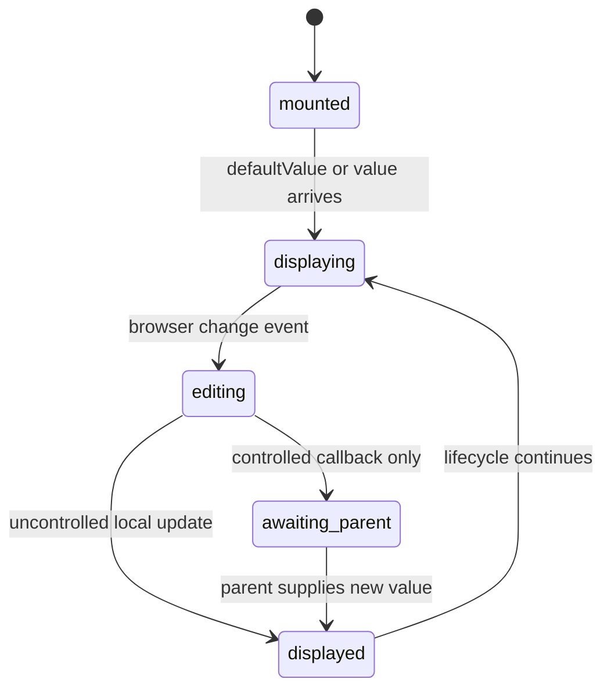

# Value ownership

## Summary

`QuantityInput` can display a locally owned value from `defaultValue` or a parent-owned value from `value`. Both modes emit the raw string through `onValueChange` when the user edits, but only uncontrolled mode updates the displayed field immediately from that edit. The component does not normalize the visible string into a parsed or converted value.

## The simple case

In Default and Invalid, `defaultValue` seeds a local field. Typing replaces or extends the text and the field shows the typed characters. The field's evaluation state follows the displayed text.

In a controlled use such as Spreadsheet, the parent supplies each raw string through `value` and updates its array in `onValueChange`. A user edit emits the new string, and the parent re-renders the field with that string. If the parent ignores the callback, the field continues showing the old controlled value.

## The interaction, event by event

### Arrive

If `value` is defined, it is the displayed value. Otherwise the component initializes local state from `defaultValue`, which defaults to an empty string. The two props are not merged; a controlled value takes precedence.

### Leave untouched

No callback fires just because the field mounted or received a default value. The displayed raw string stays exactly as supplied. Evaluation and `onResultChange` are separate from `onValueChange`.

### Begin editing

The browser sends a change event containing the input's current string. The component first updates local state only when it is uncontrolled, then calls any supplied normal `onChange` handler and `onValueChange` with the same raw string.

### While editing

The displayed value is always `controlledValue ?? uncontrolledValue`. The component does not replace `1` with `1 bar`, round the value, or switch it to a conversion. It uses a derived expression for evaluation while preserving the raw input for display and callbacks.

A parent can replace the value, declared unit, conversions, or other props during editing. The current props win on the next render and the evaluation state is recomputed from them.

### Finish editing

Uncontrolled editing finishes with the new raw value retained in local state. Controlled editing finishes only visually when the parent supplies the new value; the callback alone is not a commit. Neither mode persists the value beyond the mounted component.

## Modifiers

| Variant | Set at the start | Changed while extended |
| --- | --- | --- |
| Controlled or uncontrolled value | `value` selects controlled ownership; absence selects local ownership. | Switching ownership while mounted follows the nullish value expression and can preserve or reveal local text unexpectedly. |
| Default value | Seeds local state once at mount. | A changed default does not reset an already mounted uncontrolled field. |
| Declared unit | Used to expand bare numeric text. | Current raw text is reinterpreted and revalidated. |
| Conversion list | Does not affect raw value ownership. | Conversion rows recompute while the raw value stays unchanged. |
| Locale | Does not affect raw value. | Only conversion text changes. |
| Runtime readiness | Does not affect raw value. | Evaluation status changes while displayed text remains. |

The user cannot change ownership with a keyboard gesture. Ownership changes when the parent changes props, and the component does not warn or visibly label the mode.

## Cancel and interrupt

| Event | Before extended | While extended |
| --- | --- | --- |
| Escape | Does not reset the initial value. | Closes transient popover UI without restoring text. |
| Clicking or interacting elsewhere | Leaves the untouched raw string as supplied. | Does not commit or revert beyond the state already accepted. |
| Closing the conversion popover | Leaves ownership and value unchanged. | Leaves ownership and value unchanged. |
| Runtime or browser failure | Does not itself replace the raw string. | A failed evaluation keeps the raw text; an unmount loses local uncontrolled state. |
| Reloading or closing the tab | Loses local uncontrolled value. | Loses local uncontrolled value; parent storage is outside this component. |
| Parent changes the value or props | Parent value is used on the next render. | Parent value can overwrite the user's latest visible edit. |
| Input channel changes through paste, autofill, or another device | Delivered text enters the same ownership path. | Controlled mode emits it; uncontrolled mode displays it. |

## Interactions with other systems

**Validation and error display.** The raw owned value is the input to validation.

**Controlled and uncontrolled state.** This document owns the ownership distinction and callback timing.

**Conversion formatting and locale.** Conversions never rewrite the raw owned value.

**Callbacks.** `onChange` receives the browser event; `onValueChange` receives only the raw string; `onResultChange` receives derived status separately.

**Focus and keyboard access.** Browser editing rules determine the change events; focus does not transfer ownership.

**Dim runtime and provider.** Runtime readiness changes derived status, not the owned raw value.

**Popover and portal behavior.** Opening the panel does not affect ownership.

**Layout and table integration.** Spreadsheet uses controlled ownership for each row and updates an array in response to raw callbacks.

**Browser accessibility semantics.** The input remains a text input in either ownership mode.

## Edge cases

- A controlled field can call `onValueChange` and still display its previous value when the parent does not update `value`.
- `defaultValue` is not reapplied when the parent changes that prop after mount.
- An empty controlled string is still controlled because the check is for `undefined`, not truthiness.
- The component accepts a full expression as raw text and never replaces it with the result's display unit.

## Open questions and verification

- Switching a mounted field between controlled and uncontrolled ownership is not covered by tests and may be worth treating as a product/documentation question.
- The exact callback ordering relative to React's visible update needs browser verification.

Verified against /Users/jerell/Repos/dim commit `5d9cf0d`.
