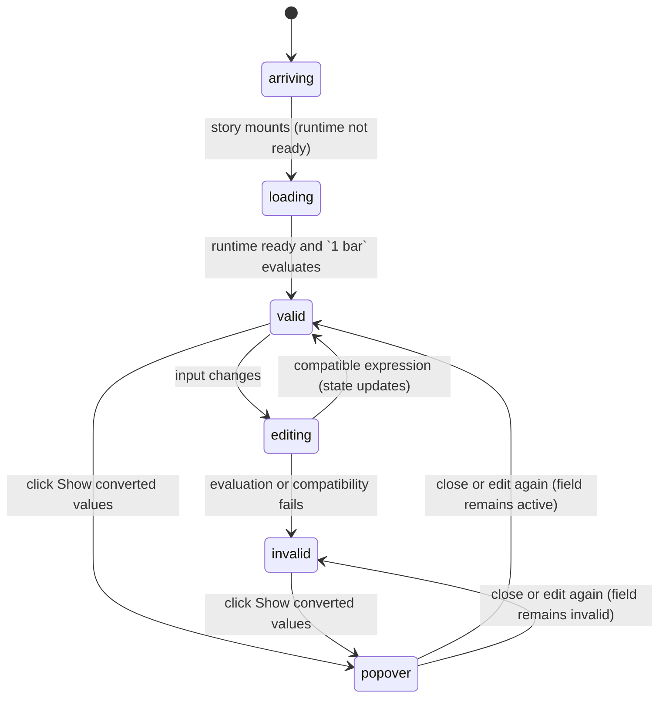

# The basic quantity field

## Summary

The quantity field lets the user enter either a bare number or a full quantity expression while a declared unit gives bare numbers their meaning. In the Default Storybook story it appears as a square-edged `bar` field initially filled with `1 bar`, an info button, and a conversion popover. When the runtime is ready and the expression is compatible, the field can show converted `bara`, `kPa`, and `psi` values.

## The simple case

When the Default story opens, the provider first loads the dim runtime. The Storybook decorator may briefly show `Loading dim…`; after initialization the story shows the field with `1 bar`. The field is a text input aligned to the right in a monospace, tabular-number style. Its surrounding group has square edges.

Click the info button labeled `Show converted values`. A popover opens below the button. It says `Converted values` and lists `1.000 bara`, `100.0 kPa`, and `14.50 psi`, with the configured labels and decimal places. The input remains in place and keeps its value.

Click the field and replace the value with `2`. The field interprets the bare number as `2 bar`. The value is re-evaluated and the conversion popover, when opened, reflects the new pressure. The component remains a field; it does not submit or save anything.

## The interaction, event by event

### Arrive

The story mounts inside `DimProvider` with the Default story's loading fallback. Before the runtime is ready, the decorator can replace the story content with `Loading dim…`. Once the provider reports ready, the field is visible with raw value `1 bar`, declared unit `bar`, and the three default conversions.

The field itself has no explicit label in the Default story. The info button has the accessible name `Show converted values`. The input is text, has autocomplete disabled, and is visually right-aligned. The field group has a `data-status` state that is not normally visible as text.

### Leave untouched

If the user does not edit the field, its raw value remains `1 bar` and the valid state remains associated with that expression after runtime readiness. Opening the info button does not change the raw value or create a saved record. The popover reads the current field state.

If the user opens the story while the runtime is still loading and opens the popover as soon as the button becomes available, the panel can say `Loading unit conversions…`. After readiness and state recomputation, opening it again shows the valid conversion result.

### Begin editing

The first input change calls the input's normal change handler. In an uncontrolled field it also changes the value displayed by the input. In this story there is no `onValueChange` callback, so no parent-visible change is shown.

A bare finite number is expanded to an expression using `bar`; for example, `2` is evaluated as `2 bar`. Text such as `2 kPa` is evaluated as written. The field does not wait for blur before attempting evaluation; the new expression is considered whenever the value changes and the runtime is ready.

### While editing

The field recomputes its status from the current expression. A valid compatible expression keeps a quantity result and recomputes each configured conversion. An invalid expression clears the conversion rows, marks the input `aria-invalid="true"`, and applies destructive border and focus-ring styling to the group.

The user can open the info button while editing. The panel displays the current state: `Enter a quantity expression.` for empty text, `Loading unit conversions…` while the runtime is unavailable, `Invalid quantity` plus the error message for invalid text, `Compatible with bar.` when valid with no conversions, or `Converted values` and rows when conversions exist.

The result is recomputed rather than accumulated. Changing the conversion list, locale, declared unit, or readiness also causes the current expression to be evaluated again. There is no submit button, progress indicator, undo history, or local draft separate from the input value.

### Finish editing

An input change finishes when the component has accepted the raw value into local field state and recomputed the observable state. There is no explicit commit gesture. Focus may move elsewhere without saving a record; the last uncontrolled value remains displayed while the component stays mounted.

When the popover closes, the field remains in its current valid, invalid, loading, or idle state. A successful conversion is displayed only in the popover and does not replace the input's original expression. A failed evaluation keeps the user's raw text so it can be corrected.

## Modifiers

| Variant | Set at the start | Changed while extended |
| --- | --- | --- |
| Controlled or uncontrolled value | The Default story is uncontrolled because it supplies `defaultValue`, not `value`. | A parent changing from controlled input changes the displayed value; typing alone never changes a controlled display. |
| Default value | The initial raw value is `1 bar`. | Changing the prop after mount does not act as a new default for the existing local value. |
| Declared unit | `bar` gives bare numbers their meaning and is the compatibility target. | A changed unit reinterprets bare input and recomputes validity and conversions. |
| Conversion list | `bara`, `kPa`, and `psi` rows are requested in that order. | A changed list recomputes rows; an empty list produces only the compatible message. |
| Locale | The default locale is `en-GB`. | A changed locale reformats conversion text without changing numeric conversion. |
| Runtime readiness | The provider starts loading and then makes evaluation available. | Losing readiness changes a non-empty field to loading; readiness recovery recomputes it. |

Changing a variant is a prop or provider update, not a keyboard modifier. The component responds to changed dependencies while mounted; the raw value is not rewritten merely because display conversions change.

## Cancel and interrupt

| Event | Before extended | While extended |
| --- | --- | --- |
| Escape | Closes the open conversion popover if the browser primitive treats Escape as dismissal; it does not erase the field value. | Closes the popover; the current text and status remain. |
| Clicking or interacting elsewhere | Moves focus or closes the popover without changing an untouched value. | The input keeps its latest raw value; a popover can close while the field remains valid or invalid. |
| Closing the conversion popover | Nothing is committed; the field remains at its current state. | The panel disappears, but no value is reverted. |
| Runtime or browser failure | The field may remain loading or the provider may replace the story with its error fallback. | A failed evaluation makes the field invalid and keeps the raw text; an unmounted component stops observing updates. |
| Reloading or closing the tab | The current field value and popover state are lost with the Storybook page. | No value is persisted or restored by the component. |
| Parent changes the value or props | A parent-provided value or unit determines the next rendered state. | The current expression is recomputed from the latest props; a controlled value can replace what the user just typed. |
| Input channel changes through paste, autofill, or another device | The resulting input event is treated like any other value change if the browser delivers it. | The latest delivered raw value wins; autocomplete is disabled, but browser or parent writes remain possible. |

After an interruption the component stays on the same Storybook page while mounted. It has no cancel button, undo operation, persistence layer, or recovery of a page-local value.

## Interactions with other systems

**Validation and error display.** Evaluation and compatibility determine idle, loading, valid, or invalid state. Invalid state is visible through destructive border/ring styling and `aria-invalid`; the popover gives the text explanation.

**Controlled and uncontrolled state.** The Default story owns its value locally after `defaultValue`; a controlled consumer owns the displayed value and receives raw changes without automatic display updates.

**Conversion formatting and locale.** Valid results are converted in the requested order and formatted with each conversion's decimal places and the active locale.

**Callbacks.** The Default story supplies no callbacks, so editing has no visible parent side effect. A consumer can observe raw changes and structured state through `onValueChange` and `onResultChange`.

**Focus and keyboard access.** The text input is focusable and the info control is a button. The input-group addon focuses the input when its non-button area is clicked; popover dismissal follows the browser primitive.

**Dim runtime and provider.** The provider controls when evaluation can happen. The field only treats the runtime as ready or not ready; provider fallback content can hide the story while loading or on initialization failure.

**Popover and portal behavior.** The info control opens a positioned panel rendered through the popover primitive's portal. The panel does not replace or mutate the input.

**Layout and table integration.** The Default story wraps the field in a fixed `w-96` container. The same component can merge its border into a table cell through `groupClassName`, as shown by Spreadsheet.

**Browser accessibility semantics.** The info control has an accessible label, the input exposes invalid state only when needed, and the Default story's unlabeled input is an open accessibility question.

## Edge cases

- Empty or whitespace-only text becomes idle and clears conversions instead of being marked invalid.
- A bare number is interpreted in `bar`; a full expression can use another compatible pressure unit.
- An incompatible quantity such as `12 kg` remains visible but produces no conversion rows.
- With no conversions, a valid field says `Compatible with bar.` rather than showing an empty result list.
- The field accepts full expressions, so a user can type more than a numeric literal.
- The input does not have a visible unit suffix; the declared unit affects interpretation and compatibility rather than decorating the field.
- The first provider load can replace the entire story with `Loading dim…`, while later field loading is represented inside the conversion panel.

## Open questions and verification

- The exact initial loading duration and whether the Default field can be interacted with before the provider fallback disappears need browser verification.
- The Default story does not provide an accessible name for the text input; this may be worth treating as an accessibility bug rather than documenting as intended.
- Exact popover placement, focus return after dismissal, and Escape behavior were inferred from the primitive and need hand verification.
- The source and tests do not establish whether browser autofill can write despite `autoComplete="off"`.

Verified against /Users/jerell/Repos/dim commit `5d9cf0d`.
