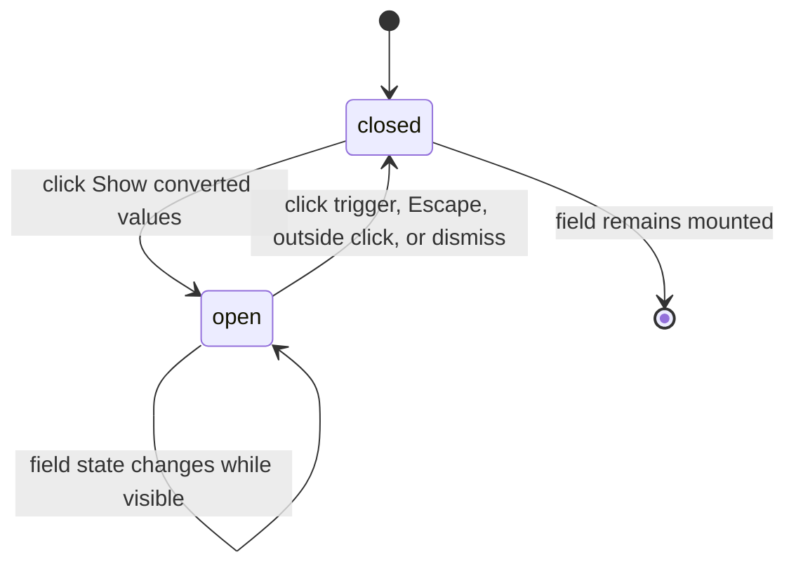

# The conversion popover

## Summary

The conversion popover is the info panel attached to the left side of the quantity field. The button is always available while the component is rendered and is labeled `Show converted values` by default. Opening it presents the current field state without changing the input; closing it leaves the input's raw value and validation state intact.

## The simple case

In Default, click the info icon. A panel opens below the button with the heading `Converted values` and one value/unit pair per configured conversion. The panel is wide enough for the result and label, and it appears above surrounding page content through the popover layer.

In Invalid, open the same button after entering or loading `12 kg`. The panel instead says `Invalid quantity` and `Not compatible with bar`. In an empty field it says `Enter a quantity expression.`.

## The interaction, event by event

### Arrive

The trigger is an icon-only button in the input group's inline-start addon. Its default accessible name is `Show converted values`; a consumer can replace that label. The panel is closed initially and does not occupy the field's normal layout.

### Leave untouched

Clicking the trigger opens the panel and reads the current state. For an empty, loading, invalid, compatible-only, or converted field, the panel chooses the corresponding message. Opening it does not focus or rewrite the text as a component-level action.

### Begin editing

The popover interaction begins with a click or keyboard activation on the trigger. The trigger is a button rather than a submit control. The field's value and state have already been derived independently.

### While editing

While open, the panel renders one of five contents: an idle prompt, a loading prompt, an invalid message and error, a compatible-only message, or a conversion heading with a two-column definition list. Conversion labels use the configured label when present, otherwise the unit name. The panel can update if the field changes while it remains open.

The panel is positioned relative to the trigger with start alignment and a small offset. It is rendered through a portal, so it is not constrained by the input group's overflow or table-cell DOM.

### Finish editing

Closing the panel hides only the panel. It does not emit a value callback, clear the field, change validity, or commit converted values. The next opening reads whatever state the field currently has.

## Modifiers

| Variant | Set at the start | Changed while extended |
| --- | --- | --- |
| Controlled or uncontrolled value | The panel reads whichever value the field currently displays. | A parent or local edit changes the panel contents on the next state update. |
| Default value | Determines the initial panel message after readiness. | Does not reset an open panel's field state by itself. |
| Declared unit | Supplies the compatible-only wording and invalid fallback. | New unit can change panel text and rows. |
| Conversion list | Determines whether and which rows appear. | Rows are recomputed while the panel may remain open. |
| Locale | Determines formatted conversion text. | Existing rows can change their text formatting. |
| Runtime readiness | Determines whether the panel says loading or shows a result. | Readiness changes the panel content without changing its open state. |

## Cancel and interrupt

| Event | Before extended | While extended |
| --- | --- | --- |
| Escape | No effect while closed. | Dismisses the open panel; field state remains. |
| Clicking or interacting elsewhere | No effect beyond normal focus behavior. | Outside interaction can dismiss the panel; field text remains. |
| Closing the conversion popover | The panel is already closed. | This is the normal completion and hides the panel only. |
| Runtime or browser failure | The panel may not open or may show loading/error state. | A state update changes its contents; unmount removes it. |
| Reloading or closing the tab | Closed/open state is lost. | Open panel disappears with the page. |
| Parent changes the value or props | The next opening uses new state. | Open content updates from the latest field state. |
| Input channel changes through paste, autofill, or another device | No panel opens automatically. | The panel reflects the changed field after state recomputation. |

## Interactions with other systems

**Validation and error display.** The panel is the principal visible error explanation but does not decide validity.

**Controlled and uncontrolled state.** It reads the current displayed value through field state.

**Conversion formatting and locale.** Rows use formatted text generated for each conversion.

**Callbacks.** Opening or closing the panel does not call value callbacks.

**Focus and keyboard access.** The trigger is keyboard-activatable; dismissal and focus return are supplied by the popover primitive.

**Dim runtime and provider.** Loading state can be shown while the runtime is unavailable.

**Popover and portal behavior.** This document owns the trigger/panel relationship and portal placement behavior.

**Layout and table integration.** Portal rendering avoids clipping inside the Spreadsheet table cell.

**Browser accessibility semantics.** The trigger has an accessible label; the panel's text is exposed through the primitive's popup semantics.

## Edge cases

- The info button has no visible text, so its accessible name is essential.
- A custom `infoLabel` changes the trigger name but not the panel content.
- A valid field with no conversions says `Compatible with bar.` instead of showing an empty definition list.
- The panel can show a loading message after the field exists even if the Storybook decorator's whole-canvas loading fallback is no longer visible.
- Outside click, Escape, and trigger activation may have different focus-return details supplied by Base UI.

## Open questions and verification

- Focus return after Escape and outside dismissal was not confirmed by source tests.
- The exact screen-reader announcement for the portal popup needs accessibility verification.
- The panel's behavior when conversions change while it is open needs a browser pass.

Verified against /Users/jerell/Repos/dim commit `c26ec6a`.
