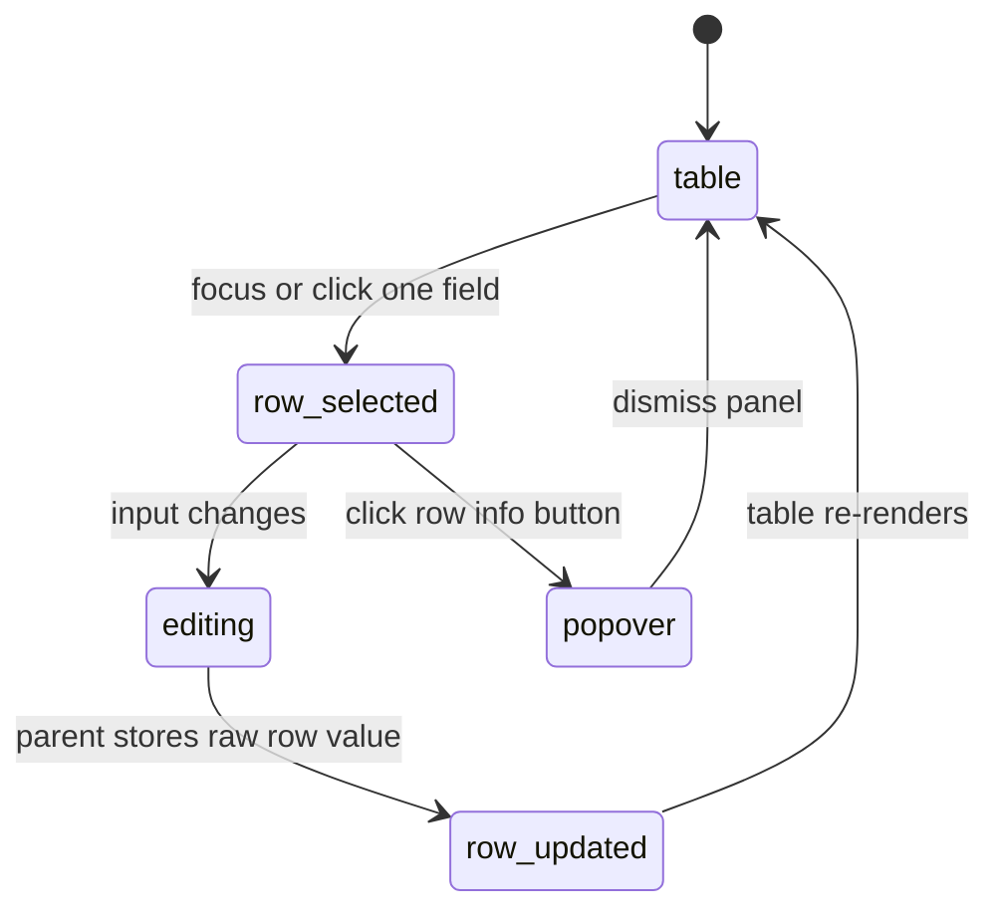

# Spreadsheet integration

## Summary

The Spreadsheet story places three `QuantityInput` fields inside a two-column table and controls them from one array of raw strings. Each row shows a node label and a pressure field; editing one row calls the parent with a raw value and replaces only that row's value. The component's validation and conversion behavior remains the same as in Default.

## The simple case

The story shows rows `P-1`, `P-2`, and `P-3` with `1 bar`, `250 kPa`, and `14.5 psi`. Each field declares `bar` and offers the same `bara`, `kPa`, and `psi` conversions. The field borders are merged into the table cell so the grid reads as one table rather than three floating controls.

Click a row's info button to inspect that row's conversions. Edit one field and the row's parent value changes while the other two rows retain their text. Each row can be valid or invalid independently, although all three share the same runtime provider.

## The interaction, event by event

### Arrive

The story initializes an array of three raw values and maps it to rows. React keys each row by array index. Every field receives its array item as a controlled `value`, the shared pressure conversion list, and a `groupClassName` that extends the field across the table-cell border.

### Leave untouched

Rows are visible without any input focus. Initial values are displayed exactly as supplied: `1 bar`, `250 kPa`, and `14.5 psi`. Once the runtime is ready, each is checked for compatibility with `bar`; the conversion text is derived separately.

### Begin editing

The user chooses one row's text field and changes its raw string. The field calls `onValueChange` with the exact new string. The story's parent maps over the current array and replaces only the item at the edited index.

### While editing

The edited field is controlled, so the callback alone does not change its display. The parent update supplies the new `value`, causing that row to re-render and re-evaluate. Other rows receive their existing values and remain unchanged. Clicking a row's info button opens that row's panel through a portal rather than changing the table layout.

If the edited text is incompatible, only the edited field receives invalid state and an invalid panel message. The parent still stores the raw string, so the user can correct it. The table does not submit or persist the values.

### Finish editing

The row update finishes when the parent array has been rendered with the new raw value. There is no row-level save button, undo, or server request. Moving to another row leaves the last parent-stored text in place while the component remains mounted.

## Modifiers

| Variant | Set at the start | Changed while extended |
| --- | --- | --- |
| Controlled or uncontrolled value | All Spreadsheet fields are controlled by the row array. | Parent array updates are required for the visible value to change. |
| Default value | No `defaultValue` is used; array values supply the initial text. | Changing the array replaces the matching row. |
| Declared unit | Every row declares `bar`. | A story change would re-evaluate that row's current value. |
| Conversion list | All rows share the same three conversion definitions. | A changed list affects every field on the next render. |
| Locale | All rows use the component default locale. | A changed locale reformats all converted text. |
| Runtime readiness | All rows wait on the shared provider. | Readiness transitions all current fields together. |

## Cancel and interrupt

| Event | Before extended | While extended |
| --- | --- | --- |
| Escape | Dismisses a row popover without changing the array. | Dismisses the panel; parent-stored text remains. |
| Clicking or interacting elsewhere | Selects another row without changing untouched values. | Focus can move to another row; the latest callback may already have updated the array. |
| Closing the conversion popover | No row value is committed by closing. | The panel closes without changing its row. |
| Runtime or browser failure | Shared loading/error behavior affects all rows. | A row evaluation can become invalid; an unmount loses local UI but not any external array owned by the story. |
| Reloading or closing the tab | The story's array is recreated from its initial values. | All edits are lost on reload because the story has no persistence. |
| Parent changes the value or props | New array values determine rows. | A parent update can overwrite the user's current edit. |
| Input channel changes through paste, autofill, or another device | The affected row receives the delivered string. | The parent stores the latest delivered row value. |

## Interactions with other systems

**Validation and error display.** Each row derives its own field status and panel message.

**Controlled and uncontrolled state.** The story is controlled and demonstrates parent-owned raw values.

**Conversion formatting and locale.** All rows share conversion definitions and formatting defaults.

**Callbacks.** The row's `onValueChange` is the bridge from the component to the array update.

**Focus and keyboard access.** The table contains multiple independent text fields and buttons; focus moves among them normally.

**Dim runtime and provider.** One provider gates all rows; a shared readiness change can update the whole table.

**Popover and portal behavior.** Row panels render outside the cell, reducing clipping risk.

**Layout and table integration.** `groupClassName` merges the component border into each cell and expands its width by two pixels.

**Browser accessibility semantics.** The table headers label the columns visually, but the inputs themselves do not receive explicit aria labels in the story.

## Edge cases

- Editing one row does not update the other array entries.
- A value such as `250 kPa` remains displayed in kPa even though the declared unit is bar.
- Invalid raw text is still stored by the parent array.
- Row keys use indexes, so the story does not model row insertion or reordering.
- All three popovers use the same default accessible label, making their row identity dependent on surrounding position rather than the button name.

## Open questions and verification

- The exact visual border merge and popup positioning inside the table need browser verification.
- The lack of per-row input labels may be worth treating as an accessibility bug rather than documenting as intended.
- The story's controlled update is synchronous in the render function; delayed parent updates are out of scope and untested.

Verified against /Users/jerell/Repos/dim commit `c26ec6a`.
