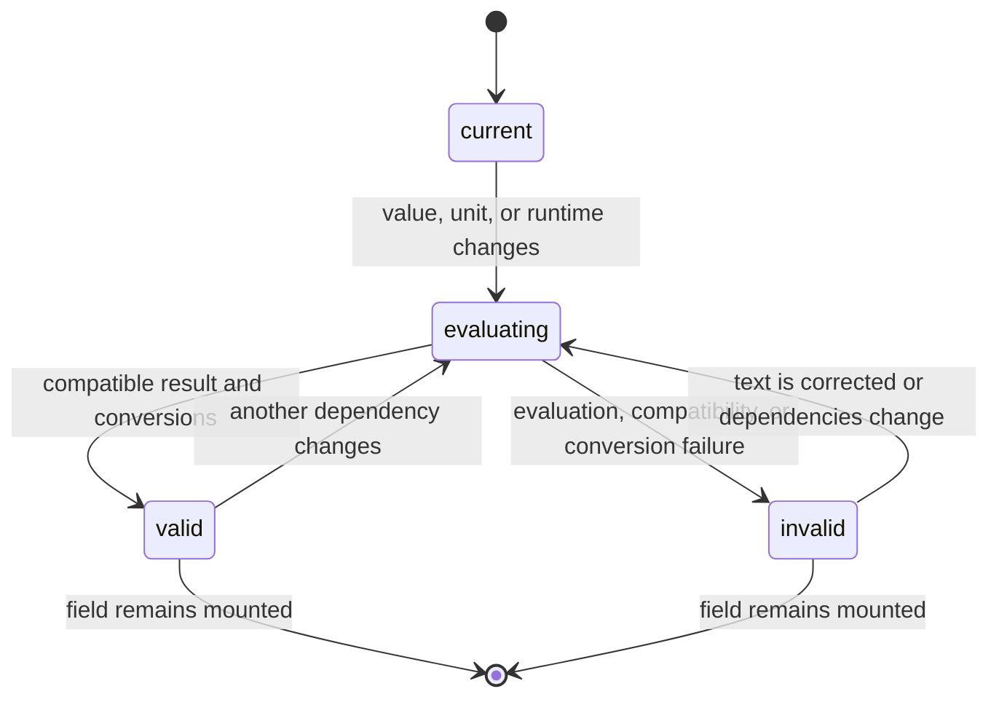

# Validation and conversions

## Summary

The component evaluates the current raw value, checks whether its dimension matches the declared unit, and converts it into every requested target when valid. The Default and Invalid stories make this visible through valid conversion rows or an invalid message. The field keeps the user's text even when the result cannot be evaluated.

## The simple case

With `1 bar` and the default conversion list, the field is compatible with `bar`. Opening the info button shows `Converted values` followed by `1.000 bara`, `100.0 kPa`, and `14.50 psi`.

If the user changes the field to `12 kg`, evaluation succeeds as a quantity but compatibility with `bar` fails. The field stays visibly `12 kg`, receives invalid styling, and the popover says `Invalid quantity` and `Not compatible with bar`.

## The interaction, event by event

### Arrive

The component derives an expression from the raw value and declared unit. It does not attempt evaluation until the runtime is ready. A valid starting expression receives its result and conversion list after the evaluation effect runs.

### Leave untouched

No user edit is needed to validate the initial value. The Default story's `1 bar` is valid; the Invalid story's `12 kg` is invalid once the runtime evaluates it. Opening the popover is read-only.

### Begin editing

A change event supplies a new raw string. A finite numeric string is paired with the declared unit; a full expression is passed through. The component evaluates the derived expression and separately asks whether it is compatible with the declared unit.

### While editing

For a valid result, every conversion request is evaluated as an expression-to-unit conversion. The rows keep their configured order, label, and decimal-place rule. Formatting uses no grouping and the current locale. A conversion failure invalidates the field and clears all rows rather than showing only the successful subset.

For an invalid result, the component keeps the raw text, clears `result` and conversions, sets `aria-invalid`, and supplies the caught error to the panel. The validity check is dimensional: `kPa`, `bar`, and `psi` are compatible pressure units even though their scales differ.

Changing `unit`, `conversions`, `locale`, or runtime readiness re-runs the same process for the current expression. The component does not accumulate previous results or preserve stale conversion rows after failure.

### Finish editing

The latest valid or invalid state is sent to `onResultChange` after state updates when that callback exists. Converted values are not written into the input and no value is submitted. The next edit starts another evaluation from the new raw text.

## Modifiers

| Variant | Set at the start | Changed while extended |
| --- | --- | --- |
| Controlled or uncontrolled value | Either ownership supplies the expression to validate. | A parent-controlled replacement re-runs validation; local edits do so in uncontrolled mode. |
| Default value | Determines the first expression only in uncontrolled mode. | Does not reset an active local value. |
| Declared unit | Sets bare-number expansion and the compatibility requirement. | Reinterprets bare values and can turn a valid result invalid. |
| Conversion list | Sets target units, labels, order, and precision. | Recomputes all rows from the current result. |
| Locale | Sets number formatting language and separators. | Reformats text without changing the underlying converted numbers. |
| Runtime readiness | Prevents validation until ready. | Moves the field into or out of evaluation availability. |

## Cancel and interrupt

| Event | Before extended | While extended |
| --- | --- | --- |
| Escape | Does not cancel validation; it only dismisses transient panel UI. | Dismisses the panel and leaves the current result state. |
| Clicking or interacting elsewhere | Does not trigger a separate commit or revert. | The latest evaluation remains associated with the current text. |
| Closing the conversion popover | Hides result text without changing validation. | Hides result text without changing validation. |
| Runtime or browser failure | No result may be produced, leaving loading or invalid state. | A thrown evaluation or conversion becomes invalid; a browser unmount stops future updates. |
| Reloading or closing the tab | Loses all validation state. | Loses all validation state and visible conversion results. |
| Parent changes the value or props | New dependencies become the next validation input. | Old results can be replaced by the new evaluation. |
| Input channel changes through paste, autofill, or another device | The delivered string is validated normally. | The latest delivered string replaces the validation target. |

## Interactions with other systems

**Validation and error display.** This is the central behavior: compatibility and evaluation determine state and panel text.

**Controlled and uncontrolled state.** Ownership determines which raw string is validated.

**Conversion formatting and locale.** Numeric conversion happens before locale-specific text formatting.

**Callbacks.** `onResultChange` receives structured status, expression, result, conversion rows, and possible error.

**Focus and keyboard access.** Validation does not require blur and can occur while the input remains focused.

**Dim runtime and provider.** The runtime performs evaluation, compatibility, and batch conversion.

**Popover and portal behavior.** The panel is an observer of validation state, not its owner.

**Layout and table integration.** Invalid styling applies to each field group, including Spreadsheet cells.

**Browser accessibility semantics.** Invalid evaluation is surfaced through `aria-invalid`; the error text is visible only in the open panel.

## Edge cases

- `12 kg` is invalid for `bar` but remains editable as raw text.
- A bare `12` becomes `12 bar` for evaluation, while the input continues to show `12`.
- Full expressions can contain units and arithmetic; the field does not restrict input to digits.
- An empty conversion list does not make a valid expression invalid.
- A conversion list with an incompatible target can make an otherwise compatible source invalid because conversion is part of the valid path.
- Decimal places affect displayed text, not conversion arithmetic.

## Open questions and verification

- The component tests establish the main valid and incompatible paths, but do not cover conversion failure in one item of a multi-item list.
- The exact visual interval in which stale conversion rows might remain before the effect runs needs browser verification.
- Whether all runtime error messages are user-appropriate is a product review question.

Verified against /Users/jerell/Repos/dim commit `c26ec6a`.
