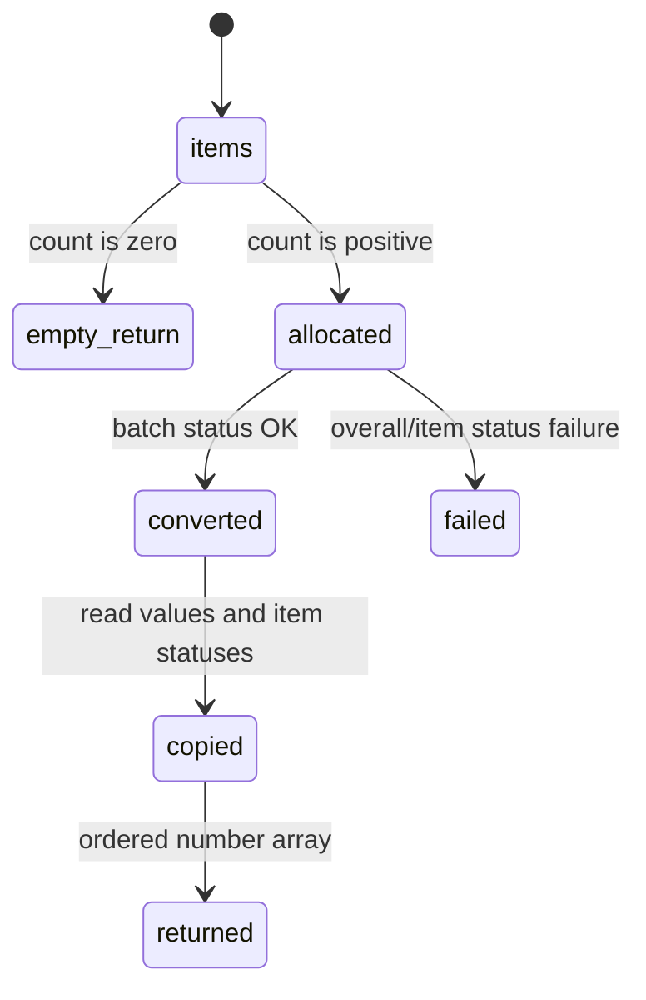

# Batch operations

## Summary

Batch helpers convert multiple expressions or numeric values in one call and return numbers in the original item order. Empty arrays return immediately. Non-empty arrays require a ready runtime, allocate arrays of inputs/outputs/statuses, and throw if the overall call or any item status is non-OK.

## The simple case

Call `batchConvertValues` with `1 bar -> Pa` and `2 km -> m`. It returns `[100000, 2000]` in the same order. A zero-length array returns `[]` without initialization or WASM work.

## The interaction, event by event

### Prepare

The caller constructs an ordered array of expression/unit pairs or value/from/to triples. Item count determines buffer sizes. Empty arrays are handled before requiring a runtime.

### Invoke

The wrapper writes slices and values, invokes the matching batch export, then reads output values and status words. The JavaScript array order is the contract for returned numbers.

### Compute

WASM processes each item in the current context. One item can fail while another would be valid; the wrapper checks each status while constructing the returned array.

### Read and format

The wrapper returns numbers only. It does not return per-item structured errors or formatted strings. Callers needing labels or diagnostics must issue individual calls or handle the thrown status text.

### Release or recover

The whole scratch allocation is reset after success or failure. A recovery invalidates any pending assumption about context constants or runtime memory.

## Modifiers

| Variant | Set at the start | Changed while extended |
| --- | --- | --- |
| Initialization source | Selects the runtime for all items. | Cannot change within batch. |
| Operation kind | Expression batch versus numeric batch chooses input arrays. | Fixed. |
| Runtime/context state | Constants and readiness apply to every item. | Later context changes do not alter current batch inputs. |
| Syntax normalization | Expression/unit slices are normalized; raw numeric arrays are not text-normalized. | Fixed after writing slices. |
| Single versus batch call | Batch count and order determine output array. | Count cannot change mid-call. |
| Format mode | Batch helpers return numbers without formatting mode. | Format afterward if needed. |

## Cancel and interrupt

| Event | Before extended | While extended |
| --- | --- | --- |
| Call before initialization | Empty batch returns; non-empty batch throws. | No cancellation hook. |
| Another API call or recovery begins | A later call is separate. | Shared runtime can be reset concurrently. |
| A call returns immediately | Empty input completes with `[]`. | Non-empty batch is synchronous after setup. |
| Fetch/WASM/runtime failure | No batch begins. | Overall or item status throws. |
| Page unload or worker termination | No array is persisted. | Host may abandon call. |
| Input bytes or context state changes | New array is independent. | Current slices/values are fixed. |
| Concurrent callers or a second runtime | One runtime/context is shared. | Callers must coordinate context/recovery. |

## Interactions with other systems

**Initialization and readiness.** Only non-empty batches require it.

**WASM memory and FFI reset.** Buffer sizes scale with item count.

**Errors and status codes.** Item statuses are checked and collapsed into thrown errors.

**Contexts and constants.** Every item resolves in the same context.

**Text encoding and syntax normalization.** Expression and unit slices are normalized.

**Numeric and format behavior.** Output is raw numbers, not formatted text.

**Browser/Node asset loading.** Asset source affects setup only.

**Batch operations.** This document owns ordering, empty behavior, and per-item status handling.

**Concurrency/resource cleanup.** Large arrays increase shared scratch usage.

## Edge cases

- Empty input returns without runtime initialization.
- Output order follows input order even when units differ.
- One bad item can prevent any array from being returned.
- Batch APIs do not preserve per-item error detail.

## Open questions and verification

- Maximum practical batch size and memory failure behavior need stress testing.
- Per-item error reporting may be a product/API improvement.

Verified against /Users/jerell/Repos/dim commit `811dcf0`.
