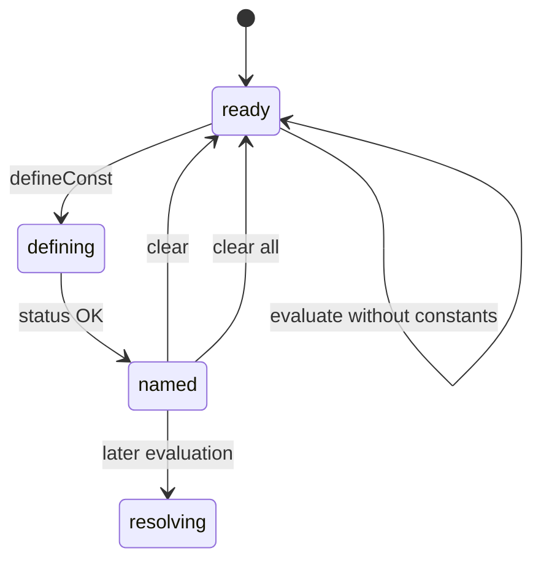

# Constants and contexts

## Summary

The wrapper exposes runtime constants in one shared context through `defineConst`, `clearConst`, and `clearAllConsts`. A constant changes how later expressions resolve a name, but it is neither persisted nor independently scoped per caller. Recovery creates a fresh context and removes all constants.

## The simple case

After initialization, call `defineConst("workday", "8 h")`. `evalStructured("2 workday as h")` then returns 16 hours. `clearConst("workday")` removes it; `clearAllConsts` removes every constant. Reinitializing through recovery starts empty.

## The interaction, event by event

### Prepare

The caller chooses a name and expression. Names are written raw; expressions are normalized. The current shared runtime/context must be ready.

### Invoke

Definition calls are synchronous and throw on non-OK status. Clear calls do not return a status; they clear the requested name or all names in the context.

### Compute

WASM evaluates the definition and stores a unit-like value. Later expression calls resolve constants before built-in registries.

### Read and format

Constants are observed through later structured results or formatted strings. The wrapper does not expose a list operation for constants.

### Release or recover

Clear calls remove logical state. `recoverDim` frees the context, so constants disappear even when the same asset is loaded again.

## Modifiers

| Variant | Set at the start | Changed while extended |
| --- | --- | --- |
| Initialization source | Determines the context instance. | Recovery changes context/source. |
| Operation kind | Define, clear-one, clear-all, or evaluate chooses state effect. | Fixed per call. |
| Runtime/context state | Constants require ready shared context. | Any caller using shared runtime sees changes. |
| Syntax normalization | Expression value normalized; name preserved raw. | Current definition is fixed. |
| Single versus batch call | Constants are single operations; later batch calls see them. | No effect on current call. |
| Format mode | Only later output formatting uses mode. | No effect on stored constant. |

## Cancel and interrupt

| Event | Before extended | While extended |
| --- | --- | --- |
| Call before initialization | Define/clear throws or cannot run. | No cancel hook. |
| Another API call or recovery begins | Later call can observe current state. | Recovery can remove constants for later callers. |
| A call returns immediately | Clear is immediate. | Definition finishes synchronously. |
| Fetch/WASM/runtime failure | No definition is stored. | Status failure throws; context may remain usable. |
| Page unload or worker termination | Constants disappear. | No persistence. |
| Input bytes or context state changes | New definition/name is independent. | Current name/value already copied. |
| Concurrent callers or a second runtime | Shared context has no per-caller isolation. | Concurrent mutation needs coordination. |

## Interactions with other systems

**Initialization and readiness.** Constants require runtime readiness.

**WASM memory and FFI reset.** Names/expressions are temporary input buffers.

**Errors and status codes.** Definition status throws; clear operations are silent.

**Contexts and constants.** This document owns shared constant state.

**Text encoding and syntax normalization.** Names and definitions use different writers.

**Numeric and format behavior.** Stored constants are unit-like values used by evaluation.

**Browser/Node asset loading.** Asset source does not persist constants.

**Batch operations.** Later batch expressions see the current context constants.

**Concurrency/resource cleanup.** Shared mutable context is not a lock.

## Edge cases

- Clearing an unknown name is silent.
- Recovery clears constants without a separate clear callback.
- Constant names can shadow built-in unit names.
- The wrapper provides no enumeration API.

## Open questions and verification

- Shared-context concurrency and constant mutation ordering need a decision/documentation.
- Whether callers need a list/read API is a product/API question.

Verified against /Users/jerell/Repos/dim commit `5d9cf0d`.
