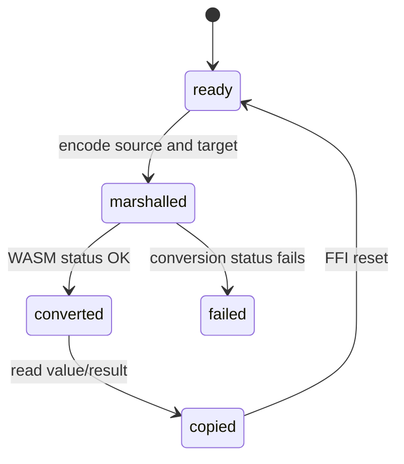

# Conversions

## Summary

The wrapper exposes expression-to-unit conversion, numeric value conversion, compatibility, and dimensional comparison. Single calls return copied values or booleans; invalid status usually throws for conversions and returns false for predicates. The caller can choose affine units, compound units, and direct numeric paths.

## The simple case

After initialization, `convertValue(1, "bar", "Pa")` returns `100000`. `convertExpr("100 km/h", "m/s")` returns a structured quantity result. `isCompatible("1 m", "km")` returns true, while failed predicate status returns false rather than throwing.

## The interaction, event by event

### Prepare

The caller supplies an expression and target unit, or a numeric value with from/to units. The wrapper normalizes string syntax and allocates the appropriate output record.

### Invoke

`convertExpr`, `convertValue`, `isCompatible`, and `sameDimension` synchronously call the current context. They require prior initialization except where an empty batch shortcut applies.

### Compute

WASM converts through canonical units and applies affine/delta semantics. Expression conversion returns dimensions, unit, mode, value, and delta marker. Numeric conversion returns only a number.

### Read and format

The wrapper copies structured quantity fields or reads a number/boolean. Callers can use `formatQuantity` afterward; conversion itself does not return display text.

### Release or recover

The operation resets scratch memory. A recovery invalidates the context and removes constants that later conversions might otherwise resolve.

## Modifiers

| Variant | Set at the start | Changed while extended |
| --- | --- | --- |
| Initialization source | Chooses the runtime used for conversion. | Recovery is required to change it. |
| Operation kind | Expression, numeric, compatibility, or dimension comparison selects behavior. | Fixed for the call. |
| Runtime/context state | Current constants and ready context affect lookup. | Later context changes affect later calls only. |
| Syntax normalization | Expression/unit strings are normalized before conversion. | Input is fixed once marshalled. |
| Single versus batch call | Scalar call returns one result; batch returns ordered array. | Batch count cannot change. |
| Format mode | Expression target can carry a format mode; numeric conversion has none. | Formatting after return is independent. |

## Cancel and interrupt

| Event | Before extended | While extended |
| --- | --- | --- |
| Call before initialization | Throws or predicate cannot return true. | No cancellation hook. |
| Another API call or recovery begins | Later call uses current runtime. | Shared recovery can invalidate later state. |
| A call returns immediately | Predicate and numeric calls return synchronously. | No partial conversion is exposed. |
| Fetch/WASM/runtime failure | No conversion begins. | Non-OK status throws for conversion calls. |
| Page unload or worker termination | No result survives. | Host can abandon the synchronous call. |
| Input bytes or context state changes | New call sees new target/constants. | Current buffers/results are fixed. |
| Concurrent callers or a second runtime | Calls share one context. | FFI reset and context mutation are shared concerns. |

## Interactions with other systems

**Initialization and readiness.** Conversion requires runtime readiness.

**WASM memory and FFI reset.** Inputs/results use temporary buffers.

**Errors and status codes.** Conversion throws on non-OK; predicates return false.

**Contexts and constants.** Current context names can be conversion targets.

**Text encoding and syntax normalization.** String inputs are normalized.

**Numeric and format behavior.** Affine/delta and structured mode fields affect results.

**Browser/Node asset loading.** Runtime source is external to conversion semantics.

**Batch operations.** Batch conversion shares the same per-item status rules.

**Concurrency/resource cleanup.** Calls use the shared runtime and reset scratch memory.

## Edge cases

- A conversion can be dimensionally compatible while using a different scale.
- Affine temperature conversion differs for absolute and delta values.
- `sameDimension` compares expressions rather than unit names.
- Predicate failures are represented as false, which can conceal whether input was invalid.

## Open questions and verification

- The caller-facing distinction between invalid input and false compatibility needs documentation review.
- Browser behavior for URL-loaded conversion assets needs a harness.

Verified against /Users/jerell/Repos/dim commit `811dcf0`.
