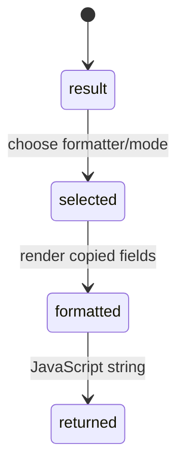

# Formatting

## Summary

The wrapper formats structured results into strings without calling WASM again. `formatEvalResult` handles every result kind; `formatQuantity` handles delta markers, units, dimensionless values, and four format modes. Formatting is synchronous and operates on copied JavaScript data.

## The simple case

Call `formatEvalResult(evalStructured("1 bar as kPa"))` to receive text such as `100 kPa`. A scientific result uses three decimal places and `e` notation; an engineering result chooses an exponent divisible by three; auto uses fixed three-decimal output.

## The interaction, event by event

### Prepare

The caller holds a structured result or chooses a formatter after an API call. No runtime is required for formatting a copied result.

### Invoke

`formatEvalResult` dispatches by result kind. `formatQuantity` uses the quantity's mode, value, unit, and dimension. Convenience `evalDim` evaluates and immediately formats while runtime is required for the evaluation half.

### Compute

The formatter adds a delta prefix when `isDelta` is true, omits unit `1` for dimensionless values, and chooses numeric notation based on mode.

### Read and format

The return is an ordinary JavaScript string. Reformatting the same copied result with another function/mode does not change the structured result.

### Release or recover

No FFI reset or runtime release is needed for pure formatting. A copied result remains usable after runtime recovery.

## Modifiers

| Variant | Set at the start | Changed while extended |
 --- | --- | --- |
| Initialization source | Only affects `evalDim`'s evaluation half. | Pure formatting is independent. |
| Operation kind | Structured result versus convenience text selects output. | Fixed per call. |
| Runtime/context state | Required only to produce a result. | Does not affect copied result formatting. |
| Syntax normalization | Relevant only before evaluation. | No effect. |
| Single versus batch call | Formatting functions handle one copied result at a time. | No effect. |
| Format mode | Result mode selects notation; helper output follows it. | A different formatter can be called afterward. |

## Cancel and interrupt

| Event | Before extended | While extended |
 --- | --- | --- |
| Call before initialization | Pure formatting still works on a copied result; evaluation helpers throw. | No cancellation. |
| Another API call or recovery begins | Independent copied values can be formatted. | Current JS formatting is synchronous. |
| A call returns immediately | String formatting returns immediately. | No partial WASM result. |
| Fetch/WASM/runtime failure | Only evaluation half can fail. | Pure formatting cannot fetch. |
| Page unload or worker termination | String is lost with page if not stored. | Host may abandon call. |
| Input bytes or context state changes | Copied result is independent. | No effect. |
| Concurrent callers or a second runtime | Pure formatter is stateless. | Independent copied results remain safe. |

## Interactions with other systems

**Initialization and readiness.** Pure formatting is runtime-free.

**WASM memory and FFI reset.** It consumes copied fields only.

**Errors and status codes.** Unknown result kind formats as nil rather than throwing.

**Contexts and constants.** Not consulted by pure formatting.

**Text encoding and syntax normalization.** Not consulted.

**Numeric and format behavior.** This document owns mode-specific text.

**Browser/Node asset loading.** Not consulted.

**Batch operations.** Batch numeric arrays need caller formatting.

**Concurrency/resource cleanup.** Pure formatting has no shared runtime state.

## Edge cases

- Dimensionless results omit a unit unless the unit is not `1`.
- Engineering zero formats as `0.000`.
- Scientific mode removes the plus sign from positive exponents.
- String results return their string directly; nil returns `nil`.

## Open questions and verification

- Locale-sensitive formatting is not used; whether that is intentional needs product review.
- Exact negative engineering exponent formatting needs boundary checks.

Verified against /Users/jerell/Repos/dim commit `811dcf0`.
