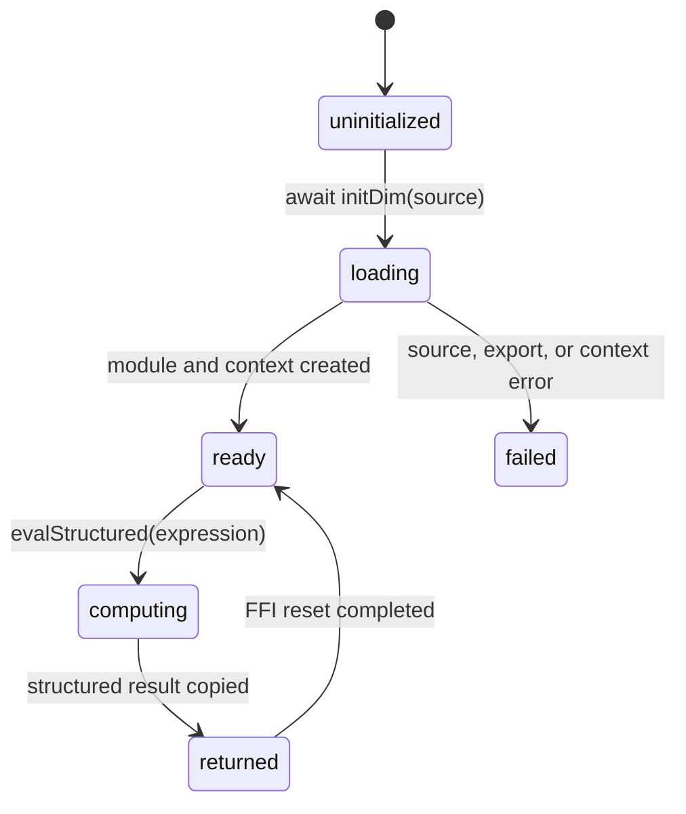

# Initialization and evaluation

## Summary

The wrapper's smallest complete browser interaction is loading a WASM source and evaluating one expression as a structured JavaScript result. A caller awaits `initDim`, then calls `evalStructured` or `evalDim`. The first call creates one shared runtime/context; later calls reuse it until recovery or page teardown.

## The simple case

A browser application calls `await initDim({ wasmUrl: "/dim/dim_wasm.wasm" })`. When the promise resolves, it calls `evalStructured("100 km/h as m/s")` and receives a quantity result with value near `27.777...`, unit `m/s`, rational dimensions, and mode `none`.

The caller can use `formatEvalResult` or `evalDim` to turn that result into text. The runtime remains available for later operations. No UI or persistent storage is created by the wrapper.

## The interaction, event by event

### Prepare

The caller chooses explicit bytes, base64, a URL, or default asset discovery. The wrapper has no usable runtime before initialization. A second `initDim` while the first promise exists reuses that promise rather than creating a second runtime.

### Invoke

`initDim` returns a promise. After it resolves, `evalStructured` is a synchronous call that requires readiness. `evalDim` combines structured evaluation and formatting. Calling an operation first throws `dim not initialized. Call initDim() first.`.

### Compute

The wrapper encodes and normalizes the expression, allocates input and result buffers, calls the WASM context evaluator, checks the status, and reads the result kind and fields. Numbers, booleans, strings, quantities, and nil have different structured shapes.

### Read and format

The wrapper copies strings and dimensions into JavaScript values before resetting the FFI arena. `formatEvalResult` renders the copied value; quantity formatting includes delta markers, units, and the selected format mode.

### Release or recover

A single evaluation resets the FFI arena in `finally`, but the JavaScript result remains usable because its strings and numbers were copied. `recoverDim` releases the context and initializes a new runtime; constants and old runtime state do not carry over.

## Modifiers

| Variant | Set at the start | Changed while extended |
| --- | --- | --- |
| Initialization source | Bytes, base64, URL, or default discovery selects loading behavior. | The current initialization source cannot change; use recovery. |
| Operation kind | Structured evaluation, text evaluation, or formatting selects result shape. | A call kind cannot change mid-call. |
| Runtime/context state | Ready runtime is required for evaluation. | Recovery makes the shared runtime unavailable and creates a new context. |
| Syntax normalization | The wrapper normalizes Unicode operators and scientific notation before evaluation. | Input text is fixed for the call. |
| Single versus batch call | `evalStructured` handles one expression; batch APIs handle arrays. | Batch size is fixed once called. |
| Format mode | Expression suffix or result mode controls rendering. | Formatting after return can use a different function but does not change the result. |

## Cancel and interrupt

| Event | Before extended | While extended |
| --- | --- | --- |
| Call before initialization | Throws immediately and no WASM call begins. | Not applicable once evaluation has begun. |
| Another API call or recovery begins | A second init can share the in-flight promise; recovery replaces runtime state. | A concurrent recovery can invalidate shared state for later calls; current synchronous call has no cancellation hook. |
| A call returns immediately | Empty/simple wrapper paths return their value; no partial result is exposed. | `evalStructured` completes synchronously after initialization. |
| Fetch/WASM/runtime failure | Initialization rejects and readiness remains false. | A non-OK status or trap throws; FFI reset still runs for wrapper calls. |
| Page unload or worker termination | No runtime state survives. | The call can be abandoned by the host environment. |
| Input bytes or context state changes | New calls use new input or current constants. | Current input is copied into the call; later mutation does not change it. |
| Concurrent callers or a second runtime | All callers share module-level runtime state. | Calls must not assume independent contexts. |

## Interactions with other systems

**Initialization and readiness.** Every runtime operation depends on this lifecycle.

**WASM memory and FFI reset.** The wrapper copies results before resetting scratch allocations.

**Errors and status codes.** Non-OK status becomes a JavaScript error for most operations.

**Contexts and constants.** The default context persists constants until recovery or clearing.

**Text encoding and syntax normalization.** Input is encoded and normalized before WASM sees it.

**Numeric and format behavior.** Structured values retain numeric precision; formatting is a separate choice.

**Browser/Node asset loading.** Source discovery differs by browser and Node environment.

**Batch operations.** Batch calls are separate operations with array-specific status handling.

**Concurrency/resource cleanup.** The module-level runtime and FFI reset impose shared lifetime rules.

## Edge cases

- `initDim` with no options searches multiple browser paths and rejects after all fail.
- A result's raw WASM pointers are not usable after the wrapper returns; copied objects are.
- `evalStructured` returns `nil` for the corresponding result kind rather than JavaScript `null`.
- `formatEvalResult` does not add a unit to numbers or booleans.
- Calling `recoverDim` clears constants even when the same bytes are loaded again.

## Open questions and verification

- Browser fetch timing and the exact first-load failure aggregation need a browser harness.
- Concurrent `recoverDim` and evaluation behavior is not covered by tests and may need a product decision.
- The source test exercises Node loading, not a real browser's module-relative URL behavior.

Verified against /Users/jerell/Repos/dim commit `811dcf0`.
