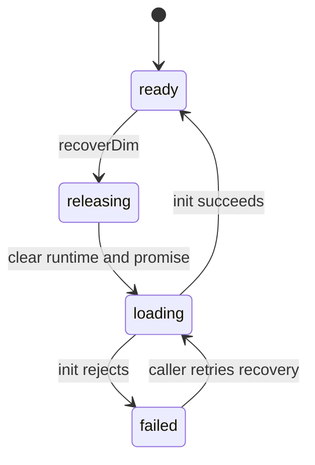

# Recovery

## Summary

`recoverDim` lets a caller replace a failed or outdated runtime with a newly loaded one. It clears the current context and initialization promise, emits not-ready, and awaits a fresh `initDim`. Recovery is process-local and removes constants; previously copied JavaScript results remain ordinary values.

## The simple case

Call `await recoverDim({ wasmBase64 })` after initialization. When it resolves, conversion calls work against a new context. Any constants defined before recovery are gone. A failed recovery leaves the wrapper unready and rejects its promise.

## The interaction, event by event

### Prepare

The caller selects a new or repeated asset source. Recovery can be called with bytes, base64, URL, or default discovery. Existing runtime state is still available until recovery begins its release step.

### Invoke

`recoverDim` frees the current context, nulls runtime, resets the promise, emits false, and awaits initialization. It is asynchronous.

### Compute

The new initialization validates exports and creates a fresh context. It does not transfer constants or pending scratch allocations from the previous runtime.

### Read and format

After the returned promise resolves, normal calls read from the new runtime. Results copied before recovery remain valid JavaScript objects but no longer represent current context state.

### Release or recover

This phase is the operation's commit: old context is released and new readiness is established or failure is reported. There is no rollback to the old runtime after it is freed.

## Modifiers

| Variant | Set at the start | Changed while extended |
| --- | --- | --- |
| Initialization source | New source chooses replacement runtime. | Cannot change until another recovery. |
| Operation kind | Recovery is a lifecycle call, not evaluation. | Fixed. |
| Runtime/context state | Existing runtime may be ready, failed, or absent. | All callers see unready then new ready/failed state. |
| Syntax normalization | Not relevant to asset loading. | No effect. |
| Single versus batch call | Recovery is single and asynchronous. | No effect. |
| Format mode | Not relevant. | No effect on copied old results. |

## Cancel and interrupt

| Event | Before extended | While extended |
| --- | --- | --- |
| Call before initialization | Recovery can initialize from an unready state. | No cancellation method. |
| Another API call or recovery begins | A later recovery replaces the current promise/runtime. | Concurrent recovery can race and should not be assumed safe. |
| A call returns immediately | `recoverDim` returns a promise, not an immediate ready result. | Old runtime is already released before new readiness. |
| Fetch/WASM/runtime failure | New initialization rejects; runtime remains null. | No automatic rollback. |
| Page unload or worker termination | New runtime is abandoned. | Old runtime is already gone. |
| Input bytes or context state changes | New source controls next runtime. | Current source is captured by initialization. |
| Concurrent callers or a second runtime | All callers share module state. | Calls during recovery can throw not-initialized. |

## Interactions with other systems

**Initialization and readiness.** Recovery transitions readiness for every caller.

**WASM memory and FFI reset.** Old memory/context is released.

**Errors and status codes.** New initialization errors reject the recovery promise.

**Contexts and constants.** New context has no old constants.

**Text encoding and syntax normalization.** Only later API inputs normalize.

**Numeric and format behavior.** Copied old results are unaffected; new calls use new runtime.

**Browser/Node asset loading.** Recovery repeats the normal source selection rules.

**Batch operations.** Batches called during recovery fail until readiness returns.

**Concurrency/resource cleanup.** Recovery is the cleanup boundary and shared-state hazard.

## Edge cases

- Recovering with the same bytes still clears constants.
- A failed recovery clears the initialization promise so another attempt is possible.
- A caller holding a copied result can format it after recovery, but cannot use its old runtime pointers.

## Open questions and verification

- Concurrent recovery semantics are not defined and may need an explicit guard.
- Browser behavior when recovery is triggered during page navigation needs a harness.

Verified against /Users/jerell/Repos/dim commit `811dcf0`.
