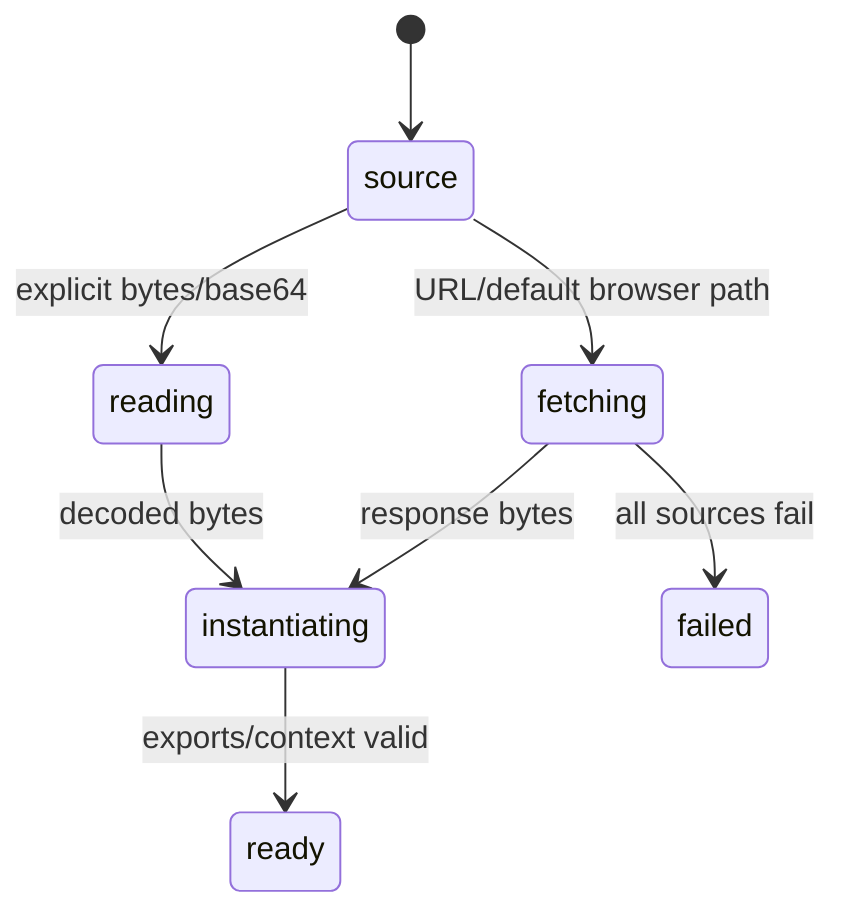

# Browser loading

## Summary

The wrapper can load its WASM artifact from explicit bytes, base64, a URL, or default browser candidates. Browser defaults try module-relative binary/base64 paths and root `/dim/` paths; Node defaults use filesystem candidates. Fetches use `cache: "no-cache"` and reject non-OK responses.

## The simple case

A browser caller supplies `wasmUrl` or uses the default colocated asset. `initDim` fetches bytes, instantiates the module with the wrapper's WASI imports, validates required exports, and resolves. A missing or non-OK source causes an initialization rejection containing the attempted source failures.

## The interaction, event by event

### Prepare

The caller chooses source and optional fetch options. Explicit bytes/base64 take precedence over URL and default discovery. The browser does not use Node filesystem candidates.

### Invoke

`initDim` fetches with no-cache semantics for URLs, decodes base64 text when the source suffix or option indicates it, and passes bytes to WebAssembly instantiation.

### Compute

The wrapper supplies WASI imports. Unsupported filesystem, clock, polling, and many descriptor operations return `ENOTSUP`; `proc_exit` throws an error. Required exports are checked before context creation.

### Read and format

After initialization resolves, API calls use the runtime. Loading failures are JavaScript errors; no partial ready runtime is exposed.

### Release or recover

Recovery repeats loading and instantiation after freeing the old context. The page or worker owns the lifetime of the resulting runtime.

## Modifiers

| Variant | Set at the start | Changed while extended |
 --- | --- | --- |
| Initialization source | Bytes/base64/URL/default selects source and transport. | Use recovery to switch source. |
| Operation kind | Init, evaluation, conversion, or recovery chooses runtime use. | Fixed per call. |
| Runtime/context state | Browser runtime may be absent or ready. | Recovery changes all callers' state. |
| Syntax normalization | Asset loading does not normalize expression text. | No effect. |
| Single versus batch call | Asset loading is one module/context. | No effect. |
| Format mode | Not relevant to loading. | No effect. |

## Cancel and interrupt

| Event | Before extended | While extended |
 --- | --- | --- |
| Call before initialization | Runtime calls fail; initialization can begin. | No cancel API for fetch. |
| Another API call or recovery begins | Calls wait/throw according to readiness. | Recovery can replace runtime. |
| A call returns immediately | Explicit bytes avoid fetch but instantiation remains async. | No partial ready state. |
| Fetch/WASM/runtime failure | Rejects with source/instantiate error. | Current operation can fail if runtime disappears. |
| Page unload or worker termination | Fetch/instantiate promise can be abandoned. | Runtime is lost. |
| Input bytes or context state changes | New source applies on later recovery. | Current bytes are fixed. |
| Concurrent callers or a second runtime | Module-level source/promise is shared. | Multiple consumers do not get isolated modules. |

## Interactions with other systems

**Initialization and readiness.** Loading establishes readiness.

**WASM memory and FFI reset.** Instantiation creates memory and exports.

**Errors and status codes.** HTTP and export failures reject; WASI unsupported calls report errors.

**Contexts and constants.** A newly loaded module creates a new context.

**Text encoding and syntax normalization.** Loading bytes are not expression text.

**Numeric and format behavior.** Asset choice should not alter intended numeric semantics.

**Browser/Node asset loading.** This document owns environment-specific candidates.

**Batch operations.** Batch calls wait for the same runtime.

**Concurrency/resource cleanup.** Browser host lifetime controls module lifetime.

## Edge cases

- A `.wasm.base64` URL is decoded as text rather than treated as binary.
- Failed default candidates are aggregated into one initialization error.
- Browser default paths depend on where the wrapper is served.
- Empty environment/argv WASI imports are supported, while filesystem calls are intentionally unsupported.

## Open questions and verification

- The exact default candidate that wins in a deployed browser needs a browser harness.
- Cache behavior with service workers and no-cache fetches needs verification.
- Asset corruption and truncated base64 error messages need a product review.

Verified against /Users/jerell/Repos/dim commit `5d9cf0d`.
