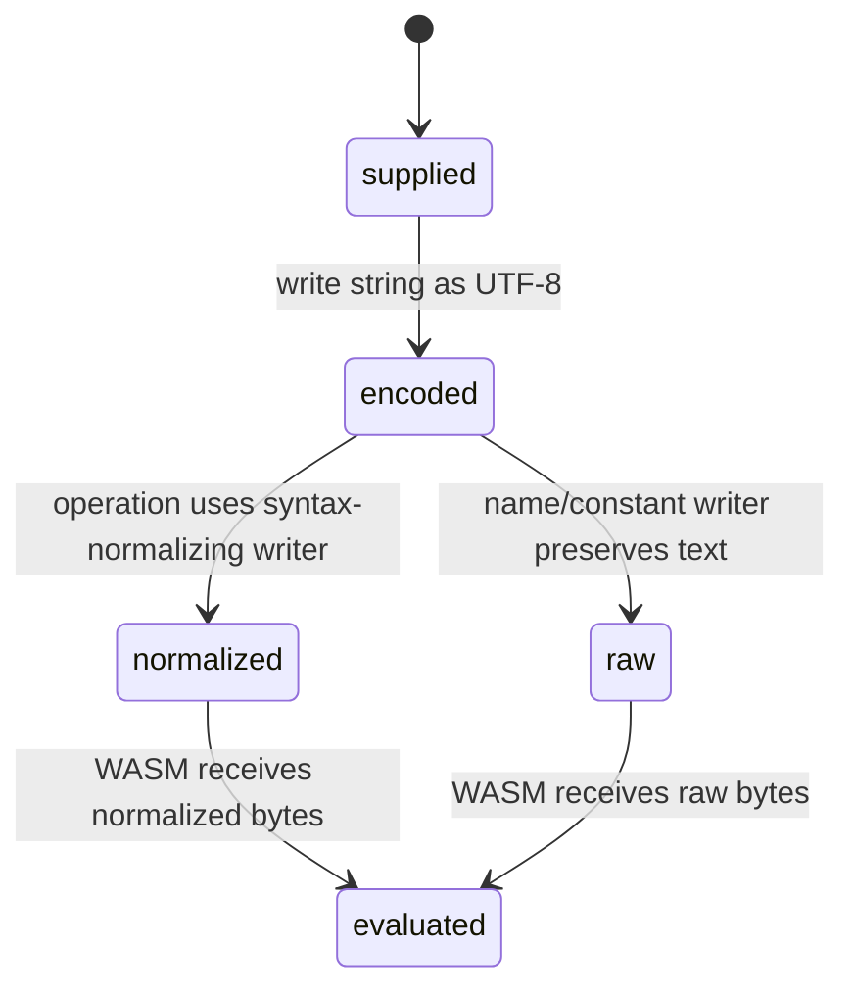

# Input normalization

## Summary

Before text reaches WASM, the wrapper encodes it as UTF-8 and normalizes selected syntax. Middle-dot multiplication becomes `*`, a small set of superscripts becomes caret notation, and scientific notation is expanded into decimal text within a 4096-character-index bound. This changes which browser strings the runtime accepts without changing the caller's original JavaScript string.

## The simple case

Call `evalStructured("1.5e3 m")`. The wrapper sends an expanded numeric representation and returns a quantity result equivalent to 1500 meters. A Unicode middle dot in a compound unit is normalized before evaluation. The caller still owns the original string it passed.

## The interaction, event by event

### Prepare

The caller supplies JavaScript strings. Expression and unit parameters use the normalizing writer; constant names use raw UTF-8 while constant expressions use normalized input.

### Invoke

The wrapper allocates a byte buffer and copies encoded text. No mutation is made to the original JavaScript string. Empty strings are still encoded for operations that accept them.

### Compute

Normalization replaces U+00B7 and U+22C5 with `*`, U+00B2/U+00B3 with `^2`/`^3`, and expands recognized scientific notation. It leaves unsupported values unchanged, allowing WASM to report a parse/runtime error.

### Read and format

Returned units and strings are decoded as UTF-8. Formatting operates on the structured result rather than re-normalizing the caller's original expression.

### Release or recover

The temporary normalized bytes are reclaimed by FFI reset. The caller must retain its own original strings if it needs to display or retry them.

## Modifiers

| Variant | Set at the start | Changed while extended |
| --- | --- | --- |
| Initialization source | Runtime availability determines whether normalization can be sent. | No effect on an already encoded call. |
| Operation kind | Expression/unit operations normalize; constant names use raw text. | Fixed by function. |
| Runtime/context state | Ready runtime is required except empty batch shortcut. | Context changes affect evaluation, not encoding. |
| Syntax normalization | Unicode/scientific input selects normalization paths. | Original string changes require a new call. |
| Single versus batch call | Batch entries are normalized item by item. | Batch contents are fixed. |
| Format mode | Formatting mode does not alter input normalization. | No effect. |

## Cancel and interrupt

| Event | Before extended | While extended |
| --- | --- | --- |
| Call before initialization | Normalizing operation throws before encoding. | No separate cancel. |
| Another API call or recovery begins | Later call gets its own temporary bytes. | Current bytes are already copied. |
| A call returns immediately | Empty batch skips normalization. | Synchronous call completes after WASM. |
| Fetch/WASM/runtime failure | No normalized bytes reach WASM. | Error cleanup still resets scratch memory. |
| Page unload or worker termination | Temporary buffers disappear. | Result may be abandoned. |
| Input bytes or context state changes | New strings are normalized independently. | Current bytes do not change. |
| Concurrent callers or a second runtime | Shared runtime memory is used. | Concurrent resets require caller discipline. |

## Interactions with other systems

**Initialization and readiness.** Encoding needs runtime allocation.

**WASM memory and FFI reset.** Normalized buffers are temporary scratch allocations.

**Errors and status codes.** Unsupported syntax is left for WASM to reject.

**Contexts and constants.** Raw constant names preserve exact names; definitions normalize expressions.

**Text encoding and syntax normalization.** This document owns transformation rules.

**Numeric and format behavior.** Scientific expansion can change textual precision before parsing.

**Browser/Node asset loading.** No difference once the wrapper is initialized.

**Batch operations.** Each item is normalized before its slice is sent.

**Concurrency/resource cleanup.** The normalized buffer is not caller-owned.

## Edge cases

- Scientific notation with an exponent beyond the decimal-index bound remains unchanged.
- Middle dots in a constant name are not normalized by the raw name writer.
- Only specific superscript characters are rewritten.
- A leading plus sign is preserved by scientific expansion rules where applicable.
- Locale-specific decimal commas are not normalized into dots.

## Open questions and verification

- The complete set of Unicode syntax cases accepted by WASM needs browser/Node assertions beyond the current wrapper test.
- Scientific expansion's 4096 bound is an implementation limit that should be documented or tested at its boundary.

Verified against /Users/jerell/Repos/dim commit `811dcf0`.
