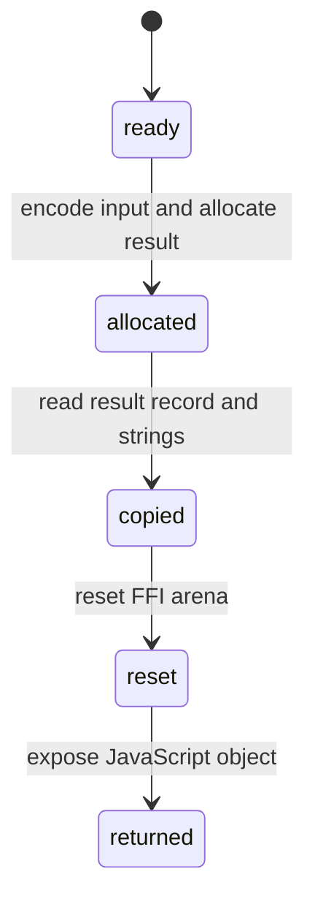

# Result and memory

## Summary

The wrapper exchanges UTF-8 strings, numbers, slices, and fixed-size result records with WASM memory. It reads every result into ordinary JavaScript values and resets the FFI arena in a `finally` block. Callers can safely retain returned objects, but must not retain raw pointers or assume WASM scratch storage survives a call.

## The simple case

Call `evalStructured("1 bar as kPa")`. The returned object contains JavaScript numbers, strings, and rational pairs. After the call returns, the wrapper has reset scratch memory, but the returned unit string and fields remain usable.

## The interaction, event by event

### Prepare

A ready runtime supplies memory and allocation exports. The wrapper encodes input, allocates buffers, and writes pointers/lengths or numeric values into WASM memory.

### Invoke

The wrapper calls one exported operation with the context pointer and buffer pointers. Result records contain kind/value/dimension/unit fields; conversion calls use quantity or numeric output records.

### Compute

WASM writes output values and pointers into its FFI arena. The wrapper checks the operation status before reading output. A non-OK status becomes a `DimWasmError` for operations that use `expectStatus`; its status code is available to callers before scratch memory is reset.

### Read and format

The wrapper reads UTF-8 strings and rational dimensions into JavaScript objects. `formatQuantity` and `formatEvalResult` operate on copied data and do not call WASM.

### Release or recover

The `finally` block calls `dim_ffi_reset` for individual operations. The copied result remains valid; the original pointers do not. Recovery frees the context and invalidates all runtime memory.

## Modifiers

| Variant | Set at the start | Changed while extended |
| --- | --- | --- |
| Initialization source | Determines memory instance and export set. | Recovery can replace memory. |
| Operation kind | Chooses result record size and reader. | Fixed for the call. |
| Runtime/context state | Ready memory is required. | Recovery can invalidate shared memory for later calls. |
| Syntax normalization | Encoded input may be normalized first. | Bytes are fixed once written. |
| Single versus batch call | Determines scalar or array allocations. | Batch length cannot change mid-call. |
| Format mode | Determines copied mode field or later formatter choice. | Later formatting can choose another mode without changing copied values. |

## Cancel and interrupt

| Event | Before extended | While extended |
| --- | --- | --- |
| Call before initialization | No buffers are allocated; call throws. | No separate cancellation. |
| Another API call or recovery begins | A later call has separate scratch allocations. | Shared memory/concurrent reset can invalidate assumptions. |
| A call returns immediately | Empty batches avoid allocation and runtime use. | Single calls finish synchronously after WASM returns. |
| Fetch/WASM/runtime failure | No result is returned. | Status failure throws after cleanup. |
| Page unload or worker termination | Allocations disappear with the page. | Returned object may never reach the caller. |
| Input bytes or context state changes | A new call gets new buffers. | Current copied input/result is isolated from later JS changes. |
| Concurrent callers or a second runtime | One runtime/context is shared. | FFI reset is not a caller-owned lock. |

## Interactions with other systems

**Initialization and readiness.** Memory exists only after initialization.

**WASM memory and FFI reset.** This document owns copy/reset lifetime.

**Errors and status codes.** Status is checked before reading fields, and status-checked failures expose their numeric category through `DimWasmError.status`.

**Contexts and constants.** Context pointers are passed with each operation.

**Text encoding and syntax normalization.** String buffers use UTF-8.

**Numeric and format behavior.** JS numbers are read from little-endian WASM records.

**Browser/Node asset loading.** The source determines which instance memory is used.

**Batch operations.** Slice arrays and status arrays scale allocations by item count.

**Concurrency/resource cleanup.** Callers should not use raw memory after wrapper return.

## Edge cases

- Result strings are copied before reset, while raw pointers are not exposed by the public wrapper.
- Empty batch operations return without requiring runtime or allocating result arrays.
- A malformed result kind falls back to `nil` in the reader.
- A memory growth during an operation could invalidate a previously created DataView; source tests do not exercise this.

## Open questions and verification

- Browser memory-growth and concurrent-call behavior need a dedicated harness.
- The public wrapper does not expose a manual FFI reset; callers cannot control the scratch lifetime directly.

Verified against /Users/jerell/Repos/dim commit `5d9cf0d`.
