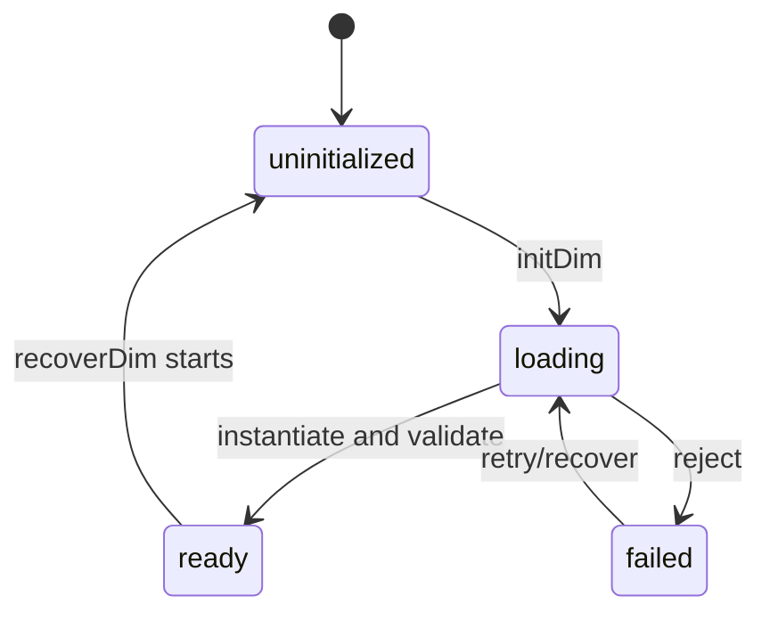

# Runtime lifecycle

## Summary

The wrapper has one module-level runtime lifecycle: uninitialized, loading, ready, or failed. `initDim` loads and validates the WASM module and creates a context; `recoverDim` tears down the current context and starts again. Every operation that touches WASM requires ready state.

## The simple case

Await `initDim` once. It resolves when required exports exist and a context has been created. Calls then reuse that context. If a call fails because the runtime is absent, initialize or recover before trying again.

## The interaction, event by event

### Prepare

The module begins with no runtime and no initialization promise. `initDim` selects the first initialization source and emits not-ready to subscribed listeners.

### Invoke

Initialization is asynchronous and deduplicated while its promise exists. The wrapper validates all required exports, creates a context, and stores memory, encoders, and decoders.

### Compute

The WASM instance and context become usable only after initialization resolves. A failed fetch, instantiation, missing export, or context allocation rejects initialization and resets the module-level runtime/promise.

### Read and format

Readiness is observed through `subscribeDimReady`, while operations observe it indirectly through `requireRuntime`. There is no public status object; callers use the initialization promise or catch the not-initialized error.

### Release or recover

`recoverDim` frees the existing context if present, clears runtime and promise state, emits false, and calls `initDim` again. A successful recovery creates a fresh context and loses prior constants.

## Modifiers

| Variant | Set at the start | Changed while extended |
| --- | --- | --- |
| Initialization source | Explicit bytes/base64/URL/default search chooses loading path. | Recovery can choose a new source. |
| Operation kind | No operation can run before ready. | Current initialization cannot change call kind. |
| Runtime/context state | Initial state is uninitialized. | Recovery or failure changes readiness for all callers. |
| Syntax normalization | Not relevant to module loading. | No effect. |
| Single versus batch call | Both require ready for non-empty operations. | No effect on current initialization. |
| Format mode | Not relevant to initialization. | No effect. |

## Cancel and interrupt

| Event | Before extended | While extended |
| --- | --- | --- |
| Call before initialization | Throws immediately. | A running operation has no wrapper cancellation method. |
| Another API call or recovery begins | Another init shares the promise; recovery resets it. | Shared runtime can be replaced while another caller is active. |
| A call returns immediately | `initDim` remains pending until load/instantiate completes. | Existing calls finish or throw according to host/WASM state. |
| Fetch/WASM/runtime failure | Initialization rejects and can be retried. | A failed export/status path rejects the operation. |
| Page unload or worker termination | Initialization promise is abandoned. | Runtime memory is lost with the host. |
| Input bytes or context state changes | A new source applies only on recovery. | Current instance does not change source. |
| Concurrent callers or a second runtime | No second module-level runtime is created by repeated init. | Callers share the one context. |

## Interactions with other systems

**Initialization and readiness.** This document owns state transitions.

**WASM memory and FFI reset.** Memory becomes available after instance creation.

**Errors and status codes.** Initialization errors reject promises; operation status errors throw.

**Contexts and constants.** A new context starts without previous constants.

**Text encoding and syntax normalization.** Encoding begins after runtime readiness.

**Numeric and format behavior.** Lifecycle does not alter numeric semantics.

**Browser/Node asset loading.** Environment determines default candidate sources.

**Batch operations.** Non-empty batches wait for ready runtime.

**Concurrency/resource cleanup.** The module-level state is shared and context cleanup happens during recovery.

## Edge cases

- Failed initialization clears `initPromise`, so a later call can retry.
- Repeated `initDim` calls while the promise exists do not use new options.
- `recoverDim` emits not-ready even if the new initialization resolves immediately.
- Provider-level readiness wrappers can observe the emitted boolean, but standalone callers do not get a status enum.

## Open questions and verification

- Exact event ordering for readiness listeners during recovery needs a browser/Node timing pass.
- The intended concurrency contract for recovery while calls are active is not explicitly documented.

Verified against /Users/jerell/Repos/dim commit `811dcf0`.
