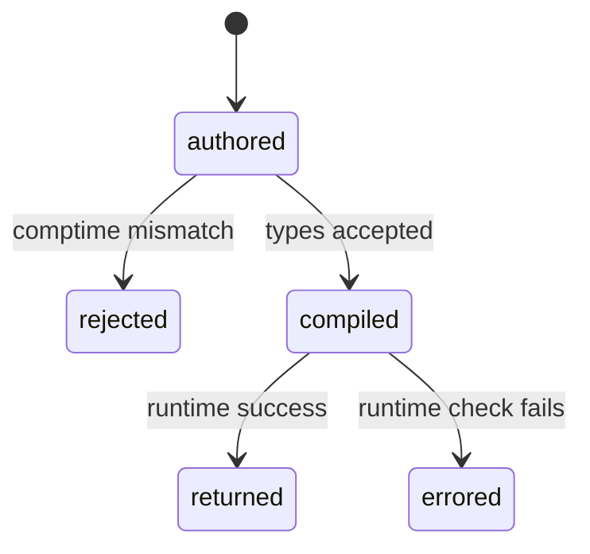

# Compile-time safety

## Summary

The library deliberately splits dimensional mistakes into compile-time rejection and runtime errors. Generic quantity types and comptime units prevent incompatible code from compiling, while dynamic units, delta markers, allocators, and expression strings require runtime checks. This boundary determines what a consumer can handle in code and what must be fixed before building.

## The simple case

Adding a length quantity to a time quantity does not produce an executable. Constructing a length from a runtime unit with a time dimension compiles but returns `DimensionMismatch`. Multiplying a temperature delta returns `MulDivTemperatureDelta` from checked runtime methods.

## The interaction, event by event

### Declare

The consumer chooses generic types, comptime units, dynamic units, checked methods, or expression evaluation. The selected API determines whether safety is encoded in a type or returned at runtime.

### Compile or return immediately

Comptime mismatched dimensions, invalid generic operands, and unsupported `pow` exponent kinds are compile errors. The consumer cannot catch them with an error union.

### Begin execution

Compiled code enters runtime checks for dynamic unit dimensions, affine/delta state, allocation, writer output, expression syntax, and division by zero.

### While executing

Checked APIs return errors instead of asserting where the library has an explicit error path. Unchecked unit composition uses debug assertions for affine values. Convenience expression evaluation collapses many failures to null.

### Return

The consumer either receives a value, an error union, null, or no executable at all. A robust integration chooses APIs whose failure boundary matches its ability to report or recover.

## Modifiers

| Variant | Set at the start | Changed while extended |
| --- | --- | --- |
| Compile-time or runtime unit | Chooses rejection versus runtime checking. | Fixed by API call. |
| Checked or unchecked operation | Chooses error return versus assertion/assumption. | Cannot change. |
| Dimension and quantity type | Fixes compile-time guarantees. | Types cannot change. |
| Registry and format mode | Mostly runtime lookup/output concerns. | No effect on a compiled type. |
| Affine or delta state | Determines runtime checked errors. | Current value state is fixed for the call. |
| Allocator and context | Determines runtime failure/ownership paths. | Context can be reused only after the operation returns. |

## Cancel and interrupt

| Event | Before extended | While extended |
| --- | --- | --- |
| Compile-time rejection | Build stops before execution. | No in-flight compile operation exists. |
| Caller doing another operation | Caller revises source or chooses another API. | Current runtime call completes synchronously. |
| Operation completes before extension | Type checks are immediate. | No partial executable result. |
| Runtime error or panic | Caller can handle documented runtime errors. | Unchecked assertions may terminate. |
| Allocator failure or resource teardown | Runtime allocation can fail. | Cleanup responsibility remains with caller. |
| Input value/type/unit changing | New source/build is needed for type changes. | Values are captured by the current call. |
| Second context or thread using same state | Typed values are independent; contexts isolate dynamic state. | Shared contexts require protection. |

## Interactions with other systems

**Compile-time safety.** This document owns the failure-boundary distinction.

**Dimensions and rational exponents.** Compile-time dimensions are exact rational values.

**Units and registries.** Comptime units provide stronger checks than runtime lookup.

**Affine and delta semantics.** Runtime markers require checked methods.

**Formatting.** Writer/dimension mismatches can still fail after successful compilation.

**Allocators and ownership.** Runtime resource errors are separate from type safety.

**Contexts and constants.** Dynamic names cannot change compiled types.

**Concurrency.** Thread-local/default and explicit context guarantees differ.

**Release/build configuration.** Debug assertions and compiler diagnostics can differ by build.

## Edge cases

- `fromDynamic` is the intended runtime counterpart to comptime `from`.
- `div` can return an error even when its operand types are valid because delta state is runtime.
- `evaluate` returns typed parse, runtime, and allocation errors; callers can still choose a lower-information wrapper if they intentionally discard them.
- Unchecked APIs are safe only when the caller has established their preconditions.

## Open questions and verification

- Public documentation should make unchecked preconditions more prominent; this may be a product call.
- A compile-failure fixture should be maintained to verify the intended diagnostics across Zig versions.

Verified against /Users/jerell/Repos/dim commit `811dcf0`.
