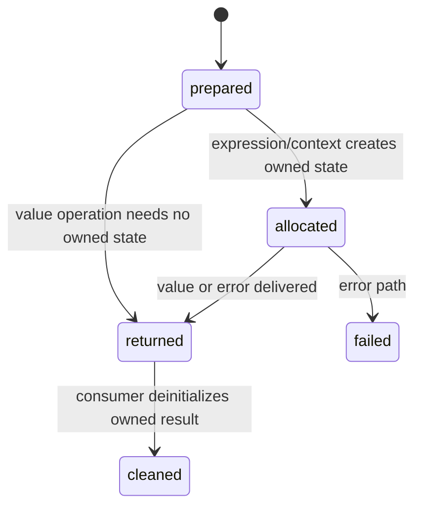

# Ownership and errors

## Summary

The library combines value types with allocator-owned runtime strings and context storage. Typed quantities generally return values directly, while expression evaluation and display helpers can return owned strings or `DisplayQuantity` values that the consumer must deinitialize. Error unions identify recoverable mismatches and unsafe runtime states.

## The simple case

Call `try dim.evaluate(allocator, "100 km/h as m/s", null)`. On success, the consumer receives a `LiteralValue`; if it contains a display quantity, the consumer formats it and calls `dim.deinitLiteralValue` before discarding it. Parse, runtime, and allocation failures are returned as typed errors. An explicit `DimContext` must also be deinitialized when its owner is finished.

## The interaction, event by event

### Declare

The consumer chooses an allocator for returned values and, for isolated runtime work, initializes a `DimContext` with a backing allocator. A context owns constants and scratch storage. A typed quantity does not own heap memory.

### Compile or return immediately

Compile-time mismatches are rejected before allocation or execution. Runtime constructors and operations return explicit errors such as `DimensionMismatch`, `MulDivTemperatureDelta`, and `AffineUnitCombination`. `evaluate` returns `EvaluationError!LiteralValue`, preserving parse, runtime, and allocation failures.

### Begin execution

An explicit context resets scratch storage before expression evaluation. The result allocator receives copies of returned strings and display-unit text so those copies outlive the scratch arena.

### While executing

Intermediate parser and runtime storage belongs to the context's scratch arena. A failed operation can return an error after partial scratch allocation; the context remains usable. A context's constants arena persists until clear/deinit.

### Return

The caller owns the allocator-backed result it requested and must call the matching deinitializer. `deinitLiteralValue` frees display quantities and strings and turns the value into nil. `DimContext.deinit` releases both arenas. Forgetting cleanup is a consumer resource leak rather than an automatic library action.

## Modifiers

| Variant | Set at the start | Changed while extended |
| --- | --- | --- |
| Compile-time or runtime unit | Typed construction has no result allocator; dynamic/evaluation paths may allocate. | Ownership does not change during a call. |
| Checked or unchecked operation | Quantity unchecked variants assume their preconditions; Unit composition always returns `UnitCompositionError`. | Cannot change method behavior mid-call. |
| Dimension and quantity type | Typed values are allocation-free; display/runtime values may own strings. | No effect on existing ownership. |
| Registry and format mode | Formatting can allocate normalized text and choose registry output. | A later format call may allocate separately. |
| Affine or delta state | May determine whether an error is returned. | Current result retains its delta state. |
| Allocator and context | Chooses where result copies and context arenas live. | Context scratch resets between operations; result ownership remains with its allocator. |

## Cancel and interrupt

| Event | Before extended | While extended |
| --- | --- | --- |
| Compile-time rejection | No allocations or cleanup are needed. | No type operation can be cancelled. |
| Caller doing another operation | Caller can reuse an allocator/context according to its ownership rules. | Scratch work is not a second result; later calls may reset it. |
| Operation completes before extension | Plain typed values return without cleanup. | No partial owned result is promised. |
| Runtime error or panic | Caller receives a typed error where the API provides it. | Unchecked Quantity variants can still assume their preconditions. |
| Allocator failure or resource teardown | Allocation can return an error/null before a result is delivered. | Caller must not deinit an uninitialized result; context teardown ends its storage. |
| Input value/type/unit changing | New calls use new inputs. | Existing returned strings and values do not change. |
| Second context or thread using same state | Explicit contexts isolate ownership and constants. | A shared context requires external coordination. |

## Interactions with other systems

**Compile-time safety.** Compile failures occur before ownership begins.

**Dimensions and rational exponents.** Errors can arise from dimension mismatch or overflow.

**Units and registries.** Dynamic lookup and formatting can allocate copied symbols.

**Affine and delta semantics.** Checked runtime state can produce errors that must be handled.

**Formatting.** Display wrappers may own normalized unit strings.

**Allocators and ownership.** This document owns deinitialization and scratch/result lifetime.

**Contexts and constants.** Context deinitialization releases constants and scratch storage.

**Concurrency.** One explicit context should not be concurrently mutated without external protection.

**Release/build configuration.** Debug assertions may be more visible than release behavior; consumers must handle documented errors.

## Edge cases

- `evaluate` returns typed parse, runtime, and allocation errors; callers still need to deinitialize successful owned results.
- A returned `LiteralValue` can contain an owned string or display quantity and must be passed to `deinitLiteralValue`.
- `clearAllConstants` retains context capacity but removes logical state.
- A result copy can outlive the context scratch arena when allocated with the caller's result allocator.

## Open questions and verification

- Exact allocation behavior on every formatting path needs allocator-instrumented verification.
- Allocation-failure behavior still needs allocator-instrumented verification.
Verified against /Users/jerell/Repos/dim commit `5d9cf0d`.
