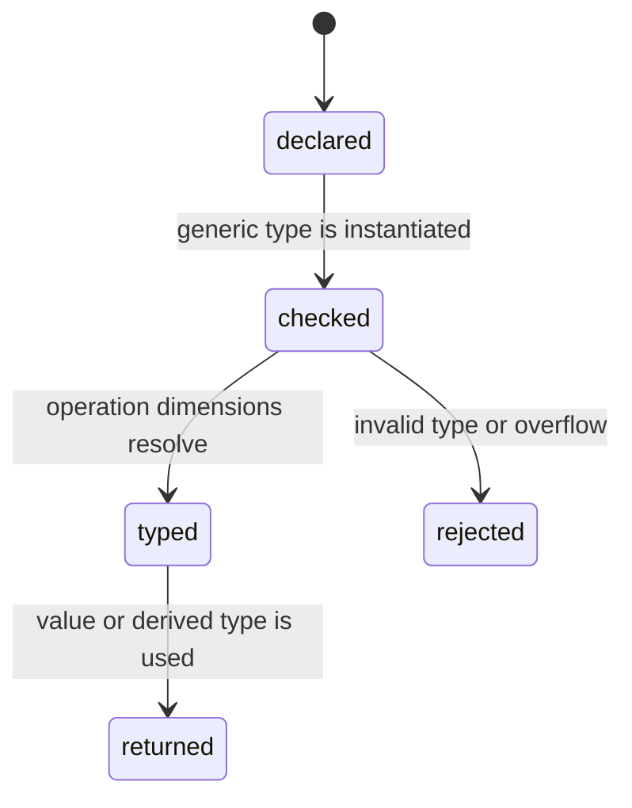

# Type and dimension model

## Summary

The library represents physical dimensions as seven rational exponents and uses those dimensions to parameterize `Quantity`. The model determines which operations compile, what type an arithmetic result has, and how rational powers are represented. It is the foundation for every typed API document.

## The simple case

A consumer chooses `dim.Dimensions.Length` and creates `dim.Quantity(...)`. The resulting type accepts length values and rejects an attempt to add a time quantity. Multiplication and division produce a new type whose dimension is derived from the operands.

## The interaction, event by event

### Declare

The consumer selects one of the base or derived dimensions, or constructs a `Dimension` from rational components. `Quantity(Dim)` exposes the chosen dimension as a public declaration and stores a numeric value plus delta state.

### Compile or return immediately

Dimension operations on comptime values resolve before runtime. Wrong unit dimensions, non-quantity operands, and unsupported non-integer `pow` exponents are rejected at compile time. Rational dimension multiplication can use checked helpers when overflow must become a nullable result.

### Begin execution

Once compiled, quantity operations use canonical numeric values. Addition and subtraction preserve dimensions; multiplication and division derive dimensions; powers multiply exponents.

### While executing

Most dimension rules are already fixed in the type. Runtime state only affects rules that cannot be known at compile time, especially `is_delta` and checked temperature operations. No dimension registry lookup happens for a typed operation.

### Return

The consumer receives a typed quantity or, for dynamic construction and checked runtime operations, an error union. The dimension is available for further compile-time use and can be compared at runtime with `Dimension.eql`.

## Modifiers

| Variant | Set at the start | Changed while extended |
| --- | --- | --- |
| Compile-time or runtime unit | Comptime dimensions use typed checks; dynamic units use runtime checks. | A running value cannot change its type. |
| Checked or unchecked operation | Checked dimension helpers return nullable/error outcomes; ordinary arithmetic assumes representable dimensions. | The selected method cannot change mid-call. |
| Dimension and quantity type | The selected `Dimension` fixes the quantity type. | No effect. |
| Registry and format mode | No effect on dimension derivation. | No effect. |
| Affine or delta state | The dimension identifies temperature/pressure rules; delta is stored on the value. | Delta state can change whether checked arithmetic returns an error. |
| Allocator and context | No effect on typed dimensions. | No effect. |

## Cancel and interrupt

| Event | Before extended | While extended |
| --- | --- | --- |
| Compile-time rejection | The program does not compile. | No type mutation is possible. |
| Caller doing another operation | The caller can choose a different typed expression. | The current call returns synchronously. |
| Operation completes before extension | Type construction and dimension calculation complete immediately. | No partial dimension is exposed. |
| Runtime error or panic | Dynamic mismatch can return an error. | Checked delta violations return; unchecked affine operations may assert. |
| Allocator failure or resource teardown | Dimension values do not allocate. | No effect. |
| Input value/type/unit changing | A new type or unit is part of a later call/build. | Existing result is unaffected. |
| Second context or thread using same state | Dimensions are immutable values. | Independent. |

## Interactions with other systems

**Compile-time safety.** This document owns the dimension/type boundary.

**Dimensions and rational exponents.** Rational normalization and exponent multiplication define equality and derived dimensions.

**Units and registries.** A unit must match the quantity dimension when constructing from a unit.

**Affine and delta semantics.** Dimension identifies the special dimensions; value state identifies delta behavior.

**Formatting.** Fractional dimensions influence normalized unit strings.

**Allocators and ownership.** Dimension and quantity types do not own allocations.

**Contexts and constants.** Runtime constants carry dimensions but do not change a compiled quantity type.

**Concurrency.** Dimension values are safe to copy; context state is a separate concern.

**Release/build configuration.** Compiler version determines exact diagnostics, not the intended type boundary.

## Edge cases

- Equivalent rational dimensions compare equal after normalization.
- Fractional dimensions can be valid even when no named unit exists.
- Dimension overflow has checked and unchecked paths.
- A dimensionless quantity is still a quantity type and may format without a unit.

## Open questions and verification

- Compiler diagnostics and error locations vary by Zig version and need external-consumer verification.
- The practical limits of rational dimension overflow were not determined from user-facing tests.

Verified against /Users/jerell/Repos/dim commit `811dcf0`.
