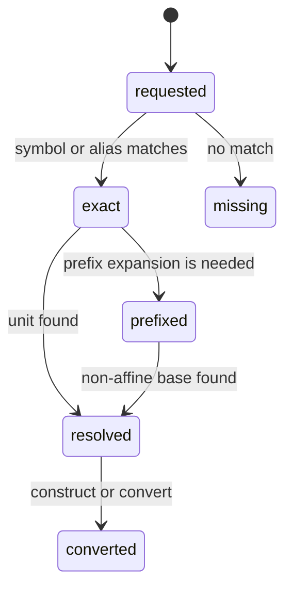

# Unit and registry model

## Summary

A `Unit` pairs a dimension with a scale, optional affine offset, and symbol. Registries resolve exact symbols, aliases, and prefixes across built-in unit families. Consumers use units to construct quantities, convert values, compose derived units, and choose display output.

## The simple case

`dim.Units.si.km` is a comptime unit. A length quantity can be constructed from `100.0` kilometers and stores the canonical meter value. `dim.findUnitAll("km")` performs a runtime lookup. Formatting can use the SI registry to choose a readable unit or a specific composed unit.

## The interaction, event by event

### Declare

The consumer chooses a comptime unit namespace or a runtime registry lookup. A unit's dimension and scale are fixed in its value. A symbol can be exact, an alias, or a prefix plus base symbol.

### Compile or return immediately

Comptime `Unit` methods can derive dimensions and scales immediately. `from` rejects a dimension mismatch at compile time. Checked composition rejects affine participants with `AffineUnitCombination`; unchecked composition asserts that both units are multiplicative.

### Begin execution

Runtime lookup checks constants first when using a context, then exact symbols and aliases in SI, Imperial, CGS, industrial, and optional extra registries, then prefix expansion. Prefixes are not applied to affine units.

### While executing

Conversion applies scale and, for absolute affine values, offset. Delta conversion applies scale without the affine offset. Multiplication, division, and powers compose non-affine dimensions and scales.

### Return

The consumer receives a `Unit`, a typed quantity, a converted number, or an error. A unit's symbol is the caller-supplied display spelling for composed units; registry normalization can choose another display string.

## Modifiers

| Variant | Set at the start | Changed while extended |
| --- | --- | --- |
| Compile-time or runtime unit | Comptime namespace gives compile-time checks; lookup resolves at runtime. | A resolved unit value does not change. |
| Checked or unchecked operation | Checked composition returns affine errors; unchecked composition asserts. | Method choice is fixed. |
| Dimension and quantity type | Quantity construction requires matching unit dimension. | No effect. |
| Registry and format mode | Registry selection determines lookup/format choices. | A later formatting call can use another registry. |
| Affine or delta state | Unit offset determines absolute conversion; delta flag selects scale-only conversion. | Delta state belongs to the quantity conversion call. |
| Allocator and context | Dynamic lookup can consult context constants; basic units do not allocate. | Context changes affect later lookups. |

## Cancel and interrupt

| Event | Before extended | While extended |
| --- | --- | --- |
| Compile-time rejection | The program fails to compile. | No mutation of the unit is possible. |
| Caller doing another operation | The caller can select another registry or unit. | Current conversion completes synchronously. |
| Operation completes before extension | Exact lookup and simple conversion return immediately. | No partial unit is returned. |
| Runtime error or panic | Dynamic mismatch or checked affine composition returns an error. | Unchecked affine composition can assert. |
| Allocator failure or resource teardown | Basic unit values do not allocate. | Only later owned formatting/evaluation may need cleanup. |
| Input value/type/unit changing | A later lookup sees new input. | Current conversion uses captured unit values. |
| Second context or thread using same state | Explicit contexts isolate constants. | Independent lookups remain independent. |

## Interactions with other systems

**Compile-time safety.** Unit dimensions are checked when the compiler has the unit value.

**Dimensions and rational exponents.** Composition derives dimension exponents and can represent fractions.

**Units and registries.** This document owns exact/alias/prefix lookup and built-in registry ordering.

**Affine and delta semantics.** Offsets apply to absolute values only; checked composition prevents meaningless affine products.

**Formatting.** Unit symbols and registries determine displayed unit text.

**Allocators and ownership.** Runtime expression lookup may allocate copied symbols through result allocators.

**Contexts and constants.** Constants take precedence over built-in registry lookup inside a context.

**Concurrency.** Explicit contexts are the isolation mechanism for concurrent consumers.

**Release/build configuration.** Built-in registry contents are part of the compiled package version.

## Edge cases

- Exact symbols win before prefix expansion, preventing a prefix from stealing an exact alias.
- A prefixed affine symbol is rejected rather than applying an offset through the prefix.
- `barg`, `bara`, and `bar` share pressure dimensions but differ in absolute/delta conversion.
- Composed unit symbols are not automatically normalized until formatting asks for it.

## Open questions and verification

- The ordering among similarly named units in all built-in registries should be checked with representative lookup cases.
- The user-facing behavior of a custom extra registry is outside the default verification pass.

Verified against /Users/jerell/Repos/dim commit `811dcf0`.
