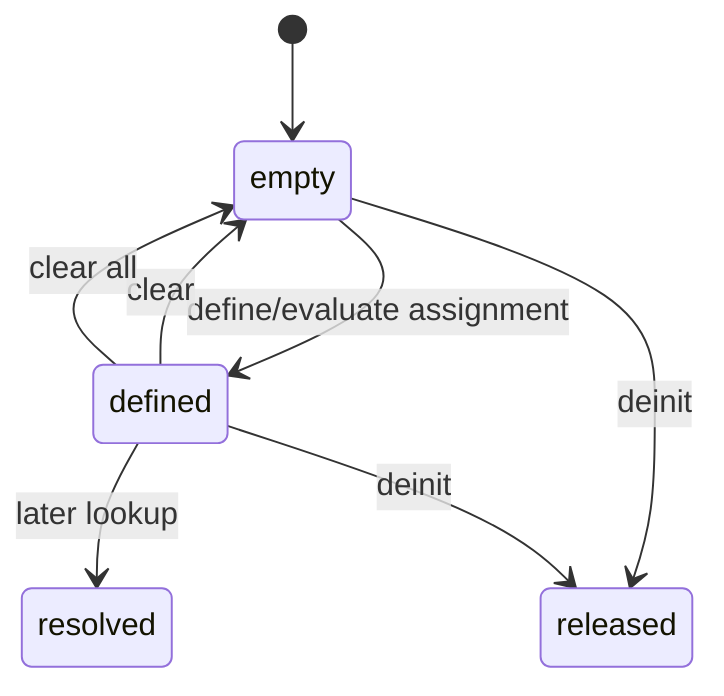

# Contexts and constants

## Summary

An explicit `DimContext` gives a consumer isolated runtime constants and scratch storage. The consumer can define, resolve, enumerate, clear, and clear-all constants without affecting another context. Convenience helpers use one context per calling thread, while explicit contexts are the canonical choice for isolation and concurrency.

## The simple case

Initialize two contexts with the same allocator. Evaluate `foo = (2 m)` in the first, then evaluate `1 foo as m` there; it succeeds. The same expression in the second context returns null because constants do not leak across contexts. Deinitialize both contexts when finished.

## The interaction, event by event

### Declare

The consumer creates a context with a backing allocator. A context owns a constants arena, scratch arena, map, and ordered names. The default thread-local context is implicit for convenience helpers.

### Compile or return immediately

Context initialization and clearing return immediately. A constant definition can fail through allocation or expression evaluation. Name resolution is runtime and constants are checked before built-in units.

### Begin execution

`defineConstant` stores a unit-like value; expression assignment stores the evaluated right-hand quantity. Redefining a name replaces its value while keeping its logical listing position.

### While executing

Later evaluation and lookup calls see the context's constants. Scratch storage is reset for each expression while the constants arena persists. `clear` removes one name; `clearAllConstants` removes logical state while retaining capacity.

### Return

Lookup returns a `Unit` copy or null. Enumeration returns a `ConstantEntry` by index. Context deinitialization releases both arenas; no constant is persisted outside the context.

## Modifiers

| Variant | Set at the start | Changed while extended |
| --- | --- | --- |
| Compile-time or runtime unit | Constants and lookups are runtime values; typed APIs do not consult them. | A later call sees the changed map. |
| Checked or unchecked operation | Constant definition/evaluation can return failure; lookup returns optional. | Current lookup does not change mid-call. |
| Dimension and quantity type | Constant values carry dimensions at runtime. | New definitions can have different dimensions. |
| Registry and format mode | Constants take precedence over registry symbols; formatting is separate. | Replacing a constant changes later resolution. |
| Affine or delta state | Definition stores canonical unit-like scale; expression may preserve delta semantics. | Current returned value stays fixed. |
| Allocator and context | Context choice owns state and cleanup. | Context changes are visible only to calls using that context. |

## Cancel and interrupt

| Event | Before extended | While extended |
| --- | --- | --- |
| Compile-time rejection | No typed compile failure for a runtime name. | No cancellation. |
| Caller doing another operation | Caller can use another context. | Current definition/lookup completes synchronously. |
| Operation completes before extension | Clear/lookup return immediately. | No partial constant is promised. |
| Runtime error or panic | Failed definition leaves prior state. | Allocation/evaluation failure can abort the definition. |
| Allocator failure or resource teardown | Initialization/definition can fail. | Deinit ends all context-owned state. |
| Input value/type/unit changing | Later definitions use new values. | Current stored unit is copied. |
| Second context or thread using same state | Explicit contexts are isolated. | Shared context mutation needs external protection. |

## Interactions with other systems

**Compile-time safety.** Runtime constants cannot alter compiled Quantity types.

**Dimensions and rational exponents.** Stored constants carry dimensions used by expression evaluation.

**Units and registries.** Constants resolve before built-in units.

**Affine and delta semantics.** Constant definitions store canonical scale; expression use applies runtime semantics.

**Formatting.** Enumeration normalizes or displays a constant's unit.

**Allocators and ownership.** Context arenas own names and storage.

**Contexts and constants.** This document owns isolation, ordering, replacement, and clearing.

**Concurrency.** One context is not a synchronization primitive.

**Release/build configuration.** Context behavior is process/library version behavior, not persistent configuration.

## Edge cases

- Redefining a constant replaces its value without appending a duplicate listing name.
- Clearing an unknown name is silent.
- A context with retained capacity is logically empty after clear-all.
- Thread-local default contexts prevent cross-thread sharing but remain process-lifetime state unless deinitialized by package internals.

## Open questions and verification

- Exact behavior of default-context lifetime at thread exit needs runtime verification.
- Whether constant replacement should preserve or move listing order is a product/API decision.

Verified against /Users/jerell/Repos/dim commit `811dcf0`.
