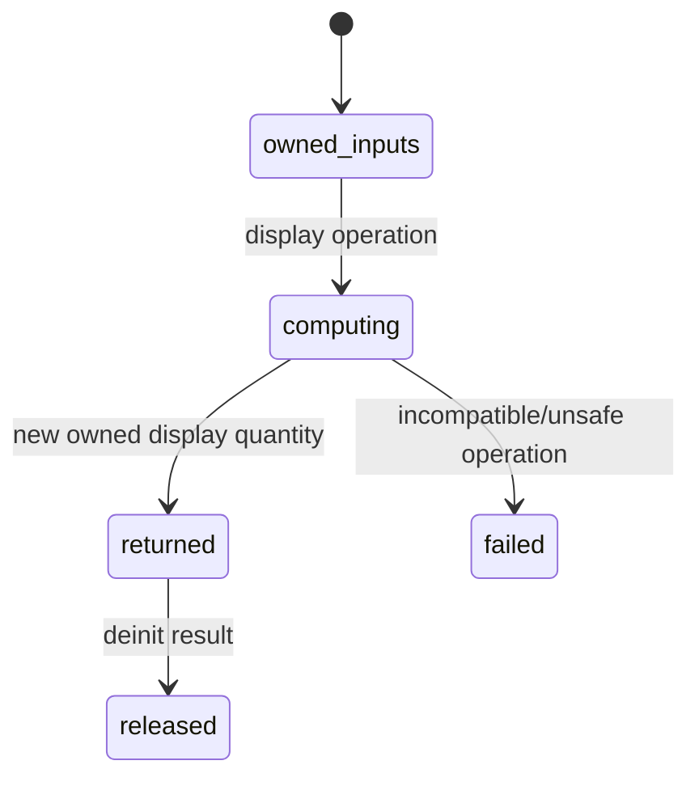

# Display quantities

## Summary

`DisplayQuantity` is the runtime-owned value used when an expression or display helper must retain a value, dimension, unit string, format mode, and delta/value-space semantics together. Consumers can add, subtract, multiply, divide, scale, and power display quantities, then deinitialize the owned result.

## The simple case

Evaluate or construct two display quantities, call `addDisplay`, and format the returned value. The result has a copied unit string and the combined value/dimension. When finished, call its deinitializer with the allocator that owns the returned display quantity.

## The interaction, event by event

### Declare

The consumer chooses an allocator and supplies display quantities with dimensions, units, and value spaces. Inputs may or may not own their unit strings; results returned by helpers own copied strings.

### Compile or return immediately

Display helpers return error unions for invalid operands, unsafe temperature-delta multiplication/division, and allocation failure. Dimension compatibility is checked at runtime rather than through a generic result type.

### Begin execution

The operation combines canonical/display values according to the helper. Addition and subtraction preserve dimensional rules; multiply/divide derive dimensions; powers change dimensions.

### While executing

Each result is recomputed from input values and gets an owned unit string. Temperature delta restrictions can reject multiplication or division. The input display quantities are not mutated.

### Return

The caller receives a new `DisplayQuantity` and must deinit it. The original inputs remain available according to their own ownership. A failed operation returns an error without a usable result.

## Modifiers

| Variant | Set at the start | Changed while extended |
| --- | --- | --- |
| Compile-time or runtime unit | Display operations resolve dimensions at runtime. | Unit strings remain attached to current values. |
| Checked or unchecked operation | Runtime helpers enforce unsafe delta rules. | No method switch mid-call. |
| Dimension and quantity type | Runtime dimensions determine compatibility/result. | Current result type does not change. |
| Registry and format mode | Unit/format metadata travels with the display value. | Later formatting can choose another wrapper. |
| Affine or delta state | Delta marker affects arithmetic safety and output. | Current operation uses captured markers. |
| Allocator and context | Allocator owns result strings; context may own input scratch. | Ownership remains with the result allocator. |

## Cancel and interrupt

| Event | Before extended | While extended |
| --- | --- | --- |
| Compile-time rejection | Not applicable to runtime display values. | No cancellation. |
| Caller doing another operation | Caller can retain inputs and choose another helper. | Current helper is synchronous. |
| Operation completes before extension | Empty/simple result returns immediately. | No partial result. |
| Runtime error or panic | Error union reports invalid operands. | Unsafe delta operation returns error. |
| Allocator failure or resource teardown | Result allocation can fail. | Caller must preserve allocator through return/deinit. |
| Input value/type/unit changing | Later helper uses new input. | Current result is independent copy. |
| Second context or thread using same state | Inputs can be isolated by ownership/context. | Shared mutable allocation requires protection. |

## Interactions with other systems

**Compile-time safety.** Display dimensions are runtime, unlike typed Quantity.

**Dimensions and rational exponents.** Helpers derive dimensions and can produce fractions.

**Units and registries.** Unit text is carried or normalized for display.

**Affine and delta semantics.** Unsafe temperature-delta multiplication/division returns an error.

**Formatting.** Display metadata drives later output.

**Allocators and ownership.** Results own copied unit strings.

**Contexts and constants.** Expression-created display values can depend on context.

**Concurrency.** Ownership, not DisplayQuantity itself, determines safety.

**Release/build configuration.** Error behavior follows runtime build.

## Edge cases

- A dimensionless result can have no displayed pseudo-unit.
- Multiplying a temperature delta is rejected even when dimensions could otherwise be combined.
- A result's unit string may be normalized rather than preserving the input spelling.

## Open questions and verification

- Exact ownership behavior for every helper constructor should be checked with allocator instrumentation.
- The display/value-space distinction needs a consumer-facing example in the public README.

Verified against /Users/jerell/Repos/dim commit `5d9cf0d`.
