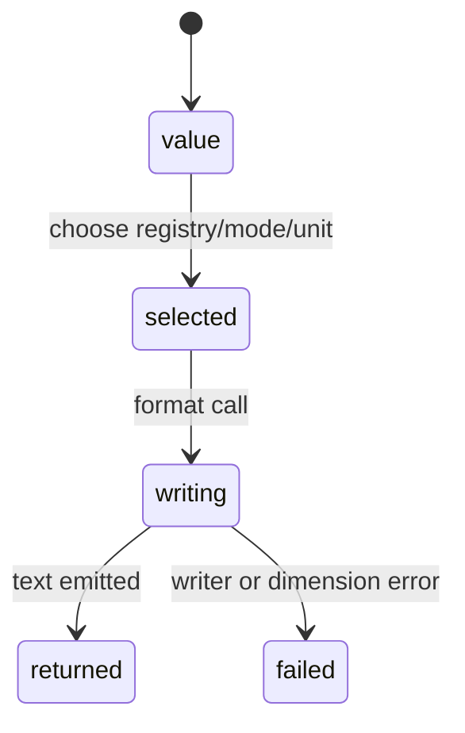

# Formatting

## Summary

The formatting API turns quantities and display values into readable text using a registry, a format mode, or an explicit unit. It can choose SI prefixes, engineering/scientific notation, aliases, normalized compound units, and delta markers. Formatting writes to a caller-provided writer and returns writer errors.

## The simple case

Wrap a speed with `speed.with(dim.Registries.si, .scientific)` and format it into a writer. Or call `speed.asUnit(kmh, .none)` to force a `km/h` display. The numeric quantity remains unchanged; only emitted text changes.

## The interaction, event by event

### Declare

The consumer chooses a registry and mode with `with`, or a target unit and mode with `asUnit`. The wrapper stores these choices until its `format` method is called.

### Compile or return immediately

Creating a format wrapper returns immediately. `asUnit` can report `DimensionMismatch` when its unit does not match the quantity dimension, during formatting.

### Begin execution

Formatting selects unit text/value according to registry prefixes, aliases, dimensions, delta state, and mode. Explicit-unit formatting converts through the chosen unit.

### While executing

`none` emits the natural numeric representation, `auto` uses fixed automatic precision, and scientific/engineering modes use exponent notation. Normalization can produce canonical compound symbols and omit a unit for dimensionless values.

### Return

Text is written to the caller's writer. Formatting does not allocate a persistent result by itself, and the underlying quantity remains unchanged.

## Modifiers

| Variant | Set at the start | Changed while extended |
| --- | --- | --- |
| Compile-time or runtime unit | Explicit target or registry selection chooses display path. | Target cannot change inside a format call. |
| Checked or unchecked operation | Explicit target checks dimensions; registry selection resolves display units. | No effect. |
| Dimension and quantity type | Dimension determines candidate units. | No effect. |
| Registry and format mode | Primary formatting choices. | A new wrapper is needed to change them. |
| Affine or delta state | Delta marker changes prefix/offset display behavior. | Current text uses captured state. |
| Allocator and context | Writer owns output; context is not required. | Writer failure ends output. |

## Cancel and interrupt

| Event | Before extended | While extended |
| --- | --- | --- |
| Compile-time rejection | Wrong typed API can fail before formatting. | No cancellation. |
| Caller doing another operation | Caller can select another wrapper. | Writer call is synchronous. |
| Operation completes before extension | Empty/simple formatting returns quickly. | Partial text may already be written if writer fails. |
| Runtime error or panic | Dimension mismatch can return an error. | Writer error returns to caller. |
| Allocator failure or resource teardown | Wrapper creation is value-only; writer may own buffers. | Caller controls writer lifetime. |
| Input value/type/unit changing | Later wrapper sees new value. | Current output uses current value copy. |
| Second context or thread using same state | Registry values are immutable. | Shared writer needs external coordination. |

## Interactions with other systems

**Compile-time safety.** Typed dimensions constrain explicit unit formatting.

**Dimensions and rational exponents.** Dimension determines canonical unit fallback.

**Units and registries.** Registry selection controls aliases/prefixes and display text.

**Affine and delta semantics.** Conversion distinguishes absolute and delta values.

**Formatting.** This document owns modes, wrappers, and output choices.

**Allocators and ownership.** Writer allocation belongs to the writer owner.

**Contexts and constants.** Constant units can be formatted after lookup.

**Concurrency.** Formatting is independent except for shared writer use.

**Release/build configuration.** Numeric output depends on formatter/version.

## Edge cases

- Dimensionless values omit pseudo-units.
- Engineering notation uses multiples of three for exponents.
- Explicit-unit formatting fails on a mismatched unit.
- Fractional dimensions format with rational exponents.

## Open questions and verification

- Exact precision/rounding expectations in all modes need representative output checks.
- Alias selection for equally valid units may be a product decision.

Verified against /Users/jerell/Repos/dim commit `5d9cf0d`.
