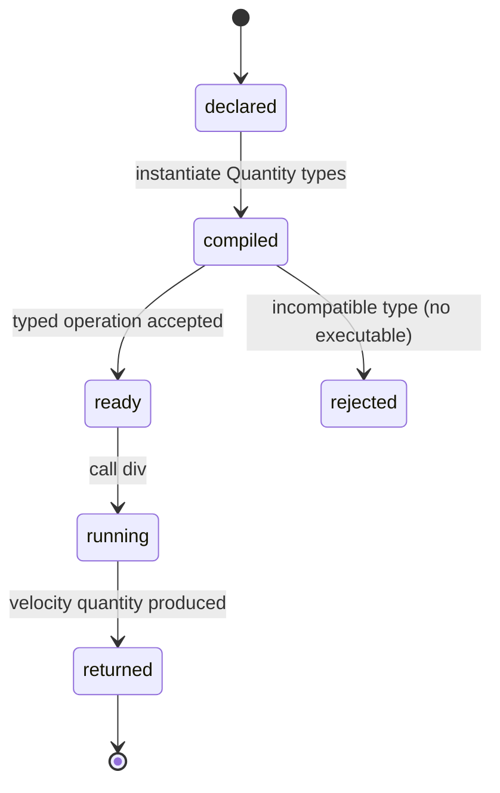

# Quantity arithmetic

## Summary

Typed quantities let a consumer combine measurements while the compiler carries their dimensions through the result type. A consumer creates `Quantity(Length)` and `Quantity(Time)` values, divides them, and receives a quantity whose dimension is velocity. The operation is available in a normal Zig program imported from `dim`; incompatible typed operations are rejected before runtime.

## The simple case

Define `Length = dim.Quantity(dim.Dimensions.Length)` and `Time = dim.Quantity(dim.Dimensions.Time)`. Construct `Length.init(100.0)` and `Time.init(10.0)`, then call `distance.div(elapsed)`. The returned value is a velocity quantity with canonical value `10.0`.

The consumer can scale or unscale a quantity and can format it through a registry. No unit string is needed for the typed arithmetic itself because the quantity type owns its dimension. The operation returns a value or an error; it does not mutate either input.

## The interaction, event by event

### Declare

The consumer chooses a `Dimension` and creates a generic `Quantity` type. The type determines the dimension of every value and the result dimension of multiplication or division. `init` creates a canonical value; `from` converts from a comptime `Unit` after checking its dimension.

### Compile or return immediately

The compiler resolves `Quantity(Dimension)` and the result of `div`. A length divided by time is accepted and produces velocity. Adding a length to a time, passing a unit with the wrong dimension to `from`, or passing a non-quantity operand produces a compile-time error before the program runs.

### Begin execution

At runtime, the operation reads the two quantity values. `div` performs numeric division and returns a new quantity with the derived dimension. Neither operand is changed. For ordinary dimensions the returned delta marker is false.

### While executing

The operation is synchronous and has no observable progress phase. Scaling multiplies the canonical numeric value while preserving the delta marker. Checked multiplication and division also inspect runtime delta state for temperature safety; ordinary length/time arithmetic does not fail.

### Return

The consumer receives a typed quantity and can read its value, compare its compile-time dimension, or format it. The result is a plain value with no allocator-owned string unless the consumer asks for formatting. There is no implicit unit label attached to the typed value.

## Modifiers

| Variant | Set at the start | Changed while extended |
| --- | --- | --- |
| Compile-time or runtime unit | `init` uses canonical values; `from` uses a comptime unit; `fromDynamic` checks a runtime unit. | The unit cannot change during a synchronous operation. |
| Checked or unchecked operation | `div`/`divChecked` enforce runtime affine-delta safety; unchecked variants skip it. | The choice is fixed by the called method. |
| Dimension and quantity type | The generic dimension fixes operand and result types. | Types cannot change at runtime. |
| Registry and format mode | A registry and mode affect only formatting wrappers. | Formatting choices apply when a wrapper is created, not during arithmetic. |
| Affine or delta state | `is_delta` is false for `init`/`from`; a delta can be constructed explicitly. | Runtime delta state can cause checked mul/div to return an error. |
| Allocator and context | Typed arithmetic needs no allocator or context. | No effect. |

## Cancel and interrupt

| Event | Before extended | While extended |
| --- | --- | --- |
| Compile-time rejection | Compilation stops; no operation begins. | A type cannot change mid-operation. |
| Caller doing another operation | The caller can choose another expression before calling. | The synchronous call finishes before another operation observes a result. |
| Operation completes before extension | Construction and simple arithmetic return immediately with no partial state. | No separate completion interrupt exists. |
| Runtime error or panic | A checked call can be selected to return an error. | A checked affine/delta violation returns an error; unchecked affine composition can assert. |
| Allocator failure or resource teardown | No allocator is used by typed arithmetic. | No effect unless a later formatting/owned-result step runs. |
| Input value/type/unit changing | The next call uses new values or a newly compiled type. | Current values are copied into the call; later changes do not alter the result. |
| Second context or thread using same state | Typed values are independent of contexts. | Operations on independent values are independent. |

## Interactions with other systems

**Compile-time safety.** The type system owns dimension compatibility and derived result types.

**Dimensions and rational exponents.** Multiplication and division add or subtract dimensions; powers multiply them.

**Units and registries.** Units convert into canonical quantities before arithmetic but are not needed for `init`.

**Affine and delta semantics.** Temperature and pressure rules can mark subtraction as delta and reject unsafe checked multiplication/division.

**Formatting.** A result can be wrapped with a registry and mode after arithmetic.

**Allocators and ownership.** Typed arithmetic returns stack-like values and does not allocate.

**Contexts and constants.** Typed arithmetic does not consult a runtime context.

**Concurrency.** Independent typed values can be used by independent workers.

**Release/build configuration.** The compile-time API is checked by the target Zig compiler and package build.

## Edge cases

- `from` with a wrong-dimension comptime unit is a compile-time error; `fromDynamic` returns `DimensionMismatch`.
- `div` derives a rational dimension at compile time and can return a quantity type not named in the source.
- A temperature delta multiplied by a quantity returns `MulDivTemperatureDelta` from checked operations.
- `powRational` supports rational dimensions; `pow` accepts only integer exponents.
- Division by a numeric zero is not guarded by the quantity type itself.

## Open questions and verification

- The exact compiler diagnostic text for incompatible quantity types is compiler-version-dependent.
- The library does not expose a user-facing unit label on a typed quantity; whether that is intuitive is a documentation question.
- These behaviors were read from source and consumer tests; a hand-written external consumer should verify the public import path.

Verified against /Users/jerell/Repos/dim commit `811dcf0`.
