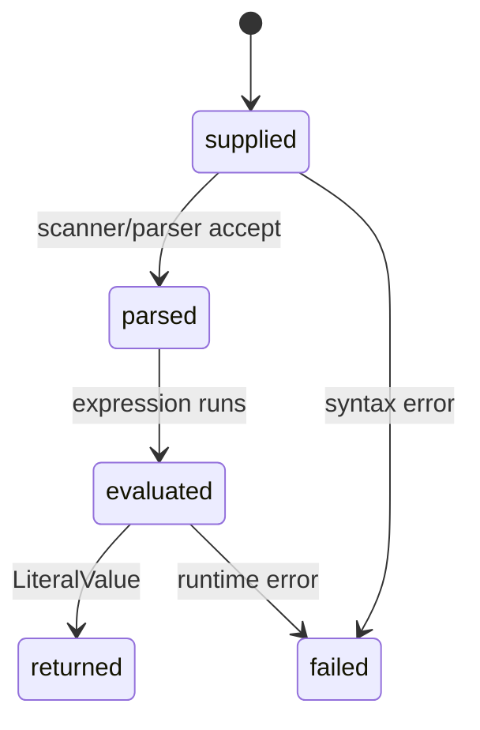

# Runtime evaluation

## Summary

Runtime evaluation turns a string expression into a `LiteralValue` through `evaluate` or `evaluateWithContext`. It accepts numeric and quantity expressions, arithmetic, conversions, comparisons, constants, and formatting suffixes. The caller receives `EvaluationError!LiteralValue` and may provide an error writer for diagnostics.

## The simple case

Call `try dim.evaluate(allocator, "100 km/h as m/s", null)`. On success the result contains a display quantity with the converted value and unit. Format it, then call `deinitLiteralValue` to release its copied unit string.

## The interaction, event by event

### Declare

The caller supplies an allocator, source string, optional error writer, and optionally a `DimContext`. `evaluate` uses the calling thread's default context; `evaluateWithContext` makes context ownership explicit.

### Compile or return immediately

The parser scans and parses the complete source before evaluation. Invalid syntax or trailing tokens return granular parse errors and write diagnostics. No partial literal result is returned.

### Begin execution

The expression evaluates against context constants and built-in units. Arithmetic, `as` conversion, comparisons, powers, and assignments follow the expression runtime rules.

### While executing

Intermediate allocations live in context scratch storage. A runtime error such as division by zero, invalid operands, undefined variable, dimension overflow, or affine exponentiation aborts the expression. The context remains available for later calls.

### Return

On success the result allocator receives copied strings and display quantities. On failure the API returns a typed parse, runtime, or allocation error. The caller deinitializes any owned literal value.

## Modifiers

| Variant | Set at the start | Changed while extended |
| --- | --- | --- |
| Compile-time or runtime unit | All expression units are resolved at runtime; typed APIs are separate. | Source is fixed for evaluation. |
| Checked or unchecked operation | Expression runtime uses checked error paths for unsafe operations. | Cannot change mid-expression. |
| Dimension and quantity type | Expression result chooses a runtime literal kind/dimension. | No effect. |
| Registry and format mode | Built-in lookup and `as` suffix affect output. | Fixed by source/context. |
| Affine or delta state | Expression operands carry absolute/delta semantics. | Runtime state follows evaluated operands. |
| Allocator and context | Result allocator and context determine ownership/state. | Scratch resets between calls; current context remains. |

## Cancel and interrupt

| Event | Before extended | While extended |
| --- | --- | --- |
| Compile-time rejection | No compile-time expression rejection; source can fail at parse. | No cancellation hook. |
| Caller doing another operation | Caller can submit another source. | Synchronous evaluation finishes before the next call. |
| Operation completes before extension | Invalid input returns a typed error without a result. | No partial result is promised. |
| Runtime error or panic | Parse/eval failure returns a typed error. | Error aborts current result; diagnostics may be written. |
| Allocator failure or resource teardown | Null may be returned on allocation failure. | Caller must preserve allocator/context lifetime through return. |
| Input value/type/unit changing | A later source is independent. | Current source is copied/read from scratch storage. |
| Second context or thread using same state | Explicit contexts isolate constants. | Default context is thread-local; shared explicit context needs protection. |

## Interactions with other systems

**Compile-time safety.** Expression types are runtime values, unlike generic Quantity arithmetic.

**Dimensions and rational exponents.** Parser/runtime computes dimensions and checks overflow.

**Units and registries.** Built-in and context constants resolve names.

**Affine and delta semantics.** Temperature/pressure arithmetic preserves delta state.

**Formatting.** `as` and format suffixes control output metadata.

**Allocators and ownership.** Result strings are copied into caller allocator.

**Contexts and constants.** Explicit context controls runtime names and scratch storage.

**Concurrency.** Context choice determines isolation.

**Release/build configuration.** Error/diagnostic text depends on parser and compiler version.

## Edge cases

- Parse errors retain their granular error-set variants; diagnostics also include the generic parse failure line.
- A successful assignment can mutate context constants while returning a value.
- Trailing tokens are rejected by the explicit evaluation path.
- Rational powers can return dimensions with fractional exponents.

## Open questions and verification

- Allocation failure paths are not covered by ordinary consumer tests.
- Allocation failure paths are not covered by ordinary consumer tests.

Verified against /Users/jerell/Repos/dim commit `5d9cf0d`.
