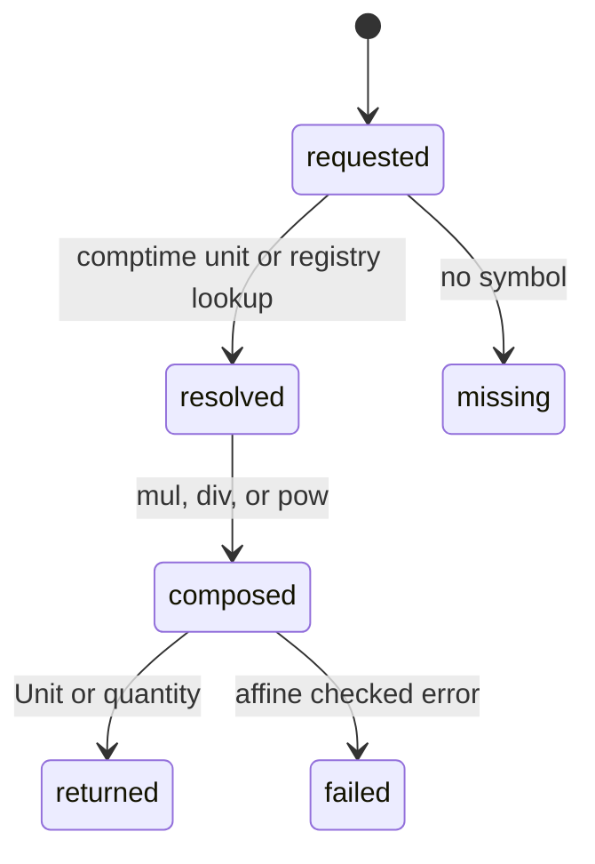

# Unit construction

## Summary

Unit construction lets a consumer create quantities from named units and compose non-affine units into derived units. It covers comptime unit namespaces, dynamic lookup, multiplication/division, powers, aliases, and prefixes. The result is a `Unit` or typed quantity, with checked variants for affine safety.

## The simple case

Use `dim.Units.si.km` to construct a length quantity from a numeric value. Compose `dim.Units.si.km.div(dim.Units.si.h, "km/h")` to create a velocity unit, then use it for explicit formatting or conversion. Runtime consumers can call `findUnitAll("km")` when the symbol is only known at runtime.

## The interaction, event by event

### Declare

The consumer selects a built-in namespace, registry, alias, prefix, or runtime symbol. A composed unit receives the caller's display symbol and a derived dimension/scale.

### Compile or return immediately

Comptime units and dimensions are checked by Zig. `Quantity.from` rejects mismatched unit dimensions at compile time. Checked unit composition returns `AffineUnitCombination`; unchecked composition asserts that participants are non-affine.

### Begin execution

Dynamic lookup resolves constants and exact/alias symbols before trying prefixes. Conversion applies scale and offset according to absolute or delta state.

### While executing

Unit composition is synchronous and allocation-free for ordinary `Unit` values. A prefix is accepted only for a non-affine base unit. Rational powers derive rational dimensions and scales.

### Return

The caller receives a unit, a converted number, or a typed quantity. The unit symbol is available for explicit output but does not imply a registry-wide preferred display.

## Modifiers

| Variant | Set at the start | Changed while extended |
| --- | --- | --- |
| Compile-time or runtime unit | Namespace/comptime unit versus dynamic symbol determines validation boundary. | Resolved unit does not change. |
| Checked or unchecked operation | Checked composition returns errors; unchecked asserts. | Fixed for the call. |
| Dimension and quantity type | Target quantity type must match unit dimension. | No effect. |
| Registry and format mode | Registry controls lookup and formatting selection. | Later formatting can choose another registry. |
| Affine or delta state | Unit offset and quantity delta choose conversion rule. | Current conversion uses captured state. |
| Allocator and context | Dynamic lookup can use context constants; unit values do not allocate. | Later lookups can see context changes. |

## Cancel and interrupt

| Event | Before extended | While extended |
| --- | --- | --- |
| Compile-time rejection | Build stops. | No cancellation. |
| Caller doing another operation | Caller can choose another unit. | Current operation completes synchronously. |
| Operation completes before extension | Exact lookup returns immediately. | No partial unit is exposed. |
| Runtime error or panic | Dynamic mismatch/checked affine error is returned. | Unchecked affine composition can assert. |
| Allocator failure or resource teardown | Basic unit construction does not allocate. | No effect. |
| Input value/type/unit changing | Later calls use new input. | Current unit/result remains fixed. |
| Second context or thread using same state | Explicit contexts isolate constants. | Independent unit values remain independent. |

## Interactions with other systems

**Compile-time safety.** Unit/dimension compatibility is checked where types permit.

**Dimensions and rational exponents.** Composition derives the result dimension.

**Units and registries.** Lookup and composition are the central behavior here.

**Affine and delta semantics.** Offsets are never carried through checked composition.

**Formatting.** Caller symbols and registry normalization determine output.

**Allocators and ownership.** Basic units are value types; dynamic display strings may allocate elsewhere.

**Contexts and constants.** Constants take precedence in context-scoped lookup.

**Concurrency.** Use independent contexts when runtime constants are involved.

**Release/build configuration.** Registry contents depend on package version.

## Edge cases

- Exact aliases win before prefix expansion.
- Prefixed affine units are not resolved.
- Unit composition with an affine participant requires checked handling or risks assertion.
- `Unit.to` compile-time-checks quantity dimensions.

## Open questions and verification

- Custom registry ordering and alias collisions need external-consumer tests.
- The ergonomics of a caller-supplied composed symbol needs documentation review.

Verified against /Users/jerell/Repos/dim commit `811dcf0`.
