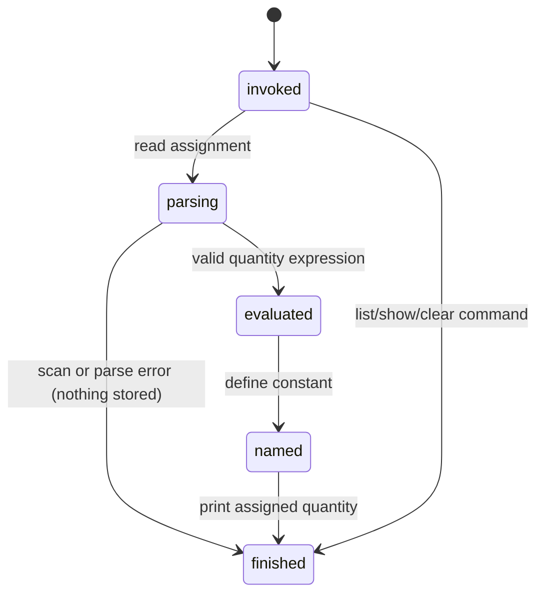

# Constants

## Summary

A constant gives a runtime name to a quantity so later expressions can use that name as a unit-like value. In the CLI it is reached by entering `name = (expression)` in an invocation or REPL line; `list`, `show name`, `clear name`, and `clear all` inspect or remove the process-local definitions. There is no separate flag or configuration file, and constants are available only for the lifetime of the current `dim` process.

## The simple case

In a REPL, enter `d = (24 h)`. The command evaluates the quantity and prints `86400 s`. The name `d` is now available on later lines, so `1000000 s as d` prints `11.574 d`.

`list` prints every defined constant in definition order, including its dimension, scale, and normalized unit. `show d` prints the same information for one name. `clear d` removes that name and prints `ok`; `clear all` removes every name and prints `ok`.

A one-shot invocation can define a constant, but the process ends after printing, so a later invocation cannot see it. In a batch file, definitions persist for subsequent non-empty lines in that one process.

## The interaction, event by event

### Invoke

The user supplies an identifier, `=`, and a parenthesized expression. The expression must evaluate to a quantity; a bare number, incompatible operation, or malformed parentheses does not define a name. The command scans the whole line before handling the assignment. A name that matches a unit is still a constant name once defined, and constants take precedence over registry units.

### Exit immediately

An empty line does nothing. `list`, `show name`, `clear name`, and `clear all` are handled as commands. `list` with no definitions produces no output; `show` for an unknown name writes `Unknown constant 'name'` to stderr and does not change state. A command with extra tokens is recognized by its first tokens rather than rejected as a general expression; this is an observable area to verify.

### Begin running

After scanning and parsing, the right-hand quantity is evaluated. The definition is stored only after that evaluation succeeds. The assignment itself evaluates to the assigned quantity, so the one-shot or REPL line prints the value that was defined.

### While running

There is no progress display or asynchronous work. The name is not available to the assignment's own right-hand expression unless it was already defined. In a REPL, the next prompt is printed only after evaluation and output are flushed. A later line can use the new name in arithmetic, a compound display unit, or an `as` target.

### Finish

A successful definition commits one in-memory constant and prints its quantity. It does not write a file, emit a notification, or create an undo step. `clear` commits removal immediately and prints `ok`. A failed scan, parse, or evaluation prints an error to stderr and leaves the previous constant state unchanged.

## Modifiers

| Variant | Set at the start | Changed while extended |
| --- | --- | --- |
| Flags and options | No constant-specific flag changes definition behavior. `--file` changes the input source. | Arguments cannot change after the process starts. |
| Environment variables | No documented environment variable changes constant behavior. | No effect. |
| Config-file keys | No rc or config file is read. | No effect. |
| Stdout TTY or pipe | A TTY shows prompts only in REPL; a pipe receives result lines without prompts. | The output destination cannot change during the line. |
| Stdin TTY or pipe | TTY selects REPL for no-argument invocation; a pipe selects batch input. | No effect on the current line. |
| Machine-readable, quiet, dry-run, verbosity | No such mode is implemented. | No effect. |

The only state-changing variant is the input source: a definition in a REPL or batch file can affect later lines in that process, while a direct one-shot invocation ends immediately.

## Cancel and interrupt

| Event | Before extended | While extended |
| --- | --- | --- |
| Ctrl+C (SIGINT) once and twice | Stops the process before the definition is stored; no new constant. | Stops the process; no durable file is left, and the current in-memory definition may not complete. |
| SIGTERM | Process ends; state is lost. | Process ends; state is lost. |
| Terminal closed (SIGHUP) | Process ends; state is lost. | Process ends; state is lost. |
| stdin closed or stdout pipe closed (SIGPIPE) | A closed stdin ends input; a broken stdout may end the process before output. | Same; no persistent constant survives process exit. |
| Network lost | No effect; constants do not use the network. | No effect. |
| Disk full or file locked | No effect unless the input file cannot be read; no definition is stored. | No normal write occurs, so no effect on the definition. |
| Required file changed | A file is read when `--file` begins; later changes are not observed during that run. | No effect on the current in-memory definition. |
| Two instances at once | Each process has separate constants. | Neither process changes the other's state. |
| Process killed outright | No constant survives. | No constant survives. |

Because constants are process-local, an interrupt never leaves a recoverable partial definition. The exact signal behavior and exit status are host-shell behavior rather than a documented CLI contract.

## Interactions with other systems

**Configuration precedence.** No configuration participates; the built-in registries are the only default lookup source.

**Output modes.** Definitions and command results use stdout; unknown names and evaluation failures use stderr. There is no JSON or quiet mode.

**Colors and Unicode.** Constant listing uses normalized unit text and may contain Unicode dimension or unit characters; no color behavior is documented.

**Exit codes.** Normal command and expression failures return from the handler without explicitly setting a nonzero status; invalid top-level arguments are the exception documented in [invocation](../foundations/invocation.md).

**Logging and verbosity.** No logging or verbosity control is exposed.

**Locking and concurrency.** There is no shared persistent store or process lock.

**Caching.** A constant is retained in process memory, but it is not a cross-process cache.

**Network and proxies.** No interaction.

**Permissions and sudo.** Only reading a `--file` input can require filesystem permission; defining a constant itself requires no permission.

**Shell completion.** No completion behavior is documented.

**Update or version checks.** No interaction.

## Edge cases

- Re-defining an existing name replaces its previous value in the runtime registry; the order and listing behavior should be checked by hand.
- A constant can be used as a compound display unit, for example `as kg/d`, but a constant definition must still evaluate to a quantity.
- `clear name` is silent about whether the name existed and still prints `ok`.
- Constants can shadow registry units, so defining a name such as `d` changes later interpretation of that token.
- In a direct invocation, the printed assignment result can make the definition look reusable even though the process has already ended.

## Open questions and verification

- The exact replacement order and `list` output after redefining a name were read from the runtime path but not confirmed by hand.
- Command recognition with trailing tokens may accept input more broadly than users expect; this may be worth treating as a product bug rather than documenting.
- Signal behavior during a very fast evaluation was not confirmed in a real terminal.

Verified against /Users/jerell/Repos/dim commit `5d9cf0d`.
