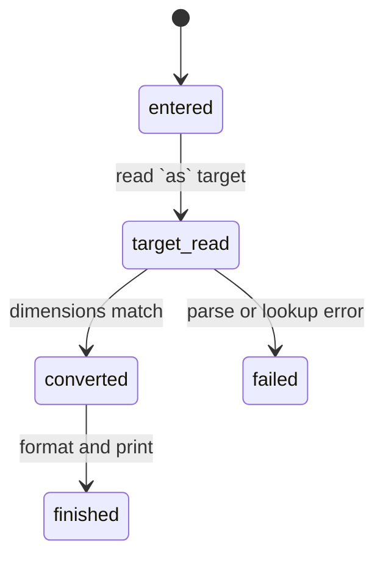

# Conversions

## Summary

The `as` suffix converts a quantity to a requested unit or compound unit and can select a formatting mode. It is entered as `expression as target`, for example `1 bar as kPa` or `100 C as F`. The target must have the same dimension as the source; affine units use their offsets for absolute values and preserve delta semantics for differences.

## The simple case

`dim "1 bar as kPa"` prints `100 kPa`. `dim "100 C as F"` prints `212 °F` or the product's corresponding Fahrenheit symbol. A compound target such as `100 km/h as m/s` prints the converted value using the requested compound spelling.

## The interaction, event by event

### Invoke

The source expression is parsed first. `as` then consumes a unit name or compound unit expression, optionally followed by `:scientific`, `:engineering`, `:auto`, or another mode name. The target is captured as part of the line; it cannot be changed interactively during evaluation.

### Exit immediately

A missing target, invalid unit exponent, or malformed compound target is a parse error. An unknown target reaches lookup and reports an undefined-variable-style runtime error. A dimension mismatch reports an invalid-operands runtime error and prints no converted result.

### Begin running

The source and target are evaluated and their dimensions compared. For a simple affine unit, conversion uses the unit's offset-aware rule. Compound and exponentiated units are treated as multiplicative factors.

### While running

No progress or intermediate conversion is shown. The source's canonical value is converted to the target, and the requested target spelling is retained for output. A delta may normalize pressure symbols to `bar` in the displayed result.

### Finish

A successful conversion prints one formatted line. `:scientific` and `:engineering` change numeric notation; `:auto` selects automatic formatting; an unrecognized suffix falls back to `none`. A failed conversion leaves session constants and earlier output unchanged.

## Modifiers

| Variant | Set at the start | Changed while extended |
| --- | --- | --- |
| Flags and options | `as` target and optional format suffix select the result. | Cannot change after parsing. |
| Environment variables | No effect. | No effect. |
| Config-file keys | No effect. | No effect. |
| Stdout TTY or pipe | Does not change conversion. | No effect. |
| Stdin TTY or pipe | Changes only input source selection. | No effect. |
| Machine-readable, quiet, dry-run, verbosity | None. | No effect. |

## Cancel and interrupt

| Event | Before extended | While extended |
| --- | --- | --- |
| Ctrl+C (SIGINT) once and twice | No conversion result. | Current result may be lost. |
| SIGTERM | Process ends. | Process ends. |
| Terminal closed (SIGHUP) | Process ends. | Process ends. |
| stdin closed or stdout pipe closed (SIGPIPE) | Input may end. | Output may stop. |
| Network lost | No effect. | No effect. |
| Disk full or file locked | No write occurs. | No effect. |
| Required file changed | Only input source changes outside the current line. | No effect. |
| Two instances at once | Independent. | Independent. |
| Process killed outright | No conversion persists. | No conversion persists. |

## Interactions with other systems

**Configuration precedence.** Built-in units and process constants determine lookup.

**Output modes.** The target unit and format mode affect stdout only; errors remain stderr.

**Colors and Unicode.** Unit aliases, degree signs, and normalized compound symbols may be Unicode.

**Exit codes.** Conversion errors are line diagnostics; invalid invocation syntax uses 64.

**Logging and verbosity.** No controls.

**Locking and concurrency.** No shared state.

**Caching.** No conversion cache.

**Network and proxies.** No interaction.

**Permissions and sudo.** No special permission.

**Shell completion.** No interaction.

**Update or version checks.** No interaction.

## Edge cases

- Temperature subtraction produces a delta and can have different output semantics from an absolute temperature.
- Pressure aliases such as `bara`, `barg`, and `bar` preserve or normalize differently depending on whether the result is absolute or delta.
- Fractional unit exponents are accepted only when dimensions and affine rules allow them.
- A target compound unit may print normalized `*` text even if the input used a Unicode middle dot.
- A format name other than the recognized modes does not fail; it selects `none`.

## Open questions and verification

- Exact rendered degree and compound-unit text needs terminal verification.
- The distinction between an undefined target and a dimension mismatch should be checked against actual stderr output.

Verified against /Users/jerell/Repos/dim commit `5d9cf0d`.
