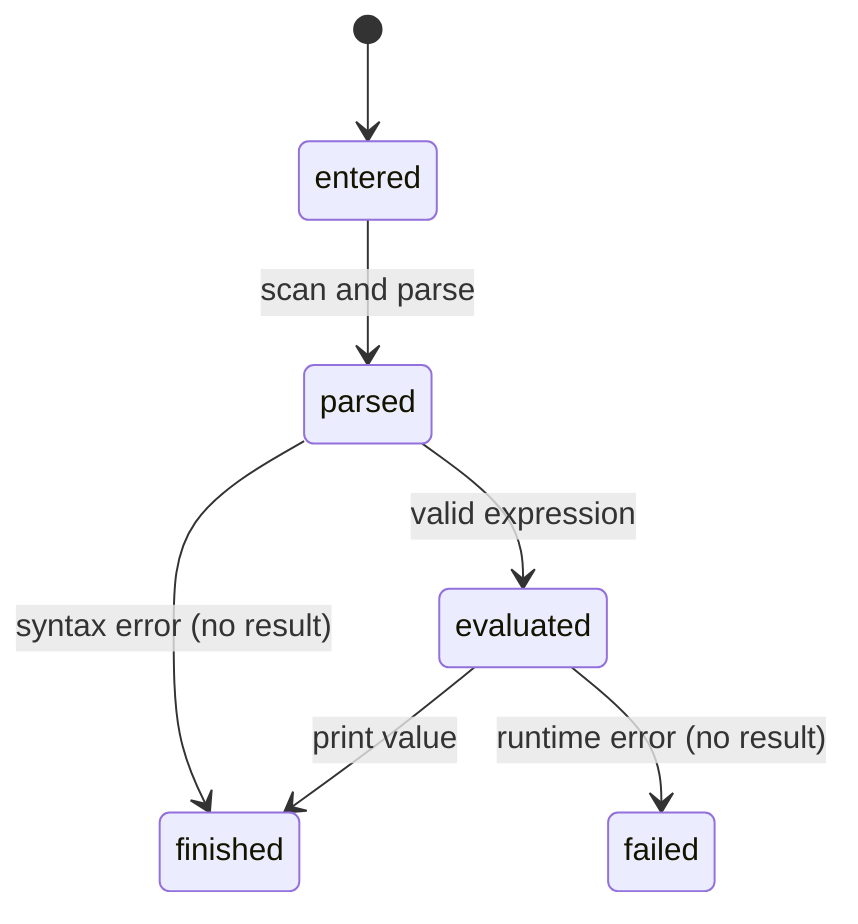

# Expressions

## Summary

Expressions let the user calculate numbers and quantities with `+`, `-`, `*`, `/`, powers, comparisons, grouping, and unit literals. They are entered as a direct argument, REPL line, stdin line, or file line. A successful expression prints one result; incompatible operands or invalid operations print a runtime error.

## The simple case

`dim "1 m + 2 m"` prints `3 m`. Numeric expressions print numbers, comparisons print `true` or `false`, and a quantity expression prints its value and unit. Parentheses control grouping, and scientific notation such as `1.5e3 m` is accepted.

## The interaction, event by event

### Invoke

The user enters an expression. Numbers may be followed by unit expressions; multiplication and division may combine quantities or scale a quantity by a number. The parser accepts caret powers and Unicode superscripts, grouping, comparisons, and the `as` conversion form.

### Exit immediately

An empty line produces nothing. A malformed exponent such as `1e` or an incomplete operator produces a parse error. A syntactically valid expression that divides by zero or combines incompatible values reaches evaluation and reports a runtime error.

### Begin running

The expression is scanned, parsed, and evaluated as one line. Quantity arithmetic uses dimensions rather than the spelling of units, so compatible units can be combined after conversion to canonical values.

### While running

There is no progress display. Power expressions may use exact rational exponents when the exponent is a literal; non-rational dimensional exponents fail. Numeric operations return numbers, and quantity operations retain dimensions and may mark subtraction results as deltas.

### Finish

The result is formatted and printed with a newline. No expression result is persisted unless the expression is a constant assignment. A runtime failure prints `Runtime error: ...` to stderr and leaves earlier session state intact.

## Modifiers

| Variant | Set at the start | Changed while extended |
| --- | --- | --- |
| Flags and options | Format and conversion choices are written in the expression. | Cannot change after parsing. |
| Environment variables | No effect. | No effect. |
| Config-file keys | No effect. | No effect. |
| Stdout TTY or pipe | Changes prompt presence only through input mode. | No effect. |
| Stdin TTY or pipe | Determines how the expression is supplied for no arguments. | No effect. |
| Machine-readable, quiet, dry-run, verbosity | No such modes. | No effect. |

## Cancel and interrupt

| Event | Before extended | While extended |
| --- | --- | --- |
| Ctrl+C (SIGINT) once and twice | No result. | Evaluation may stop with no durable state. |
| SIGTERM | Process ends. | Process ends. |
| Terminal closed (SIGHUP) | Process ends. | Process ends. |
| stdin closed or stdout pipe closed (SIGPIPE) | EOF can end input. | Output can be incomplete. |
| Network lost | No effect. | No effect. |
| Disk full or file locked | No expression file is written. | No effect. |
| Required file changed | A source file is input only. | No effect. |
| Two instances at once | Independent. | Independent. |
| Process killed outright | No result is guaranteed. | Partial output may be lost. |

## Interactions with other systems

**Configuration precedence.** None; built-in units and current session constants apply.

**Output modes.** Values go stdout and diagnostics go stderr.

**Colors and Unicode.** Unicode middle dots and superscripts are accepted and can appear in output; colors are not used.

**Exit codes.** Line errors are reported inside the process; explicit argument errors use 64.

**Logging and verbosity.** No controls.

**Locking and concurrency.** No shared state.

**Caching.** No result cache.

**Network and proxies.** No interaction.

**Permissions and sudo.** No permission beyond reading the chosen input source.

**Shell completion.** No interaction.

**Update or version checks.** No interaction.

## Edge cases

- Adding quantities with different dimensions fails rather than silently converting.
- Multiplication and division with affine temperature deltas can fail even when the displayed units look compatible.
- Dimensionless quotients print without a pseudo-unit.
- Fractional powers can produce rational dimensions and normalized unit text.
- A trailing token after a non-assignment expression produces an unexpected-token parse diagnostic.

## Open questions and verification

- The exact error text and process status for each runtime error need binary verification.
- The boundary between numeric multiplication and unit-expression multiplication in ambiguous input deserves hand tests.

Verified against /Users/jerell/Repos/dim commit `c9c1957`.
