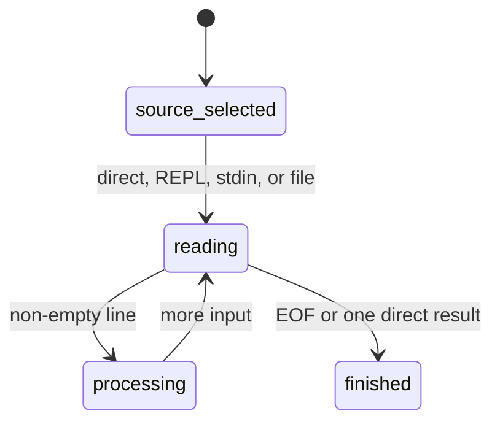

# Input sources

## Summary

The CLI accepts one direct expression, an interactive REPL, stdin batch input, or a file selected with `--file`/`-f`. Every source skips empty lines except that a direct empty argument simply produces no result. Source choice determines prompts, line persistence, and when the process finishes.

## The simple case

Use `dim "1 m + 2 m"` for one expression. Use `printf '1 m\n2 m in km\n' | dim` for batch stdin. Use `dim --file test.dim` for file input. Use bare `dim` in a terminal for the REPL, where each line is preceded by `> `.

## The interaction, event by event

### Invoke

Arguments select the source as defined in [invocation](../foundations/invocation.md). A TTY is required for bare no-argument REPL mode. File and stdin sources are line-oriented and process lines in order.

### Exit immediately

Help and invalid argument forms stop before reading input. Empty lines are ignored. EOF on a REPL exits without a final result; EOF on batch input ends the source after prior lines.

### Begin running

The source supplies a line to the common expression handler. File input is read into memory before its lines are processed. The REPL reads one line at a time and flushes the prompt before waiting.

### While running

Errors on one line do not intentionally erase prior process state. In REPL and batch modes, later non-empty lines continue after the handler returns. A direct argument has no later line.

### Finish

The direct source finishes after one expression. REPL and batch sources finish at EOF. A `--file` read failure prevents normal line processing and is reported by the host runtime. No source is modified.

## Modifiers

| Variant | Set at the start | Changed while extended |
| --- | --- | --- |
| Flags and options | `--file`, `-f`, and `-` choose source. | Cannot change source. |
| Environment variables | No effect. | No effect. |
| Config-file keys | No effect. | No effect. |
| Stdout TTY or pipe | Controls how output is observed; prompts depend on input TTY. | No effect. |
| Stdin TTY or pipe | Selects REPL or batch for bare invocation. | EOF ends the source. |
| Machine-readable, quiet, dry-run, verbosity | None. | No effect. |

## Cancel and interrupt

| Event | Before extended | While extended |
| --- | --- | --- |
| Ctrl+C (SIGINT) once and twice | Source processing stops. | Current line and remaining input may be lost. |
| SIGTERM | Process ends. | Process ends. |
| Terminal closed (SIGHUP) | Process ends. | Process ends. |
| stdin closed or stdout pipe closed (SIGPIPE) | EOF ends stdin sources. | Output or input can stop. |
| Network lost | No effect. | No effect. |
| Disk full or file locked | File input may fail to open/read. | No output file is written. |
| Required file changed | File contents are captured at read time. | Later edits are not watched. |
| Two instances at once | Sources and state are independent. | Independent. |
| Process killed outright | No source state persists. | Remaining input is lost. |

## Interactions with other systems

**Configuration precedence.** Source flags are the only selectors.

**Output modes.** REPL prompts are visible only in interactive input mode; result and error stream rules remain fixed.

**Colors and Unicode.** Input preserves Unicode characters for scanning; output follows normal formatting.

**Exit codes.** Argument errors use 64; source and line errors need runtime verification.

**Logging and verbosity.** No controls.

**Locking and concurrency.** Input files are not locked.

**Caching.** File bytes are held for the current process only.

**Network and proxies.** No interaction.

**Permissions and sudo.** File reads use normal permissions.

**Shell completion.** No interaction.

**Update or version checks.** No interaction.

## Edge cases

- Bare `dim` changes from REPL to stdin batch solely because stdin is piped.
- `dim -` reads stdin even if stdin is a TTY, so it is not a REPL selector.
- Carriage returns are treated as line separators and surrounding CR, spaces, and tabs are trimmed.
- A REPL line over 4096 bytes is rejected by the line reader.
- A file with only blank lines produces no result lines.

## Open questions and verification

- Exact prompt and EOF behavior needs a real TTY pass.
- File read failures and whether later lines continue after a line-level runtime error need binary verification.

Verified against /Users/jerell/Repos/dim commit `c9c1957`.
