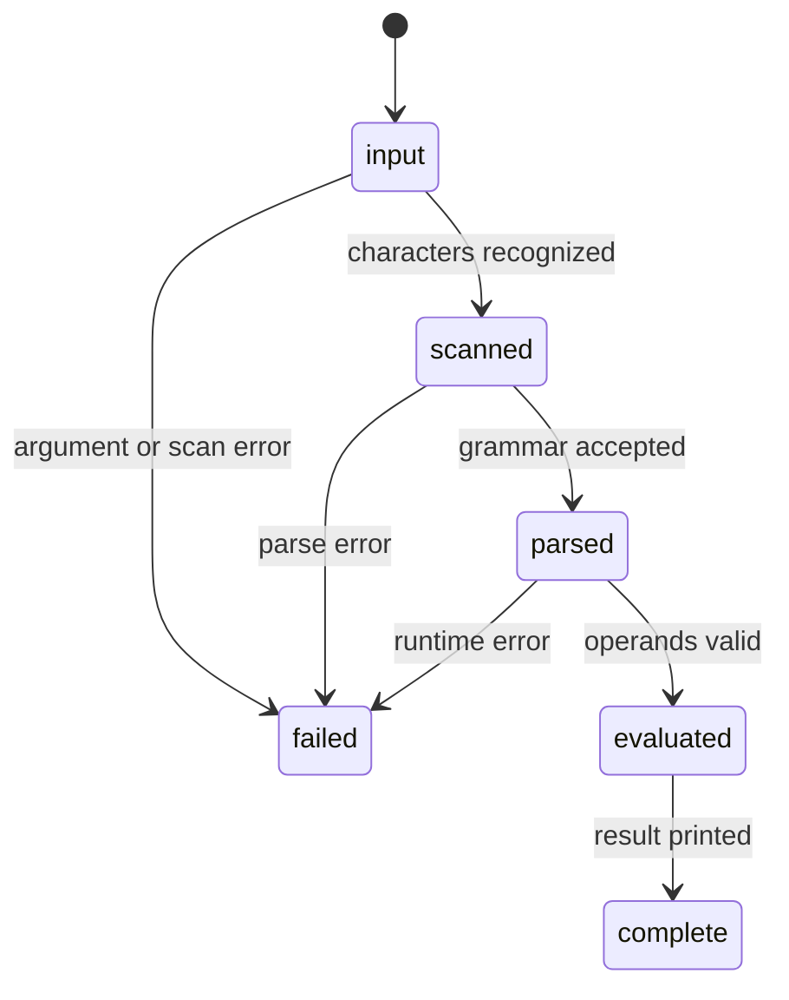

# Errors

## Summary

The CLI has three user-visible expression failure stages: scanning, parsing, and evaluation. Argument shape errors are handled before expression processing. Errors are written to stderr, while earlier successful lines and process-local constants remain unless the process itself ends.

## The simple case

A malformed expression such as `1e` prints a scanner or parser diagnostic and no result. `1 m / 0 m` reaches evaluation and prints a runtime diagnostic. A bad `--file` arity prints an argument error and usage, then exits 64.

## The interaction, event by event

### Invoke

The CLI first validates top-level arguments, then scans the expression. Scanner diagnostics can include the source location. The parser is not entered after a scanner error.

### Exit immediately

Invalid argument forms can terminate the process with status 64. A scanner or parser error returns from the current line without a result. Empty input is not an error and produces nothing.

### Begin running

A parsed expression is evaluated. Runtime failures include invalid operands, division by zero, undefined variables, dimension overflow, affine exponentiation, and invalid temperature delta multiplication or division.

### While running

There is no retry, recovery prompt, or partial result. In a REPL or batch stream, the next line can still be processed after the error. A failed assignment does not replace a previous constant.

### Finish

The diagnostic is flushed with the current output handling. The exact process exit status for line-level failures is not explicitly established by the CLI source and must be checked against the binary.

## Modifiers

| Variant | Set at the start | Changed while extended |
| --- | --- | --- |
| Flags and options | Source and expression syntax determine failure path. | No effect. |
| Environment variables | No effect. | No effect. |
| Config-file keys | No effect. | No effect. |
| Stdout TTY or pipe | Does not move errors from stderr. | No effect. |
| Stdin TTY or pipe | Changes whether errors occur in REPL or batch. | No effect. |
| Machine-readable, quiet, dry-run, verbosity | None. | No effect. |

## Cancel and interrupt

| Event | Before extended | While extended |
| --- | --- | --- |
| Ctrl+C (SIGINT) once and twice | No diagnostic is guaranteed. | The current diagnostic or output may be interrupted. |
| SIGTERM | Process ends. | Process ends. |
| Terminal closed (SIGHUP) | Process ends. | Process ends. |
| stdin closed or stdout pipe closed (SIGPIPE) | EOF can end input. | A diagnostic write may fail. |
| Network lost | No effect. | No effect. |
| Disk full or file locked | File read errors can occur before line processing. | No normal file write occurs. |
| Required file changed | Input file is not watched. | No effect. |
| Two instances at once | Independent diagnostics. | Independent. |
| Process killed outright | Diagnostic may be lost. | Diagnostic may be truncated. |

## Interactions with other systems

**Configuration precedence.** None.

**Output modes.** Errors use stderr and successful values use stdout.

**Colors and Unicode.** No colorized diagnostics are documented; source and unit text may contain Unicode.

**Exit codes.** Status 64 is established for invalid argument arity; ordinary line errors need verification.

**Logging and verbosity.** Error text is not configurable.

**Locking and concurrency.** No error log or shared lock exists.

**Caching.** Failed results are not cached.

**Network and proxies.** No interaction.

**Permissions and sudo.** File read permissions can cause host errors.

**Shell completion.** No interaction.

**Update or version checks.** No interaction.

## Edge cases

- Unknown constants use `Unknown constant 'name'` for `show` but expression lookup reports a runtime error.
- A parser may report an error and continue the process in REPL/batch modes.
- A dimension mismatch is an evaluation failure, not a parse failure.
- A malformed `--file` invocation is different from an unreadable file path.

## Open questions and verification

- Exit statuses for scanner, parser, runtime, and file-read failures remain unconfirmed.
- Exact diagnostics for Unicode and malformed compound units need hand verification.

Verified against /Users/jerell/Repos/dim commit `5d9cf0d`.
