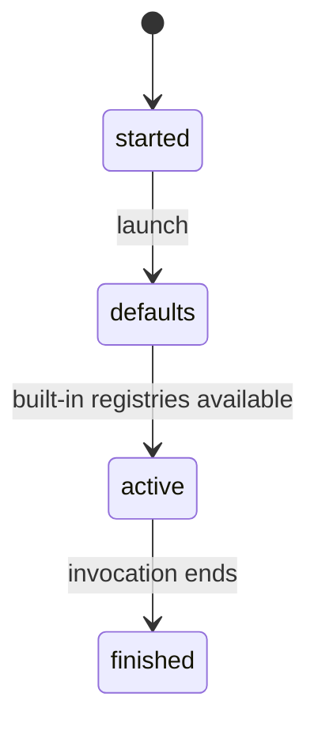

# Configuration

## Summary

The default CLI has no user configuration layer. The executable uses its built-in SI, Imperial, CGS, and industrial registries and the behavior compiled into the current binary. There is no rc file, environment variable, command-line formatting flag, proxy setting, or preference file to override those defaults.

## The simple case

Run an expression without setup. `dim "1 bar as kPa"` uses the built-in unit definitions and prints the converted result. A runtime constant can customize lookup for the current process, but it is an expression-level state change, not persistent configuration.

## The interaction, event by event

### Invoke

The CLI starts with no documented configuration file or environment lookup. The only user-provided configuration-like values are expression text, input source selection, and the `as` format suffix.

### Exit immediately

There is no configuration command, `--config` option, or startup warning. `--help` lists only the input forms and does not list hidden configuration switches.

### Begin running

The built-in registries are available when expressions are evaluated. A runtime constant defined in the process can take precedence over a registry name, as described in [constants](../cli/constants.md).

### While running

Configuration cannot be changed by editing a file or environment variable during the run. A batch file can change runtime lookup only by containing a constant definition line, which affects later lines in that process.

### Finish

No configuration is saved when the process exits. A new invocation starts with the built-in defaults again.

## Modifiers

| Variant | Set at the start | Changed while extended |
| --- | --- | --- |
| Flags and options | Only input selectors are documented; none changes registry configuration. | No effect. |
| Environment variables | No documented variables. | No effect. |
| Config-file keys | No config file. | No effect. |
| Stdout TTY or pipe | Does not alter unit lookup or formatting. | No effect. |
| Stdin TTY or pipe | Selects source only. | No effect. |
| Machine-readable, quiet, dry-run, verbosity | No such options. | No effect. |

## Cancel and interrupt

| Event | Before extended | While extended |
| --- | --- | --- |
| Ctrl+C (SIGINT) once and twice | No configuration is changed. | Process state is lost; no configuration is written. |
| SIGTERM | Same. | Same. |
| Terminal closed (SIGHUP) | Same. | Same. |
| stdin closed or stdout pipe closed (SIGPIPE) | Input may end; defaults remain. | Output may stop; defaults remain. |
| Network lost | No effect. | No effect. |
| Disk full or file locked | No config write occurs. | No effect. |
| Required file changed | No config file is read. | No effect. |
| Two instances at once | Each starts with the same built-in defaults. | They remain independent. |
| Process killed outright | No state persists. | No state persists. |

## Interactions with other systems

**Configuration precedence.** There is no precedence chain; built-in defaults are the only persistent source.

**Output modes.** Format mode is selected in expression text after `as`, not configuration.

**Colors and Unicode.** No configuration controls colors or Unicode.

**Exit codes.** No configuration controls statuses.

**Logging and verbosity.** No controls are available.

**Locking and concurrency.** No shared configuration is locked.

**Caching.** No configuration cache exists.

**Network and proxies.** No network settings exist.

**Permissions and sudo.** Configuration requires no permission because it is not read.

**Shell completion.** No completion configuration is installed by the CLI.

**Update or version checks.** No interaction.

## Edge cases

- A name defined as a constant can shadow a built-in unit for the current process, which may look like configuration but disappears at exit.
- A custom unit registry available through library APIs is outside this CLI description.
- The binary version itself changes available built-in behavior, so verification must confirm the source commit.

## Open questions and verification

- The absence of undocumented environment-based behavior was inferred from the CLI source and was not checked against a clean shell environment.
- The exact built-in registry precedence for ambiguous aliases is owned by the unit documents and remains to be verified with representative expressions.

Verified against /Users/jerell/Repos/dim commit `5d9cf0d`.
