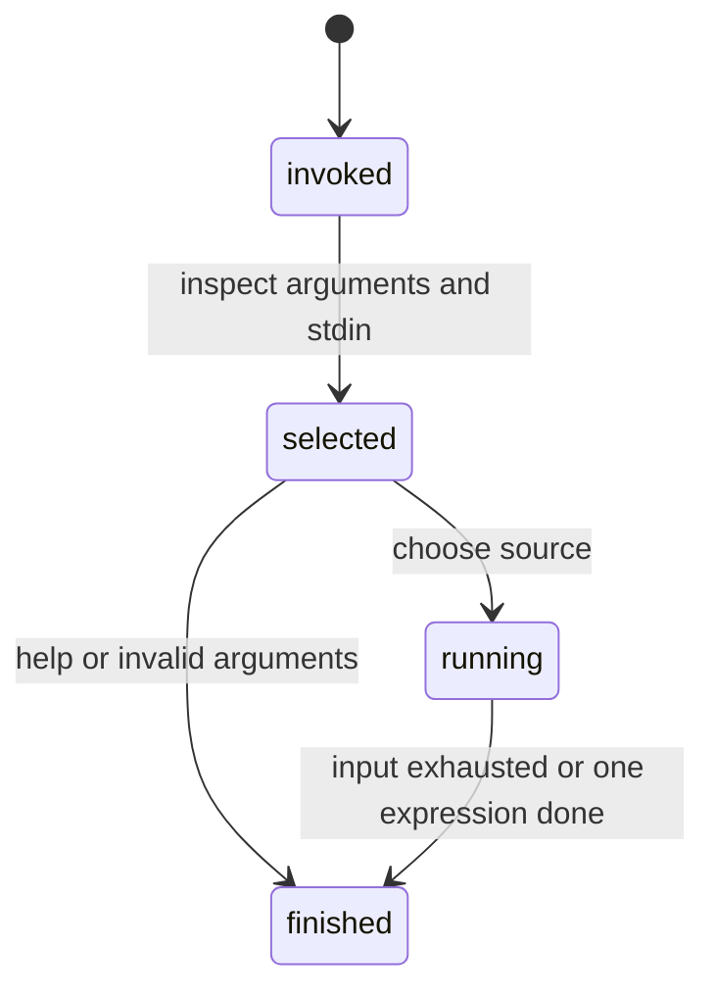

# Invocation

## Summary

An invocation selects one input mode and processes expressions through the `dim` executable. With no arguments it chooses REPL or stdin based on whether stdin is a TTY; one expression evaluates directly; `-` reads stdin; `--file` or `-f` reads a named file; and `--help` or `-h` prints usage. Invalid top-level arguments print an error and exit with status 64.

## The simple case

Run `dim "1 m + 2 m"`. The command reads the expression, evaluates it, prints `3 m` followed by a newline, and exits successfully. No prompt is printed for a direct expression.

Run `dim --file test.dim`. Each non-empty line is evaluated in order and one result is printed per successful line. Run `dim` in a terminal to enter the REPL; each line is evaluated after the `> ` prompt and the next prompt appears afterward.

## The interaction, event by event

### Invoke

The process receives its argument vector and creates buffered stdin, stdout, and stderr streams. It then selects a mode. Exactly one argument is treated as an expression unless that argument is a recognized control form. `--file` requires exactly one following path.

### Exit immediately

`--help` and `-h` write the four usage forms to stdout and return. An invalid argument combination writes `Invalid arguments. Use --help.` to stderr and exits with status 64. `--file` without exactly one path writes `Error: --file requires a path.` to stderr, repeats usage on stdout, and exits with status 64.

### Begin running

No arguments means REPL only when stdin reports as a TTY; otherwise the command consumes stdin as batch input. `-` always consumes stdin. `--file` reads the entire named file before processing its non-empty lines. A direct expression begins scanning immediately.

### While running

A batch source is split on CR/LF; surrounding spaces and tabs are removed, and empty lines are skipped. A REPL reads at most 4096 bytes for one line, prints a prompt before reading, and flushes output so the prompt is visible. Each line is processed independently; errors are printed and the source loop continues in REPL and batch modes.

### Finish

A direct expression finishes after its result or error has been handled. REPL finishes one line by flushing and returning to `> `; EOF exits the process without another prompt. Stdin and file modes finish at end of input. The process does not write input files or a history file.

## Modifiers

| Variant | Set at the start | Changed while extended |
| --- | --- | --- |
| Flags and options | `--file`/`-f`, `-`, and help select the mode. | Arguments cannot change. |
| Environment variables | No documented variables alter dispatch. | No effect. |
| Config-file keys | No config file is read. | No effect. |
| Stdout TTY or pipe | Changes only whether output is observed as a terminal stream; it does not select input mode. | No effect. |
| Stdin TTY or pipe | Selects REPL versus batch input for no arguments. | A source's kind cannot change mid-invocation. |
| Machine-readable, quiet, dry-run, verbosity | None is implemented. | No effect. |

The stdin TTY test is read at startup and is not re-evaluated for each line. Input mode is therefore latched at invocation start.

## Cancel and interrupt

| Event | Before extended | While extended |
| --- | --- | --- |
| Ctrl+C (SIGINT) once and twice | The process stops before source processing. | The process may stop during a read or evaluation; no durable output file is changed. |
| SIGTERM | Process ends before output. | Process ends; buffered output may not be flushed. |
| Terminal closed (SIGHUP) | Process ends. | Process ends; in-memory constants are lost. |
| stdin closed or stdout pipe closed (SIGPIPE) | Closed stdin is treated as end of input; a closed stdout can terminate output. | Processing stops or output fails according to the host stream. |
| Network lost | No effect. | No effect. |
| Disk full or file locked | A file read can fail; no input is processed after the failure. | No normal file write occurs. |
| Required file changed | The file contents are read for this invocation; later changes are not part of the current source. | No effect after the read. |
| Two instances at once | Each invocation has independent process state. | They do not coordinate. |
| Process killed outright | The process leaves no intentional durable state. | The current output may be incomplete. |

The CLI has no documented signal handler that converts interruptions into a user-facing result. See [output](output.md) for stream and status behavior.

## Interactions with other systems

**Configuration precedence.** There are no flags over environment over file settings; built-in defaults are used.

**Output modes.** Input selection is independent of stdout being a TTY or pipe. REPL prompts are the only mode-specific output.

**Colors and Unicode.** No color mode is exposed; expressions and unit output may contain Unicode.

**Exit codes.** Status 64 is explicit for invalid top-level arguments and malformed `--file` arity. Ordinary line errors are handled inside the process.

**Logging and verbosity.** No logging controls exist.

**Locking and concurrency.** Invocations do not lock files or share state.

**Caching.** No input or result cache is used.

**Network and proxies.** No interaction.

**Permissions and sudo.** Reading a file is subject to normal filesystem permissions.

**Shell completion.** No completion is provided.

**Update or version checks.** No interaction.

## Edge cases

- `dim --file` with a missing path attempts to read it and reports the host read failure rather than a usage error.
- More than one non-control argument is rejected rather than joined into an expression.
- No-argument stdin that is not a TTY is batch mode even when the input contains only one line.
- A line longer than 4096 bytes in the REPL returns a stream-too-long error rather than evaluating a prefix.
- An empty direct argument is ignored and produces no result.

## Open questions and verification

- The exact exit status for missing or unreadable files was not confirmed by hand.
- The host behavior for SIGPIPE, SIGHUP, and a second Ctrl+C was not confirmed in a real terminal.

Verified against /Users/jerell/Repos/dim commit `5d9cf0d`.
