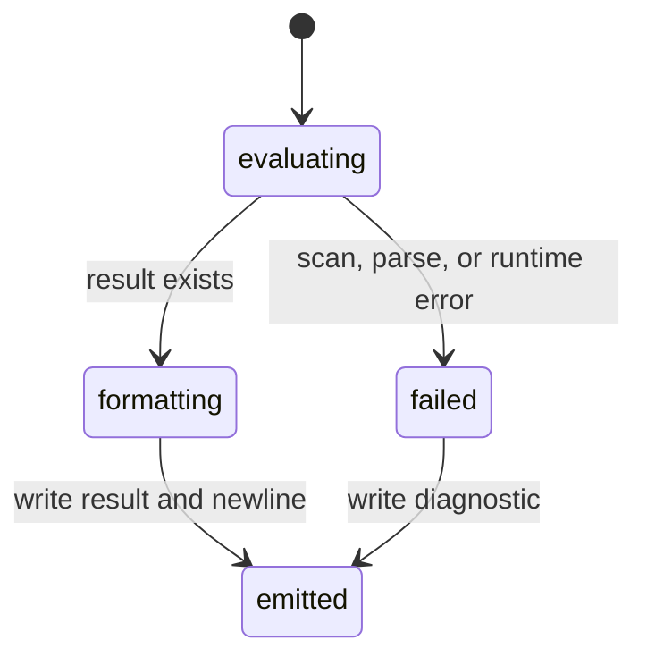

# Output

## Summary

The CLI separates successful results and usage text on stdout from scanner, parser, runtime, and unknown-constant errors on stderr. Results are printed as one line, with quantities formatted according to their display unit and optional `as` mode. There is no JSON, quiet, color, or verbose output switch.

## The simple case

`dim "2 m + 3 m"` writes `5 m` and a newline to stdout. A parse or runtime failure writes a diagnostic beginning `Parse error:` or `Runtime error:` to stderr and does not print a result for that line. In a REPL, the prompt is also stdout and is flushed before input is read.

## The interaction, event by event

### Invoke

The output streams are opened and buffered before argument dispatch. A direct expression has no prompt. REPL mode reserves stdout for prompts and successful results; stderr remains separate for diagnostics.

### Exit immediately

Help and usage text go to stdout. Invalid argument diagnostics and the `--file` arity error go to stderr while their usage block goes to stdout. An empty line produces no output.

### Begin running

After a successful evaluation, the result is selected by its value kind: number, string, boolean, quantity, or nil. A quantity's formatter emits its value and unit, while a dimensionless quotient omits a pseudo-unit.

### While running

Output is buffered and explicitly flushed after REPL lines and result handling. Batch output is accumulated in the process writer and flushed on exit. Errors do not roll back text already written for earlier lines.

### Finish

A successful result ends with one newline. `list` and `show` use a diagnostic-style summary containing the name, dimension, scale, and normalized unit; `clear` prints `ok`. A failed line keeps earlier output and state; it does not produce a placeholder result.

## Modifiers

| Variant | Set at the start | Changed while extended |
| --- | --- | --- |
| Flags and options | `:scientific`, `:engineering`, `:auto`, and `:none` are expression suffixes, not CLI flags. | Cannot change after parsing the line. |
| Environment variables | No output variables are documented. | No effect. |
| Config-file keys | None. | No effect. |
| Stdout TTY or pipe | A pipe receives the same result text without prompts unless stdin also selects REPL. | No effect. |
| Stdin TTY or pipe | TTY affects prompt selection for no-argument mode. | No effect on an emitted result. |
| Machine-readable, quiet, dry-run, verbosity | None is implemented. | No effect. |

An unrecognized format name after `as` falls back to `none` rather than producing a format error; this is a behavior to verify.

## Cancel and interrupt

| Event | Before extended | While extended |
| --- | --- | --- |
| Ctrl+C (SIGINT) once and twice | No result may be emitted. | Buffered output may be lost or partial. |
| SIGTERM | Process ends without a guaranteed flush. | Same. |
| Terminal closed (SIGHUP) | Process ends. | Process ends; output may be incomplete. |
| stdin closed or stdout pipe closed (SIGPIPE) | EOF ends input; broken stdout can stop output. | The current write may fail. |
| Network lost | No effect. | No effect. |
| Disk full or file locked | No output file is written by the CLI. | No effect on stdout. |
| Required file changed | Does not affect already-read output. | No effect. |
| Two instances at once | Streams are independent. | Streams are independent. |
| Process killed outright | Unflushed output can disappear. | The line can be truncated. |

## Interactions with other systems

**Configuration precedence.** No output configuration chain exists.

**Output modes.** stdout and stderr are the two user-visible channels; there is no JSON or quiet mode.

**Colors and Unicode.** Color is not emitted by the CLI. Unit aliases, superscripts, and dimension text may use Unicode.

**Exit codes.** Explicit invalid-argument paths use 64. Ordinary expression diagnostics return from the line handler; their final process status should be checked rather than assumed.

**Logging and verbosity.** Diagnostics are direct errors, not configurable logs.

**Locking and concurrency.** No output lock coordinates multiple processes.

**Caching.** No output cache exists.

**Network and proxies.** No interaction.

**Permissions and sudo.** Terminal stream permissions are delegated to the host.

**Shell completion.** No interaction.

**Update or version checks.** No interaction.

## Edge cases

- A result may contain a Unicode degree sign, middle dot, or superscript depending on the unit formatter.
- A dimensionless result prints only its numeric value.
- A `show` of an unknown name writes an error but does not print usage.
- A failed later line in batch mode does not erase successful earlier lines.
- Flush failures are reported as `flush error:` when the deferred flush path catches them.

## Open questions and verification

- The final process status for parse and runtime errors was not confirmed by invoking the binary.
- Terminal rendering of Unicode and behavior when stdout is closed were not confirmed by hand.

Verified against /Users/jerell/Repos/dim commit `c9c1957`.
