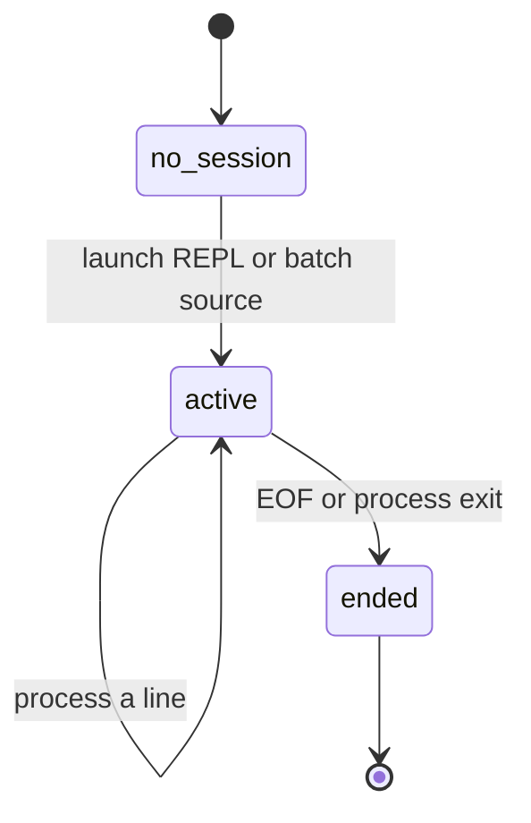

# Session state

## Summary

Most CLI invocations are stateless: they read input, print results, and exit. The REPL and a multi-line stdin or file invocation create a process session in which runtime constants persist from one line to the next. The session ends at EOF or process exit; no history, workspace, or saved configuration survives.

## The simple case

Start `dim` in a TTY and define `d = (24 h)`. The next prompt can use `d`; `1000000 s as d` prints a result in days. Type `clear d`, receive `ok`, and the name is no longer available. Press Ctrl+D at an empty prompt to end the session.

## The interaction, event by event

### Invoke

The session begins only after process startup selects REPL, stdin, or file mode. Runtime constant storage starts empty for the process. A direct expression has a session too, but it lasts only for that one expression.

### Exit immediately

Help and invalid argument paths do not process expression state. An empty REPL line leaves the state unchanged and returns to the prompt.

### Begin running

Each non-empty line is scanned and evaluated against the current process constants. A successful assignment updates the state before its result is printed. A failed assignment leaves existing constants available.

### While running

State is shared by later lines in the same process, including lines after an error. It is not shared between two invocations or two processes. A file's lines are processed in order, so a definition can affect a later line but not an earlier one.

### Finish

EOF, normal completion of a direct expression, or process termination ends the session. Constants are discarded. There is no undo, history file, autosave, or recovery prompt.

## Modifiers

| Variant | Set at the start | Changed while extended |
| --- | --- | --- |
| Flags and options | Input source determines whether multiple lines can share state. | Cannot change source mode. |
| Environment variables | No state settings. | No effect. |
| Config-file keys | No persistent state file. | No effect. |
| Stdout TTY or pipe | A TTY can expose prompts when stdin is also a TTY. | No effect. |
| Stdin TTY or pipe | Determines REPL versus batch for no arguments. | EOF ends the current source. |
| Machine-readable, quiet, dry-run, verbosity | None. | No effect. |

## Cancel and interrupt

| Event | Before extended | While extended |
| --- | --- | --- |
| Ctrl+C (SIGINT) once and twice | Session does not begin or remains without the new line's state. | Process state is lost when the process exits. |
| SIGTERM | No state survives. | No state survives. |
| Terminal closed (SIGHUP) | No state survives. | No state survives. |
| stdin closed or stdout pipe closed (SIGPIPE) | EOF ends the session cleanly. | The current process may end; state is not persisted. |
| Network lost | No effect. | No effect. |
| Disk full or file locked | No session state is written. | No effect. |
| Required file changed | A file source is read as input, not watched. | No effect on already-loaded state. |
| Two instances at once | Sessions are isolated. | Sessions are isolated. |
| Process killed outright | State disappears. | State disappears. |

## Interactions with other systems

**Configuration precedence.** Session state is not configuration and has no persistence precedence.

**Output modes.** Prompts and results show state changes; diagnostics do not reset state.

**Colors and Unicode.** State names and units are printed using normal expression formatting.

**Exit codes.** Session termination status is controlled by the host and explicit argument exits.

**Logging and verbosity.** No session log is kept.

**Locking and concurrency.** No session lock exists.

**Caching.** Constants are in-memory session state, not a reusable cache.

**Network and proxies.** No interaction.

**Permissions and sudo.** No permission is required for in-memory state.

**Shell completion.** No interaction.

**Update or version checks.** No interaction.

## Edge cases

- An assignment followed by another expression on the same line prints only the trailing expression's result, while the assignment remains stored.
- A constant defined in a file disappears when that file invocation finishes.
- `clear all` leaves the session active and prints `ok`.
- A second `dim` process cannot see constants from the first, even if both run in the same terminal.

## Open questions and verification

- EOF behavior after a partially entered REPL line was not confirmed by hand.
- The process status after an expression error in a batch session remains to be checked.

Verified against /Users/jerell/Repos/dim commit `c9c1957`.
